

# Universidad Peruana De Ciencias Aplicadas

## 1ASI0729 - Desarrollo de Aplicaciones Open Source

 </img> 

## **Sección: 4321**

## Profesor: Rafael Oswaldo Castro Veramendi

# **Informe de Trabajo Final**

## **Devvolution**

## **PescaGo**

## **Integrantes:**

     <table align="center">
        <tr>
            <th style="text-align:center;">Código</th>
            <th style="text-align:center;">Apellidos y Nombres</th>
        </tr>
        <tr>
            <td>U20191a137</td>
            <td>Belleza Tello, Paolo Eduardo</td>
        </tr>
        <tr>
            <td>U20201c131</td>
            <td>Fernandez Alva, María Fernanda</td>
        </tr>
        <tr>
            <td>U202121325</td>
            <td>Macavilca Quispe, Ian</td>
        </tr>
        <tr>
            <td>U202115357</td>
            <td>Prado Vargas, Mario Benjamín</td>
        </tr>
        <tr>
            <td>U202215164</td>
            <td>Ramos Argüelles, Alexandra Belen</td>
        </tr>
    </table>

---

 

# Abril - 2025

---

## Registro de Versiones Del Informe

<table border="1">
  <thead>
    <tr>
      <th>Versión</th>
      <th>Fecha</th>
      <th>Autor</th>
      <th>Descripción de modificación</th>
    </tr>
  </thead>
  <tbody>
    <tr>
      <td>TB1</td>
      <td>24/04/2025</td>
      <td>
        <ul>
            <li>Macavilca Quispe, Ian</li>
            <li>Prado Vargas, Mario Benjamín</li>
            <li>Ramos Argüelles, Alexandra Belen</li>
            <li>Belleza Tello, Paolo Eduardo</li>
            <li>Fernandez Alva, Maria Fernanda</li>
        </ul>
      </td>
      <td>
        ● Capítulo I: Introducción 
        ● Capítulo II: Requirements Elicitation & Analysis 
        ● Capítulo III: Requirements Specification 
        ● Capítulo IV: Product Design 
        ● Capítulo V: Product Implementation, Validation & Deployment 
        ● Avance de Conclusiones, Bibliografía y Anexos
      </td>
    </tr>
    <tr>
      <td>TP</td>
      <td>13/05/2025</td>
      <td>
        <ul>
            <li>Macavilca Quispe, Ian</li>
            <li>Prado Vargas, Mario Benjamín</li>
            <li>Ramos Argüelles, Alexandra Belen</li>
            <li>Belleza Tello, Paolo Eduardo</li>
            <li>Fernandez Alva, Maria Fernanda</li>
        </ul>
      </td>
      <td>
        ● Capítulo V: Product Implementation, Validation & Deployment 
        con respecto al Sprint 2 
        ● Avance de Conclusiones, Bibliografía y Anexos 
        ● Implementación de la Aplicación Web - PescaGo
      </td>
    </tr>
    <tr>
      <td>TB2</td>
      <td>15/06/2025</td>
      <td>
        <ul>
            <li>Macavilca Quispe, Ian</li>
            <li>Prado Vargas, Mario Benjamín</li>
            <li>Ramos Argüelles, Alexandra Belen</li>
            <li>Belleza Tello, Paolo Eduardo</li>
            <li>Fernandez Alva, Maria Fernanda</li>
        </ul>
      </td>
      <td>
        ● Capítulo V: Product Implementation, Validation & Deployment 
        con respecto al Sprint 3 
        ● Validation Interviews y video about-the-product 
        ● Avance de Conclusiones, Bibliografía y Anexos 
        ● Implementación del Backend - PescaGo
      </td>
    </tr>
  </tbody>
</table>

## Project Report Collaboration Insights

A continuación, se detalla el proceso de elaboración del informe para cada entrega, junto con capturas de pantalla que muestran los análisis de colaboración y commits en GitHub para el repositorio del informe:

**Link del repositorio-Informe:** [https://github.com/1ASI0729-2510-4321-devvolution/PescaGo-Report](https://github.com/1ASI0729-2510-4321-devvolution/PescaGo-Report)

**Link de los repositorios de la organización:** [https://github.com/1ASI0729-2510-4321-devvolution](https://github.com/1ASI0729-2510-4321-devvolution)

**Reporte de colaboración de la entrega del TB1:**

- Todos los miembros del equipo contribuyeron en la redacción del Informe. Se dividió en secciones específicas para cada capítulo, lo que permitió un mayor avance y equidad en el desarrollo del informe.

- Se establecieron fechas límite para la finalización de cada capítulo, lo que facilitó el avance de cada capítulo.

  
  

---

**Reporte de colaboración de la entrega del TP:**

- Todos los miembros del equipo contribuyeron en distintas partes del entregable. Por ejemplo, todos nos ayudamos en esta entrega como en la documentación , la implementación del frontend y la elaboracion de un API local.

- Se establecieron fechas límite para la finalización de cada tarea asignada.
  
  

  
  

---

**Reporte de colaboración de la entrega del TB2:**

- Todos los miembros del equipo contribuyeron en distintas partes del entregable. Por ejemplo, algunos se encargaron de la documentación , implementación de los videos en el landing page, elaboración del backend, y la implementación de una Api externa.

- Se establecieron fechas límite para la finalización de cada tarea asignada. Y coordinación con semanas de anticipación para finalizar el proyecto.
  
  

  
  

---

# Contenido

## Capítulo I: Introducción

- [1.1. Startup Profile](/docs/chapter-I.md/#11-startup-profile)
  - [1.1.1. Descripción de la Startup](/docs/chapter-I.md/#111-descripción-de-la-startup)
  - [1.1.2. Perfiles de Integrantes del equipo](/docs/chapter-I.md/#112-perfiles-de-integrantes-del-equipo)
- [1.2. Solution Profile](/docs/chapter-I.md/#12-solution-profile)
  - [1.2.1. Antecedentes y problemática](/docs/chapter-I.md/#121-antecedentes-y-problemática)
  - [1.2.2. Lean UX Process](/docs/chapter-I.md/#122-lean-ux-process)
    - [1.2.2.1. Lean UX Problem Statements](/docs/chapter-I.md/#1221-lean-ux-problem-statements)
    - [1.2.2.2. Lean UX Assumptions](/docs/chapter-I.md/#1222-lean-ux-assumptions)
    - [1.2.2.3. Lean UX Hypothesis Statements](/docs/chapter-I.md/#1223-lean-ux-hypothesis-statements)
    - [1.2.2.4. Lean UX Canvas](/docs/chapter-I.md/#1224-lean-ux-canvas)
- [1.3. Segmentos Objetivos](/docs/chapter-I.md/#13-segmentos-objetivos)

## Capítulo II: Requirements Elicitation & Analysis

- [2.1. Competidores](/docs/chapter-IV.md/#21-competidores)
  - [2.1.1. Análisis Competitivo](/docs/chapter-IV.md/#211-análisis-competitivo)
  - [2.1.2. Estrategias y tácticas frente a competidores](/docs/chapter-IV.md/#212-estrategias-y-tácticas-frente-a-competidores)
- [2.2. Entrevistas](/docs/chapter-IV.md/#22-entrevistas)
  - [2.2.1. Diseño de entrevistas](/docs/chapter-IV.md/#221-diseño-de-entrevistas)
  - [2.2.2. Registro de entrevistas](/docs/chapter-IV.md/#222-registro-de-entrevistas)
  - [2.2.3. Análisis de entrevistas](/docs/chapter-IV.md/#223-análisis-de-entrevistas)
- [2.3. Needfinding](/docs/chapter-IV.md/#23-needfinding)
  - [2.3.1. User Personas](/docs/chapter-IV.md/#231-user-persona)
  - [2.3.2. User Task Matrix](/docs/chapter-IV.md/#232-user-task-matrix)
  - [2.3.3. User Journey Mapping](/docs/chapter-IV.md/#233-user-journey-mapping)
  - [2.3.4. Empathy Mapping](/docs/chapter-IV.md/#234-empathy-mapping)
  - [2.3.5. As-is Scenario Mapping](/docs/chapter-IV.md/#235-as-is-scenario-mapping)
- [2.4. Ubiquitous Language](/docs/chapter-IV.md/#24-ubiquitous-language)

## Capítulo III: Requirements Specification

- [3.1. To-Be Scenario Mapping](/docs/chapter-IV.md/#31-to-be-scenario-mapping)
- [3.2. User Stories](/docs/chapter-IV.md/#32-user-stories)
- [3.3. Impact Mapping](/docs/chapter-IV.md/#33-impact-mapping)
- [3.4. Product Backlog](/docs/chapter-IV.md/#34-product-backlog)

## Capítulo IV: Product Design

- [4.1. Style Guidelines](/docs/chapter-IV.md/#41-style-guidelines)
  - [4.1.1. General Style Guidelines](/docs/chapter-IV.md/#411-general-style-guidelines)
  - [4.1.2. Web Style Guidelines](/docs/chapter-IV.md/#412-web-style-guidelines)
- [4.2. Information Architecture](/docs/chapter-IV.md/#42-information-architecture)
  - [4.2.1. Organization Systems](/docs/chapter-IV.md/#421-organization-systems)
  - [4.2.2. Labeling Systems](/docs/chapter-IV.md/#422-labeling-systems)
  - [4.2.3. SEO Tags and Meta Tags](/docs/chapter-IV.md/#423-seo-tags-and-meta-tags)
  - [4.2.4. Searching Systems](/docs/chapter-IV.md/#424-searching-systems)
  - [4.2.5. Navigation Systems](/docs/chapter-IV.md/#425-navigation-systems)
- [4.3. Landing Page UI Design](/docs/chapter-IV.md/#43-landing-page-ui-design)
  - [4.3.1. Landing Page Wireframe](/docs/chapter-IV.md/#431-landing-page-wireframe)
  - [4.3.2. Landing Page Mock-up](/docs/chapter-IV.md/#432-landing-page-mock-up)
- [4.4. Web Applications UX/UI Design](/docs/chapter-IV.md/#44-web-applications-uxui-design)
  - [4.4.1. Web Applications Wireframes](/docs/chapter-IV.md/#441-web-applications-wireframes)
  - [4.4.2. Web Applications Wireflow Diagrams](/docs/chapter-IV.md/#442-web-applications-wireflow-diagrams)
  - [4.4.3. Web Applications Mock-ups](/docs/chapter-IV.md/#443-web-applications-mock-ups)
  - [4.4.4. Web Applications User Flow Diagrams](/docs/chapter-IV.md/#444-web-applications-user-flow-diagrams)
- [4.5. Web Applications Prototyping](/docs/chapter-IV.md/#45-web-applications-prototyping)
- [4.6. Domain-Driven Software Architecture](/docs/chapter-IV.md/#46-domain-driven-software-architecture)
  - [4.6.1. Software Architecture Context Diagram](/docs/chapter-IV.md/#461-software-architecture-context-diagram)
  - [4.6.2. Software Architecture Container Diaframs](/docs/chapter-IV.md/#462-software-architecture-container-diagrams)
  - [4.6.3. Software Architecture Components Diagrams](/docs/chapter-IV.md/#463-software-architecture-components-diagrams)
- [4.7. Software Object-Oriented Design](/docs/chapter-IV.md/#47-software-object-oriented-design)
  - [4.7.1. Class Diagrams](/docs/chapter-IV.md/#471-class-diagrams)
  - [4.7.2. Class Dictionary](/docs/chapter-IV.md/#472-class-dictionary)
- [4.8. Database Design](/docs/chapter-IV.md/#48-Database-design)
  - [4.8.1. Database Diagram](/docs/chapter-IV.md/#481-Database-diagram)

## Capítulo V: Product Implementation, Validation & Deployment

- [5.1. Software Configuration Management](/docs/chapter-V.md/#51-software-configuration-management)
  - [5.1.1. Software Development Environment Configuration](/docs/chapter-V.md/#511-software-development-environment-configuration)
  - [5.1.2. Source Code Management](/docs/chapter-V.md/#512-software-code-management)
  - [5.1.3. Source Code Style Guide & Conventions](/docs/chapter-V.md/#513-source-code-style-guide-conventions)
  - [5.1.4. Software Development Configuration](/docs/chapter-V.md/#514-software-development-configuration)
- [5.2. Lading Page, Services & Applications Implementation](/docs/chapter-V.md/#52-lading-page-services-applications-implementation)
  - [5.2.1. Sprint 1](/docs/chapter-V.md/#521-spring-1)
    - [5.2.1.1. Sprint Planning 1](/docs/chapter-V.md/#5211-spring-planning-1)
    - [5.2.1.2. Aspect Leaders and Collaborators](/docs/chapter-V.md/#5212-aspect-leaders-and-collaborators)
    - [5.2.1.3. Sprint Backlog 1](/docs/chapter-V.md/#5213-spring-backlog-1)
    - [5.2.1.4. Development Evidence for Sprint Review](/docs/chapter-V.md/#5214-development-evidence-for-sprint-review)
    - [5.2.1.5. Execution Evidence for Sprint Review](/docs/chapter-V.md/#5215-execution-evidence-for-sprint-review)
    - [5.2.1.6. Services Documentation Evidence for Sprint Review](/docs/chapter-V.md/#5216-services-documentation-evidence-for-sprint-review)
    - [5.2.1.7. Software Deployment Evidence for Sprint Review](/docs/chapter-V.md/#5217-software-deployment-evidence-for-sprint-review)
    - [5.2.1.8. Team Collaboration Insights during Sprint](/docs/chapter-V.md/#5218-team-collaboration-insights-during-sprint)
  - [5.2.2. Sprint 2](/docs/chapter-V.md/#522-spring-2)
    - [5.2.2.1. Sprint Planning 2](/docs/chapter-V.md/#5221-spring-planning-2)
    - [5.2.2.2. Aspect Leaders and Collaborators](/docs/chapter-V.md/#5222-aspect-leaders-and-collaborators)
    - [5.2.2.3. Sprint Backlog 2](/docs/chapter-V.md/#5223-spring-backlog-2)
    - [5.2.2.4. Development Evidence for Sprint Review](/docs/chapter-V.md/#5224-development-evidence-for-sprint-review)
    - [5.2.2.5. Execution Evidence for Sprint Review](/docs/chapter-V.md/#5225-execution-evidence-for-sprint-review)
    - [5.2.2.6. Services Documentation Evidence for Sprint Review](/docs/chapter-V.md/#5226-services-documentation-evidence-for-sprint-review)
    - [5.2.2.7. Software Deployment Evidence for Sprint Review](/docs/chapter-V.md/#5227-software-deployment-evidence-for-sprint-review)
    - [5.2.2.8. Team Collaboration Insights during Sprint](/docs/chapter-V.md/#5228-team-collaboration-insights-during-sprint)
  - [5.2.3. Sprint 3](/docs/chapter-V.md/#523-spring-3)
    - [5.2.3.1. Sprint Planning 2](/docs/chapter-V.md/#5231-spring-planning-3)
    - [5.2.3.2. Aspect Leaders and Collaborators](/docs/chapter-V.md/#5232-aspect-leaders-and-collaborators)
    - [5.2.3.3. Sprint Backlog 2](/docs/chapter-V.md/#5233-spring-backlog-3)
    - [5.2.3.4. Development Evidence for Sprint Review](/docs/chapter-V.md/#5234-development-evidence-for-sprint-review)
    - [5.2.3.5. Execution Evidence for Sprint Review](/docs/chapter-V.md/#5235-execution-evidence-for-sprint-review)
    - [5.2.3.6. Services Documentation Evidence for Sprint Review](/docs/chapter-V.md/#5236-services-documentation-evidence-for-sprint-review)
    - [5.2.3.7. Software Deployment Evidence for Sprint Review](/docs/chapter-V.md/#5237-software-deployment-evidence-for-sprint-review)
    - [5.2.3.8. Team Collaboration Insights during Sprint](/docs/chapter-V.md/#5238-team-collaboration-insights-during-sprint)
- [5.3. Validation Interviews](/docs/chapter-V.md/#53-validation-interviews)
  - [5.3.1. Diseño de Entrevistas](/docs/chapter-V.md/#531-diseño-de-entrevistas)
  - [5.3.2. Registro de Entrevistas](/docs/chapter-V.md/#532-registro-de-entrevistas)
  - [5.3.3. Evaluaciones según heurísticas](/docs/chapter-V.md/#533-evaluaciones-segun-heuristicas)
- [5.4. Video About-the-Product](/docs/chapter-V.md/#54-video-about-the-product)

## Conclusiones

- [Conclusiones y recomendaciones](/docs/conclusiones-recomendaciones)
- [Anexos](/docs/anexos)
- [Bibliografía](/docs/bibliografía)

## Student Outcome

<table>
  <tr>
    <th>Criterio Específicos</th>
    <th>Acciones realizadas</th>
    <th>Conclusiones</th>
  </tr>
  <tr>
    <td rowspan="5"><strong>Comunica oralmente con efectividad a diferentes rangos de audiencia.</strong></td>
    <td><strong>Prado Vargas, Mario Benjamin</strong> 
    <strong>TB1:</strong> Realicé el User Personas, User Task Matrix, User Journey Mapping, Empathy Mapping, As-Is Scenario Mapping, Ubiquitous Language, Software Architecture Context Diagram, Container Diagrams, Components Diagrams, Landing Page Wireframe, Landing Page Mock-up <strong>TP:</strong> Contribuí en el Development Evidence for Sprint Review. Además, implementé las funcionalidades relacionadas en la interaccion entre modules y conexion con fakeapi.</td>
    <td rowspan="5">
    <strong>TB1:</strong>En esta primera entrega, se comunicaron de manera responsable los intereses de los stakeholders, asegurando el cumplimiento de los estándares en el desarrollo del software  <strong>TP:</strong> En esta segunda entrega, se abordó la implementación del frontend de la aplicación web PescaGo. Además, se asignaron las secciones correspondientes para la elaboración del documento.  </td>
  </tr>
  <tr>
    <td><strong>Fernandez Alva, Maria Fernanda</strong> 
    <strong>TB1:</strong> Realicé el To-Be Scenario Mapping, elaboré el Product Backlog y desarrollé el prototipo en Figma, acompañado de un video demostrando la funcionalidad. <strong>TP:</strong> Realicé la documentacion del sprint 2 en los siguientes puntos: Sprint Planning 2 , Aspect Leaders y la funcionalidad "Servicio Confirmado".</td>
  </tr>
  <tr>
    <td><strong>Belleza Tello, Paolo Eduardo</strong> 
    <strong>TB1:</strong> Realicé las User Stories, los Wireflow Diagrams, los Mock-ups y los User Flow Diagrams para la aplicación web. <strong>TP:</strong> Realicé una parte de la documentació como : Sprint Backlog 2 y developmente evidence for Sprint Review y la funcionalidad "Solicitudes para cotizar" en el código.</td>
  </tr>
  <tr>
  <td><strong>Ramos Argüelles, Alexandra Belen</strong> 
    <strong>TB1:</strong> Realicé Descripción de la Startup, Solution Profile: Antecedentes y problemática, Lean UX Process: Lean UX Problem Statements, Lean UX Assumptions, Lean UX Hypothesis Statements y Lean UX Canvas, Segmentos objetivo e Information Architecture. <strong>TP:</strong> Realicé la documentación del Sprint 2 desarrollando los apartados Sprint Backlog 2 y Development Evidence for Sprint Review. Además, implementé algunas funciones en el código fuente.</td>
  </tr>
  <tr>
    <td><strong>Macavilca Quispe, Ian</strong> 
    <strong>TB1:</strong> Realicé los Class Diagrams, Database Diagram, capítulo 2 y 5. <strong>TP:</strong> Realicé una parte del developmente evidence for Sprint Review y me enfoque en las conexiones con la fakeapi y modularidad de componentes.</td>
  </tr>
 
  <tr>
    <td rowspan="5"><strong>Comunica por escrito con efectividad a diferentes rangos de audiencia</strong></td>
    <td><strong>Prado Vargas, Mario Benjamin</strong> 
    <strong>TB1:</strong> Mis contribuciones en la primera entrega incluyeron la documentación y estructuración técnica del proyecto mediante bounded contexts y diagramas, así como la creación de la landing page, sentando las bases funcionales y visuales para el desarrollo de PescaGo. <strong>TP:</strong> Contribuí en el Development Evidence for Sprint Review. Además, implementé la funcionalidad relacionadas al fakeapi y conexion entre componentes.</td>
    <td rowspan="5">
    <strong>TB1:</strong> En esta primera entrega, se documentaron y redactaron las soluciones propuestas, estableciendo las bases funcionales y conceptuales del proyecto. Además, se desarrolló la landing page, marcando el primer avance tangible en la construcción de la aplicación web.  <strong>TP:</strong> En la segunda entrega, se desarrolló la implementación del frontend de la aplicación web PescaGo y se distribuyeron las secciones del documento entre los integrantes del equipo. La redacción de los avances se realizó con un lenguaje técnico accesible, permitiendo su comprensión tanto por parte de desarrolladores como de lectores externos al proyecto</td>
  </tr>
  <tr>
    <td><strong>Fernandez Alva, Maria Fernanda</strong> 
    <strong>TB1:</strong> Enfoqué el diseño de la aplicación en la resolución de problemas económicos y sociales identificados en el sector objetivo, asegurando que las funcionalidades propuestas respondieran a sus necesidades específicas. <strong>TP:</strong> Elaboré la documentación del Sprint 2, desarrollando los apartados de Sprint Planning 2, Aspect Leaders y la funcionalidad Servicio Confirmado. La redacción fue realizada con un enfoque claro y estructurado, considerando tanto a miembros técnicos del equipo como a lectores externos que evalúan el progreso del proyecto.</td>
  </tr>
  <tr>
    <td><strong>Belleza Tello, Paolo Eduardo</strong> 
    <strong>TB1:</strong> Realicé la identificación y separación de los bounded contexts correspondientes a la aplicación, aplicando los principios del nivel estratégico de Domain Driven Design, con el fin de estructurar claramente las responsabilidades de cada módulo. <strong>TP:</strong> Contribuí en la documentación del Sprint 2 desarrollando los apartados Sprint Backlog 2 y Development Evidence for Sprint Review. Además, implementé la funcionalidad Solicitudes para cotizar en el código fuente. La documentación fue redactada de manera clara y estructurada, considerando su comprensión por parte de compañeros del equipo y evaluadores externos.</td>
  </tr>
  <tr>
    <td><strong>Macavilca Quispe, Ian</strong> 
    <strong>TB1:</strong> Realicé la identificación de competidores, el desarrollo de estrategias frente a estos, el diseño y analisis de entrevistas, así como también el planteamiento de diagramas que orienten el desarrollo de nuestra propuesta.  <strong>TP:</strong> Contribuí en el Development Evidence for Sprint Review. Además, implementé la funcionalidad relacionadas al fakeapi y conexion entre componentes.</td>
  </tr>
  <tr>
  <td><strong>Ramos Argüelles, Alexandra Belen</strong> 
    <strong>TB1:</strong> Realicé la investigación para identificar el problema y detallar la solución más conveniente para los segementos objetivo. Además, identifiqué cómo la plataforma tiene ventajas para ambos segmentos. <strong>TP:</strong> Realicé la documentación del Sprint 2 desarrollando los apartados Sprint Backlog 2 y Development Evidence for Sprint Review. Además, implementé algunas funciones en el código fuente.</td>
  </tr>  
</table>

# Capítulo I: Introducción

## 1.1. Startup Profile

### 1.1.1. Descripción de la Startup

Devvolution es una startup fundada por estudiantes de Ingeniería de Software de la Universidad Peruana de Ciencias Aplicadas (UPC), con el propósito de desarrollar soluciones tecnológicas frente a problemáticas actuales. En esta ocasión, hemos identificado los desafíos que enfrentan los empresarios del sector pesquero, especialmente la falta de un servicio que garantice la calidad y el adecuado transporte de sus productos.

Como respuesta, presentamos PescaGo, una plataforma que busca facilitar la comunicación y coordinación entre empresarios pesqueros y empresas de transporte, asegurando así una cadena de distribución más eficiente y confiable.

### 1.1.2. Perfiles de integrantes del equipo

| Nombres y Apellidos             | Código     | Carrera                | Conocimientos técnicos/ Habilidades                                                                                                                                                                                                                                                                                                                                                                             | Foto                                                                                                                                             |
| ------------------------------- | ---------- | ---------------------- | --------------------------------------------------------------------------------------------------------------------------------------------------------------------------------------------------------------------------------------------------------------------------------------------------------------------------------------------------------------------------------------------------------------- | ------------------------------------------------------------------------------------------------------------------------------------------------ |
| Alexandra Belen Ramos Argüelles | U202215164 | Ingeniería de Software | **Frontend:** Angular, Vue y Flutter. **Backend:** Desarrollo de APIs REST con Spring Boot y .NET.  **Conocimientos adicionales:** C++, C# Python, gestión de bases de datos.                                                                                                                                                                                                                             |  |
| Ian Macavilca Quispe            | U202121325 | Ingeniería de Software | **Frontend:** Angular, Vue, React y Flutter. **Backend:** Desarrollo de APIs REST con Spring Boot y .NET.  **Conocimientos adicionales:** C++, Python, gestión de bases de datos.                                                                                                                                                                                                                         |    |
| Maria Fernanda Fernandez Alva   | U20201C131 | Ingeniería de Software | **Frontend:** Angular y Vue . **Backend:** Desarrollo de APIs REST con Spring Boot y .NET.  **Conocimientos adicionales:** C++, C# , gestión de bases de datos. También cuento con base en TypeScript, HTML y algo de CSS. Actualmente estoy fortaleciendo mis habilidades en bases de datos a través de cursos de SQL.                                                                                   |  |
| Paolo Eduardo Belleza Tello     | U20191A137 | Ingeniería de Software | **Frontend:** Angular y Vue . **Backend:** Desarrollo de APIs REST con Spring Boot y .NET.  **Conocimientos adicionales:** C++, C# ,Python, gestión de bases de datos. También cuento con base en HTML y algo de CSS. Actualmente estoy fortaleciendo mis habilidades en bases de datos a través de cursos de SQL. También me encuentro estudiando Git para mejorar la gestión de versiones en proyectos. |    |
| Mario Benjamin Prado Vargas     | U202115357 | Ingeniería de Software | **Frontend:** Angular, Tailwind . **Backend:** Desarrollo de APIs REST con Spring Boot y .NET.  **Conocimientos adicionales:** C++, gestión de bases de datos, java, python, javascript. También cuento con base en HTML, CSS y el framework Tailwind v4.0. Actualmente estoy aprendiendo desarrollo de redes neuronales y machine learning.                                                              |     |
|                                 |            |                        |                                                                                                                                                                                                                                                                                                                                                                                                                 |                                                                                                                                                  |

## 1.2. Solution Profile

PescaGo fue concebido con el objetivo de brindar una solución a los empresarios pesqueros que enfrentaban dificultades para trasladar productos marinos. Por ello, a través de nuestra plataforma buscamos establecer un canal de comunicación eficiente entre los empresarios del sector pesquero y las empresas de transporte que cuentan con equipos en excelentes condiciones.

Gracias a esta iniciativa, las empresas de transporte adquieren mayor conocimiento sobre los requerimientos del rubro y pueden garantizar que la mercadería se traslade en condiciones óptimas, asegurando su calidad y frescura.

### 1.2.1. Antecedentes y problemática

En el Perú, se ha registrado un incremento significativo en el consumo de productos marinos, alcanzando un aumento del 39 % en comparación con años anteriores ([El Comercio, 2025](https://elcomercio.pe/lima/sucesos/consumo-de-productos-marinos-aumento-39-en-el-peru-revela-produce-noticia/?ref=ecr)). Este crecimiento resalta la importancia de garantizar que dichos productos se encuentren en condiciones óptimas para su consumo, lo que implica que deben estar frescos o debidamente congelados, siguiendo protocolos estrictos que eviten infecciones o la propagación de bacterias.

Ante esta necesidad, los empresarios del sector requieren servicios de transporte especializados, que cuenten con espacios refrigerados y control de temperatura, además de otras condiciones adecuadas que aseguren la correcta preservación de estos alimentos durante su traslado.

**Principales problemáticas identificadas:**

- **Control de temperatura:** En algunas entregas de los productos se presentaron fluctuaciones de temperatura aceleraron la descomposición, afectando la textura, el sabor y el olor de los productos.
- **Cadena de frío:** Romper la cadena de frío puede causar crecimiento bacteriano, pérdida de frescura y rechazo comercial debido a los estándares no cumplidos.

**Técnica de las 5W's y 2H's**

**¿What? - ¿Cuál es el problema?**

Los empresarios pesqueros enfrentan dificultades para trasladar sus productos marinos en condiciones óptimas, debido a la falta de transporte especializado que garantice el mantenimiento de la cadena de frío y el control adecuado de la temperatura.

**¿When? - ¿Cuando se ve el problema?**

El problema aparece durante el proceso de traslado de los productos, especialmente en las etapas de carga, transporte y descarga, donde se pueden presentar fluctuaciones de temperatura o rupturas en la cadena de frío.

**¿Where? - ¿Dónde se origina el problema?**

Esto sucede principalmente en las zonas de transporte marítimo y terreste dentro del territorio peruano, desde los puntos de pesca o procesamiento hasta los de distribución o venta de productos.

**¿Who? - ¿A quién le sucede?**

A los empresarios del sector pesquero, quienes pierden calidad en su mercadería; también a las empresas de transporte que no cuenta con un canal de comunicación para informar sobre sus servicios, y a los consumidores finales, quienes podrían verse afectados por productos en mal estado.

**¿Why? - ¿Por qué sucede el problema?**

El problema sucede debido a la falta de equipos de transporte de refrigerado adecuados, desconocimientotécnico de las condiciones que requieren los productos marinos, y una escasa comunicación entre empresarios pesqueros y empresas de transporte especializadas.

**¿How? - ¿Cómo se diferencia el problema del estado normal (óptimo)?**

En un estado óptimo, los productos marinos se trasladan bajo temperaturas controladas y constantes, preservando su frescura, sabor y seguridad alimentaria. En cambio, con el problema actual, hay fluctuaciones térmicas que afectan la calidad, provocan contaminación y pérdidas económicas.

**¿How Much? - ¿Cuántos problemas se dan en un dia?**

Se estima que múltiples entregas diarias presentan incidencias, especialmente en temporadas de alta demanda. Estas fallas pueden representar pérdidas significativas para los empresarios y una disminución en la confianza del consumidor.

### 1.2.2. Lean UX Process

#### 1.2.2.1. Lean UX Problem Statements

**Problem Statement:**

Los empresarios peruanos del sector pesquero enfretan pérdidas del 30% en su mercadería debido a la falta de acceso a transportistas especializados en cadena de frío, lo que impacta su rentabilidad y la confianza del consumidor. Actualmente, no existe un sistema que conecte a estos actores con garantías de calidad y monitoreo tiempo real. PescaGo busca resolver esta brecha mediante una plataforma digital que certifique transportistas y genere transperencia en el proceso, asegurando productos frescos y reduciendo pérdida económicas.

- **Domain:** Logística y transporte de productos perecederos.
- **Customer Segments:** Dentro de los segmentos tenemos a Empresarios pesqueros que exportan a mercados locales y Empresas de transporte.
- **Pain points:** Los empresarios tienen un 30% de pérdidas por ruptura de cadena de frío. Las empresas de transporte presentan una falta de demanda estable para justificar inversión en equipos.
- **Gap:** No existe una plataforma que conecte empresarios con transportistas especializados y certifique condiciones óptimas de transporte.
- **Visión/Strategy:** Ser el puente digital que garantice la cadena de frío en el transporte pesquero, reduciendo pérdidas y aumentando la confianza en el mercado.
- **Initial Segment:** Empresarios pesqueros de Lima y Callao (80% de la producción nacional).

#### 1.2.2.2. Lean UX Assumptions

**Features:**

- jSistema de matchmaking entre empresarios pesqueros y transportistas con equipos refrigerados certificados.
- Panel de monitoreo en tiempo real con sensores IoT para temperatura/humedad durante el transporte.
- Sistema de certificación y calificaciones para transportistas basado en cumplimiento de estándares.

**Business Outcomes:**

- Reducción del 50% en pérdidas por mal transporte durante el primer año.
- 20% de aumento en el precio de venta de productos con "PescaGo".
- Captar el 15% del mercado de transporte pesquero en Lima/Callao en 18 meses.

**Users:**

- Empresario Pesquero: Desea minimizar pérdidas por transporte.
- Empresa de Transporte: Buscan obtener clientes recurrentes que justifiquen su inversión.

**User Outcomes & Benefits:**

- Disminución de mercancía: Evitar el porcentaje de pérdidas anuales.
- Mayor utilización de flota: Obtener un 40% más de ingresos por viajes.
- Confianza en calidad: Los consumidores presentan mayor disposición a pagar el precio de los productos.

**Business Assumptions:**

1. Existe una necesidad por parte de los empresarios para que la calidad de sus productos esté en buenas condiciones por lo que están dispuestos a adquirir el plan premium con el objetivo de encontrar empresas de transporte certificados.
2. Implementar sensores IoT ayudaría a proveer datos confiables.
3. Las auditorías semestrales a las empresas de transporte ayudarían a garatizar la transparecia y confiablidad de la plataforma.

#### 1.2.2.3. Lean UX Hypothesis Statements

#### Hipótesis del Proyecto:

- **Hipótesis 1:**

  **Creemos que** implementar un sistema de certificación con insignias visibles para los transportistas especializados aumentará su contratación en un 25%.

  **Sabremos que** estamos en el camino correcto.

  **Cuando observemos** un aumento en la tasa de finalización del proceso de certificación, alcanzando al menos 15 transportistas certificados por mes.

- **Hipótesis 2:**

  **Creemos que** la implementación de monitoreo en tiempo real mediante sensores IoT reducirá los incidentes de ruptura de la cadena de frío en un 40%.

  **Sabremos que** estamos en el camino correcto.

  **Cuando observemos** una reducción en las quejas relacionadas con la calidad del producto debido a problemas de temperatura durante el transporte.

- **Hipótesis 3:**

  **Creemos que** los empresarios estarán dispuestos a pagar un 10% más por servicios de transporte que cuenten con un sello de calidad verificable.

  **Sabremos que** estamos en el camino correcto.

  **Cuando observemos** un incremento en los ingresos promedio por viaje debido a la adopción del servicio premium.

#### 1.2.2.4. Lean UX Canvas

## 1.3. Segmentos objetivo

Dentro de nuestra propuesta de solución, identificamos dos segmentos clave los cuales se encuentran involucrados en el problema.

- **Empresarios Pesqueros**
  Pequeños y medianos exportadores de productos marinos en Lima y Callao, que enfrentan pérdidas por falta de transporte refrigerado especializado.
  **Características demográficas:**

  - Ubicación: Principalmente Lima Metropolitana y Callao, donde se concentra el 80% de la producción y exportación pesquera del país.
  - Tamaño de empresa: MIPYMES
  - Edad: Mayores de 35
  - Sexo: Masculino y Femenino

- **Empresas de transporte**

  Flotas de transporte con capacidad refrigerada, pero con baja utilización debido a la falta de demanda especializada.
  **Características demográficas:**

  - Ubicación: Lima Metropolitana y Callao (distritos cercanos a puertos).
  - Tamaño de empresa: MIPYMES con 2 a 15 unidades vehiculares.
  - Edad: Entre 5 y 15 años de operación.
  - Sexo: Masculino y Femenino

# Capítulo II: Requirements Elicitation & Analysis

## 2.1. Competidores

Es vital para la estrategia y planificación de nuestro producto conocer a fondo el panorama competitivo. Por ello, en este apartado explicaremos quiénes son nuestros competidores y describiremos sus aspectos más relevantes.

| EMPRESA    | DESCRIPCIÓN                                                                                                                                                                                                                                                                | IMAGEN                                                  |
| ---------- | -------------------------------------------------------------------------------------------------------------------------------------------------------------------------------------------------------------------------------------------------------------------------- | ------------------------------------------------------- |
| DeltaX     | Esta se presenta como una plataforma digital de transporte para Latinoamérica, con operaciones específicas en Perú. Podría ser un competidor directo si conecta a generadores de carga con transportistas en la región.                                                    |        |
| Movil Move | Se describe como una aplicación para empresas de transporte de pasajeros, carga, mensajería y domicilios en Perú. Si bien su enfoque parece ser más amplio, podría tener funcionalidades para conectar a empresas con necesidades de carga con transportistas disponibles. |  |
| Efletex    | Mencionada como una startup peruana que conecta proveedores y usuarios de transporte de carga a través de una app móvil.                                                                                                                                                   |      |

### 2.1.1. Análisis Competitivo

En esta sección analizaremos nuestros competidores de manera profunda. Investigaremos sobre sus fortalezas, debilidades, oportunidades, amenazas, el perfil la empresa y de la solución, lo que brindan. Así, podemos refinar nuestras características y saber que es lo que tenemos en nuestro producto que capte más la atención de nuestro mercado objetivo.

|                                             |                                       | DeltaX                                                                                                                                                                                                                                                                                                                                                                                                                                                                              | Movil Move                                                                                                                                                                                                                                                                                          | Efletex                                                                                                                                                                                                                                                                                                    |
| ------------------------------------------- | ------------------------------------- | ----------------------------------------------------------------------------------------------------------------------------------------------------------------------------------------------------------------------------------------------------------------------------------------------------------------------------------------------------------------------------------------------------------------------------------------------------------------------------------- | --------------------------------------------------------------------------------------------------------------------------------------------------------------------------------------------------------------------------------------------------------------------------------------------------- | ---------------------------------------------------------------------------------------------------------------------------------------------------------------------------------------------------------------------------------------------------------------------------------------------------------- |
|                                             | **Nombre y Logo**                     |                                                                                                                                                                                                                                                                                                                                                                                                                                    |                                                                                                                                                                                                                                              |                                                                                                                                                                                                                                                         |
| **Perfil**                                  | **Overview**                          | Plataforma digital de transporte de carga que opera en América Latina, con un enfoque en Perú. Conecta a remitentes con transportistas disponibles, facilitando el transporte de mercancías.                                                                                                                                                                                                                                                                                        | Aplicación móvil diseñada para transporte de pasajeros, carga, mensajería y entregas a domicilio en Perú. Aunque se enfoca principalmente en el transporte de pasajeros, también ofrece servicios de entrega de carga.                                                                              | Startup peruana que conecta proveedores y usuarios de transporte de carga a través de una aplicación móvil. Busca agilizar el proceso logístico para remitentes y transportistas.                                                                                                                          |
| **Ventaja competitiva**                     | **¿Qué valor ofrece a los clientes?** | Agiliza el proceso logístico para remitentes y transportistas. Proporciona una plataforma centralizada para que los remitentes encuentren y reserven servicios de transporte, mientras que ofrece a los transportistas acceso a una mayor cantidad de clientes potenciales. La plataforma también ofrece funciones como seguimiento en tiempo real, documentación automatizada y procesamiento de pagos, lo que hace que todo el proceso de envío sea más eficiente y transparente. | Proporciona una forma conveniente y eficiente para que individuos y empresas reserven servicios de transporte para pasajeros, carga o entregas. La aplicación ofrece seguimiento en tiempo real, pagos en línea y atención al cliente, lo que facilita la gestión de las necesidades de transporte. | Proporciona una forma conveniente y eficiente para que los remitentes encuentren y reserven servicios de transporte. La aplicación ofrece seguimiento en tiempo real, pagos en línea y atención al cliente, lo que facilita la gestión de las necesidades de envío.                                        |
| **Perfil de Marketing**                     | **Mercado objetivo**                  | Principalmente pequeñas y medianas empresas en Perú que necesitan transportar mercancías dentro del país o a regiones vecinas.                                                                                                                                                                                                                                                                                                                                                      | Individuos y empresas en Perú que necesitan servicios de transporte para pasajeros, carga o entregas.                                                                                                                                                                                               | Principalmente pequeñas y medianas empresas en Perú que necesitan transportar mercancías dentro del país.                                                                                                                                                                                                  |
| **Perfil de Marketing**                     | **Estrategias de marketing**          | Se enfoca en campañas de marketing digital, como publicidad en redes sociales, optimización de motores de búsqueda y marketing de contenidos, para llegar a su público objetivo. También pueden asociarse con asociaciones de la industria y empresas de logística para ampliar su alcance y credibilidad.                                                                                                                                                                          | Se enfoca en campañas de marketing digital, como publicidad en redes sociales, optimización de motores de búsqueda y marketing de contenidos, para llegar a su público objetivo. También pueden asociarse con empresas y organizaciones locales para ampliar su alcance y credibilidad.             | Se enfoca en campañas de marketing digital, como publicidad en redes sociales, optimización de motores de búsqueda y marketing de contenidos, para llegar a su público objetivo. También pueden asociarse con asociaciones de la industria y empresas de logística para ampliar su alcance y credibilidad. |
| **Perfil de Producto**                      | **Productos & Servicios**             | Plataforma digital que permite a los remitentes publicar sus requisitos de transporte y recibir ofertas de transportistas. La plataforma también ofrece funciones como seguimiento en tiempo real, documentación automatizada y procesamiento de pagos.                                                                                                                                                                                                                             | Aplicación móvil que permite a los usuarios reservar servicios de transporte para pasajeros, carga o entregas. La aplicación ofrece funciones como seguimiento en tiempo real, pagos en línea y atención al cliente.                                                                                | Aplicación móvil que permite a los remitentes encontrar y reservar servicios de transporte. La aplicación ofrece funciones como seguimiento en tiempo real, pagos en línea y atención al cliente.                                                                                                          |
| **Precios & Costos**                        |                                       | Su modelo de precios probablemente se basa en una estructura de comisiones, donde cobran una tarifa por cada transacción exitosa facilitada a través de su plataforma. Las tarifas exactas pueden variar según el tipo de carga, la distancia y otros factores.                                                                                                                                                                                                                     | Su modelo de precios probablemente se basa en un modelo por viaje o por kilómetro. Los precios exactos pueden variar según el tipo de servicio, la distancia y otros factores.                                                                                                                      | Su modelo de precios probablemente se basa en una estructura de comisiones, donde cobran una tarifa por cada transacción exitosa facilitada a través de su plataforma. Las tarifas exactas pueden variar según el tipo de carga, la distancia y otros factores.                                            |
| **Canales de distribución (Web y/o Móvil)** |                                       | Opera principalmente a través de su sitio web y aplicación móvil, que ofrece una interfaz fácil de usar para remitentes y transportistas.                                                                                                                                                                                                                                                                                                                                           | Disponible principalmente como aplicación móvil para dispositivos Android e iOS.                                                                                                                                                                                                                    | Disponible principalmente como aplicación móvil para dispositivos Android e iOS.                                                                                                                                                                                                                           |
| **Análisis SWOT**                           | **Fortalezas**                        | - Enfoque en el creciente mercado de logística latinoamericano.   - Plataforma fácil de usar con énfasis en la eficiencia y la transparencia.   - Potencial para ahorrar costos y tiempo tanto para remitentes como para transportistas.                                                                                                                                                                                                                                      | - Enfoque en la creciente demanda de servicios de transporte bajo demanda en Perú.   - Aplicación móvil fácil de usar con énfasis en la comodidad y facilidad de uso.   - Potencial para ahorrar costos y tiempo para los usuarios.                                                           | - Enfoque en la creciente demanda de servicios logísticos en Perú.   - Aplicación móvil fácil de usar con énfasis en la comodidad y facilidad de uso.   - Potencial para ahorrar costos y tiempo para los remitentes.                                                                                |
| **Análisis SWOT**                           | **Debilidades**                       | -Jugador relativamente nuevo en el mercado, en comparación con las empresas de logística establecidas.  - Es posible que deba invertir mucho en marketing y adquisición de clientes para ganar tracción.  - Depende de una conexión a Internet sólida para un funcionamiento sin problemas.                                                                                                                                                                                   | -Jugador relativamente nuevo en el mercado, en comparación con las empresas de transporte establecidas.  - Es posible que deba invertir mucho en marketing y adquisición de clientes para ganar tracción.  - Depende de una conexión a Internet sólida para un funcionamiento sin problemas.  | - Jugador relativamente nuevo en el mercado, en comparación con las empresas de logística establecidas.  - Es posible que deba invertir mucho en marketing y adquisición de clientes para ganar tracción.  - Depende de una conexión a Internet sólida para un funcionamiento sin problemas.         |
| **Análisis SWOT**                           | **Oportunidades**                     | - Creciente demanda de servicios logísticos en América Latina.  - Potencial para expandirse a otras regiones.  - Oportunidad de diferenciarse al centrarse en la tecnología y la innovación.                                                                                                                                                                                                                                                                                  | - Creciente demanda de servicios de transporte bajo demanda en Perú.  - Potencial para expandirse a otras regiones.  - Oportunidad de diferenciarse al centrarse en la tecnología y la innovación.                                                                                            | - Creciente demanda de servicios logísticos en Perú.  - Potencial para expandirse a otras regiones.  - Oportunidad de diferenciarse al centrarse en la tecnología y la innovación.                                                                                                                   |
| **Análisis SWOT**                           | **Amenazas**                          | - Competencia de empresas de logística establecidas con un fuerte reconocimiento de marca.  - Posibilidad de disrupciones tecnológicas que podrían afectar la funcionalidad de la plataforma.  - Fluctuaciones económicas que podrían afectar la demanda de servicios logísticos.                                                                                                                                                                                             | - Competencia de empresas de transporte establecidas con un fuerte reconocimiento de marca.  - Posibilidad de disrupciones tecnológicas que podrían afectar la funcionalidad de la plataforma.  - Fluctuaciones económicas que podrían afectar la demanda de servicios de transporte.         | - Competencia de empresas de logística establecidas con un fuerte reconocimiento de marca.  - Posibilidad de disrupciones tecnológicas que podrían afectar la funcionalidad de la plataforma.  - Fluctuaciones económicas que podrían afectar la demanda de servicios logísticos.                    |

### 2.1.2. Estrategias y tácticas frente a competidores

| Estrategia                                                | Tácticas                                                                                                                                                                                                                                                                                                                                                                                                                                                                                                                                                                                                                                                                                                                                                                                                               |
| --------------------------------------------------------- | ---------------------------------------------------------------------------------------------------------------------------------------------------------------------------------------------------------------------------------------------------------------------------------------------------------------------------------------------------------------------------------------------------------------------------------------------------------------------------------------------------------------------------------------------------------------------------------------------------------------------------------------------------------------------------------------------------------------------------------------------------------------------------------------------------------------------- |
| Diferenciación por nicho.                                 | **Desarrollar funcionalidades específicas:** Implementar características diseñadas para las necesidades únicas del transporte de productos pesqueros, como campos detallados para especificar el tipo de pescado, estado (fresco, congelado), requisitos de manipulación (hielo, atmósfera controlada), y certificaciones sanitarias.   **Marketing de contenido especializado:** Crear guías, artículos de blog y webinars sobre las mejores prácticas en el transporte de productos pesqueros, regulaciones sanitarias, y la importancia de la cadena de frío. Esto te posicionará como un experto en el sector.   **Colaboraciones estratégicas:** Asociarte con asociaciones de pescadores, mercados mayoristas de pescado, y empresas de procesamiento de productos del mar para promocionar tu plataforma. |
| Ofrecer una estructura de precios competitiva y flexible. | **Tarifas de comisión competitivas:** Establecer tarifas de comisión que sean atractivas para ambas partes, considerando las particularidades del transporte refrigerado.   **Descuentos por volumen o lealtad:** Ofrecer incentivos a los usuarios frecuentes para fomentar la lealtad a la plataforma.   **Modelos de suscripción específicos:** Considerar modelos de suscripción con diferentes niveles de funcionalidades adaptados a las necesidades y volúmenes de envío de los emprendedores pesqueros (por ejemplo, basado en el número de envíos al mes o el volumen total).                                                                                                                                                                                                                           |

## 2.2. Entrevistas

### 2.2.1. Diseño de entrevistas

#### Preguntas para Emprendedores Pesqueros:

**Sobre su negocio actual:**

- ¿Qué tipo de pescado vende principalmente? (fresco, congelado, etc.)
- ¿Cuánto y con qué frecuencia envía?
- ¿A dónde suele enviar?
- ¿Cómo transporta sus productos ahora?
- ¿Qué es lo más difícil del transporte actual para usted?
- ¿Qué necesita de los vehículos de transporte? (refrigeración, etc.)
- ¿Cómo se asegura de la calidad al llegar?
- ¿Qué papeles o permisos son importantes para el transporte?

**Sobre sus necesidades y expectativas:**

- ¿Qué espera de una plataforma para encontrar transporte?
- ¿Qué funciones de una app serían clave para usted? (precio, seguimiento, comunicación, etc.)
- ¿Qué necesita saber de un transportista antes de contratarlo? (experiencia, vehículo, referencias, etc.)
- ¿Qué tan rápido necesita encontrar transporte?
- ¿Qué tan importante es el precio vs. la calidad del servicio?
- ¿Cómo prefiere comunicarse con los transportistas?
- ¿Cómo le gustaría pagarles?
- ¿Qué problemas de transporte de pescado le gustaría resolver con una app?
- ¿Probaría una nueva plataforma? ¿Qué lo convencería?
- ¿Cuánto pagaría por usar una app así? (por envío, suscripción, etc.)

#### Preguntas para Transportistas:

**Sobre su negocio actual:**

- ¿Qué tipo de carga transporta? ¿Tiene experiencia con refrigerados/perecederos?
- ¿Qué vehículos refrigerados tiene y qué capacidad ofrecen?
- ¿Qué rutas hace con más frecuencia?
- ¿Cómo consigue clientes ahora?
- ¿Qué es lo más difícil de encontrar cargas o gestionar su trabajo?
- ¿Qué necesita saber de la carga antes de aceptarla?
- ¿Cómo maneja los papeles y las pruebas de entrega?

**Sobre sus necesidades y expectativas:**

- ¿Qué espera de una plataforma para encontrar clientes?
- ¿Qué funciones de una app serían clave para usted? (alertas de carga, detalles, precios, pagos, comunicación, etc.)
- ¿Qué necesita saber de un cliente antes de aceptar un trabajo? (reputación, pagos, etc.)
- ¿Qué tan importante es encontrar cargas rápido para no viajar vacío?
- ¿Qué tan importante es que los detalles del envío sean claros?
- ¿Cómo prefiere comunicarse con los clientes?
- ¿Cómo le gustaría que le pagaran?
- ¿Qué problemas del transporte le gustaría resolver con una app?
- ¿Se uniría a una nueva plataforma? ¿Qué lo convencería?
- ¿Qué tarifas o comisiones pagaría por usar una app así?
- ¿Qué otras herramientas le serían útiles (rutas, gestión, etc.)?

### 2.2.2. Registro de entrevistas

Link a las entrevistas: https://www.canva.com/design/DAGlk1jQ5ow/b33aFtHzILb4Eo1IqCrJsw/watch?utm_content=DAGlk1jQ5ow&utm_campaign=designshare&utm_medium=link2&utm_source=uniquelinks&utlId=h86049f25bd

_Entrevistado 1_

<table border="1" style="text-align: left;">
  <tbody>
    <tr>
      <td colspan="1" rowspan="6"></td>
            <td colspan="1" rowspan="1"><strong>Nombre del entrevistado:
             
            </strong> Fernando
              Escobar
            </td>
    </tr>
        <tr>
            <td>
            <strong>Edad: </strong> 46 años
             
            </td>
        </tr>
        <tr>
            <td>
            <strong>Distrito:</strong> 
             Los Olivos
            </td>
        </tr>
        <tr>
            <td>
            <strong>Nombre del entrevistador:</strong>
             Maria Fernanda
             Fernandez Alva
            </td>
        </tr>
        <tr>
            <td>
            <strong>Timming: </strong>
             -- 
            <strong>Duración: </strong>
             04:19:00
            </td>
        </tr>
        <tr>
            <td>
             <strong><a href="https://www.canva.com/design/DAGlk1jQ5ow/b33aFtHzILb4Eo1IqCrJsw/watch?utm_content=DAGlk1jQ5ow&utm_campaign=designshare&utm_medium=link2&utm_source=uniquelinks&utlId=h86049f25bd">URL Entrevista</a></strong>
            </td>
        </tr>        
  </tbody>
</table>

<strong>Resumen: </strong> 
El señor Fernando nos comentó que se dedica a la venta de pescado fresco, principalmente merluza, bonito y caballa, enviando de 2 a 3 toneladas por semana, dependiendo de la temporada. Actualmente trabaja con transportistas conocidos y alquila camiones refrigerados, sin embargo, menciona que uno de sus principales problemas es la puntualidad y asegurar que la cadena de frío no se rompa durante el traslado.
Además, nos indicó que le gustaría contar con una plataforma que le permita encontrar transportistas de forma rápida, confiable y con vehículos verificados, ya que anteriormente ha enfrentado dificultades para conseguir transporte adecuado en el tiempo que necesita. También destacó que para él es importante que la aplicación permita comparar opciones, enviar solicitudes a varias empresas a la vez y concretar todo el proceso desde la solicitud hasta el pago sin necesidad de llamadas, buscando siempre priorizar la calidad del servicio a un precio justo.

_Entrevistado 2_

<table border="1" style="text-align: left;">
  <tbody>
    <tr>
      <td colspan="1" rowspan="6"></td>
            <td colspan="1" rowspan="1"><strong>Nombre del entrevistada:
             
            </strong> Roxana 
              Tello
            </td>
    </tr>
        <tr>
            <td>
            <strong>Edad: </strong> 50 años
             
            </td>
        </tr>
        <tr>
            <td>
            <strong>Distrito:</strong> 
             Comas
            </td>
        </tr>
        <tr>
            <td>
            <strong>Nombre del entrevistador:</strong>
             Paolo Eduardo
             Belleza Tello
            </td>
        </tr>
        <tr>
            <td>
            <strong>Timming: </strong>
             -- 
            <strong>Duración: </strong>
             05:41:00
            </td>
        </tr>
        <tr>
            <td>
             <strong><a href="https://www.canva.com/design/DAGlk1jQ5ow/b33aFtHzILb4Eo1IqCrJsw/watch?utm_content=DAGlk1jQ5ow&utm_campaign=designshare&utm_medium=link2&utm_source=uniquelinks&utlId=h86049f25bd">URL Entrevista</a></strong>
            </td>
        </tr>        
  </tbody>
</table>

<strong>Resumen: </strong> 
El entrevistado se dedica a la venta de pescado fresco, principalmente merluza, bonito y caballa, enviando entre 2 a 3 toneladas semanales a Lima, Trujillo y Arequipa. Usa camiones refrigerados alquilados, pero enfrenta problemas con la puntualidad y el mantenimiento de la cadena de frío. Valora la calidad del servicio por encima del precio y necesita encontrar transporte en menos de 24 horas.

Busca una app fácil de usar, con guía, búsqueda por distrito, formularios para envíos, notificaciones y reseñas reales. Prefiere comunicarse por teléfono, pagar contra entrega con Yape y conocer los datos del transportista por seguridad. Estaría dispuesto a pagar entre 20 y 40 soles por envío si la app ofrece un servicio confiable, idealmente con un periodo de prueba de 30 días.

# Entrevistado 3

<table border="1" style="text-align: left;">
  <tbody>
    <tr>
      <td colspan="1" rowspan="6"></td>
            <td colspan="1" rowspan="1"><strong>Nombre del entrevistado:
             
            </strong> Juan
              Pérez
            </td>
    </tr>
        <tr>
            <td>
            <strong>Edad: </strong> 24 años
             
            </td>
        </tr>
        <tr>
            <td>
            <strong>Distrito:</strong> 
             Callao
            </td>
        </tr>
        <tr>
            <td>
            <strong>Nombre del entrevistador:</strong>
             Mario Benjamin
             Prado Vargas
            </td>
        </tr>
        <tr>
            <td>
            <strong>Timming: </strong>
             -- 
            <strong>Duración: </strong>
             06:01:00
            </td>
        </tr>
        <tr>
            <td>
             <strong><a href="https://www.canva.com/design/DAGlk1jQ5ow/b33aFtHzILb4Eo1IqCrJsw/watch?utm_content=DAGlk1jQ5ow&utm_campaign=designshare&utm_medium=link2&utm_source=uniquelinks&utlId=h86049f25bd">URL Entrevista</a></strong>
            </td>
        </tr>        
  </tbody>
</table>

<strong>Resumen: </strong> 
Juan Pérez, de 24 años, trabaja en Transporte Pérez, un negocio familiar en Callao que se dedica al transporte de carga refrigerada, principalmente productos pesqueros como pescado y mariscos. Cuentan con dos camiones refrigerados (5 y 8 toneladas) y realizan rutas frecuentes dentro de Lima y Callao, aunque a veces viajan a provincias cercanas. Actualmente, consiguen clientes por recomendaciones, pero Juan menciona que uno de sus mayores desafíos es encontrar cargas de forma constante para evitar viajar vacío, lo que afecta sus ingresos. También destacó la importancia de conocer los detalles de la carga (tipo, temperatura, destino) antes de aceptarla y de tener un sistema claro para coordinar entregas y pagos. Juan expresó interés en una plataforma que le permita encontrar clientes rápidamente, mostrar la calidad de sus servicios, y gestionar todo el proceso (solicitudes, comunicación, pagos) de forma digital, priorizando la confiabilidad y la eficiencia para maximizar sus viajes.

_Entrevistado 4_

<table border="1" style="text-align: left;">
  <tbody>
    <tr>
      <td colspan="1" rowspan="6"></td>
            <td colspan="1" rowspan="1"><strong>Nombre del entrevistado:
             
            </strong> Miguel Rivera
            </td>
    </tr>
        <tr>
            <td>
            <strong>Edad: </strong> 40 años
             
            </td>
        </tr>
        <tr>
            <td>
            <strong>Distrito:</strong> 
             Surquillo
            </td>
        </tr>
        <tr>
            <td>
            <strong>Nombre del entrevistador:</strong>
             Alexandra Belen
             Ramos Argüelles
            </td>
        </tr>
        <tr>
            <td>
            <strong>Timming: </strong>
             -- 
            <strong>Duración: </strong>
             06:10:00
            </td>
        </tr>
        <tr>
            <td>
             <strong><a href="https://www.canva.com/design/DAGlk1jQ5ow/b33aFtHzILb4Eo1IqCrJsw/watch?utm_content=DAGlk1jQ5ow&utm_campaign=designshare&utm_medium=link2&utm_source=uniquelinks&utlId=h86049f25bd">URL Entrevista</a></strong>
            </td>
        </tr>        
  </tbody>
</table>

<strong>Resumen: </strong> 
Miguel Rivera, vendedor de pescado fresco como anchoveta, jurel y bonito, nos comenta que realiza envíos semanales a Lima y, en menor medida, a Ecuador y Chile, dependiendo de la temporada. Actualmente trabaja con camiones refrigerados, pero señala que estos no siempre mantienen una temperatura constante, lo cual afecta la calidad del producto. Nos dice que necesita vehículos con buen sistema de refrigeración y monitoreo en tiempo real. Realiza inspecciones al recibir la carga, aunque a veces pierde producto por fallas. Requiere permisos específicos para transportar y exportar. Espera que una plataforma le permita encontrar transportistas confiables, hacer seguimiento de la temperatura, ver referencias y comunicarse fácilmente. Aunque considera importante el precio, valora más la calidad del servicio. Prefiere comunicarse por teléfono o WhatsApp y pagar por envío, aunque estaría abierto a una suscripción si garantiza disponibilidad y calidad. Nos comenta que probaría una nueva app si le ofrece garantías reales, como monitoreo constante y transportistas certificados.

### 2.2.3. Análisis de entrevistas

Ambos entrevistados representan un segmento de mercado con necesidades similares pero con algunas preferencias distintas. Una plataforma exitosa debería considerar:

- Priorizar la confiabilidad y la verificación de los transportistas y sus vehículos refrigerados. La garantía de la cadena de frío y la puntualidad son cruciales.
- Ofrecer una interfaz intuitiva y fácil de usar. La guía y la búsqueda por distrito son aspectos valorados.
- Implementar un sistema de notificaciones efectivo para mantener informados a los usuarios sobre el estado de sus envíos.
- Incluir un sistema de reseñas reales para generar confianza y transparencia.
- Considerar ambas opciones de comunicación: permitir la gestión completa online para quienes lo prefieren, pero también ofrecer la posibilidad de contacto telefónico.
- Ofrecer flexibilidad en las opciones de pago, incluyendo pagos contra entrega y medios digitales populares como Yape.
- Brindar información básica de los transportistas por seguridad.
- Tener en cuenta la sensibilidad al precio, ofreciendo opciones competitivas sin comprometer la calidad.
- La posibilidad de comparar opciones y enviar solicitudes múltiples es un punto fuerte a considerar.
- Un periodo de prueba podría ser una estrategia efectiva para atraer nuevos usuarios.

En resumen, existe una clara necesidad en el mercado de una plataforma que conecte a vendedores de pescado fresco con transportistas confiables y verificados, resolviendo los problemas actuales de puntualidad y cadena de frío. La plataforma deberá ser fácil de usar y ofrecer diversas funcionalidades que se adapten a las preferencias de diferentes usuarios, como las observadas en estas dos entrevistas.

## 2.3. Needfinding

### 2.3.1. User Personas

En esta sección se presentan personajes ficticios que representan los segmentos objetivos identificados y entrevistados mediante user personas.

**User Persona 1:**

**User Persona 2:**

### 2.3.2. User Task Matrix

En esta sección se presenta el User Task Matrix, una herramienta clave centrada en los segmentos objetivos que permite identificar las tareas y objetivos principales de los usuarios. Esta matriz facilita la priorización de características y funcionalidades al momento de elaborar el product backlog.

User Task Matrix: Antonio (Transportista)

| User Task                              | Frequency | Importance |
| -------------------------------------- | --------- | ---------- |
| Iniciar sesión en la aplicación        | Diaria    | alta       |
| Verificar nuevas ofertas de carga      | Diaria    | alta       |
| Ver detalles de una oferta de carga    | Diaria    | alta       |
| Aceptar o rechazar una oferta de carga | Diaria    | alta       |
| Evaluar y calificar a los remitentes   | Variable  | media      |
| Ver su historial de viajes/ganancias   | Variable  | media      |

User Task Matrix: Juan Torres (Empresario Pesquero)

| User Task                                                                                           | Frequency | Importance |
| --------------------------------------------------------------------------------------------------- | --------- | ---------- |
| Iniciar sesión en la aplicación                                                                     | Diaria    | alta       |
| Publicar una nueva necesidad de envío (crear solicitud de carga)                                    | Diaria    | alta       |
| Especificar detalles del envío (tipo de pescado, volumen, destino, requisitos de temperatura, etc.) | Diaria    | alta       |
| Filtrar y buscar transportistas por experiencia, tipo de vehículo, calificaciones, etc.             | Diaria    | media      |
| Ver el perfil y la información de un transportista                                                  | Diaria    | media      |
| Seleccionar y aceptar una oferta de transporte                                                      | Diaria    | alta       |
| Ver su historial de envíos y pagos                                                                  | Diaria    | media      |
| Evaluar y calificar a los transportistas                                                            | Diaria    | media      |

### 2.3.3. User Journey Mapping

User Journey Map 1 : Transportista

User Journey Map 2 : Empresario Pesquero

### 2.3.4. Empathy Mapping

Empathy Map 1 : Transportista

Empathy Map 2 : Empresario Pesquero

### 2.3.5. As-is Scenario Mapping

As-is Scenario Map 1 : Transportista

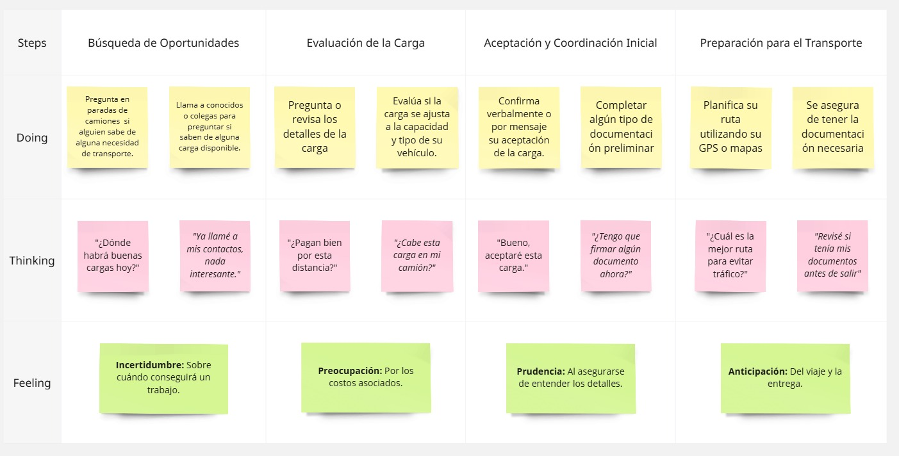

As-is Scenario Map 2 : Empresario Pesquero

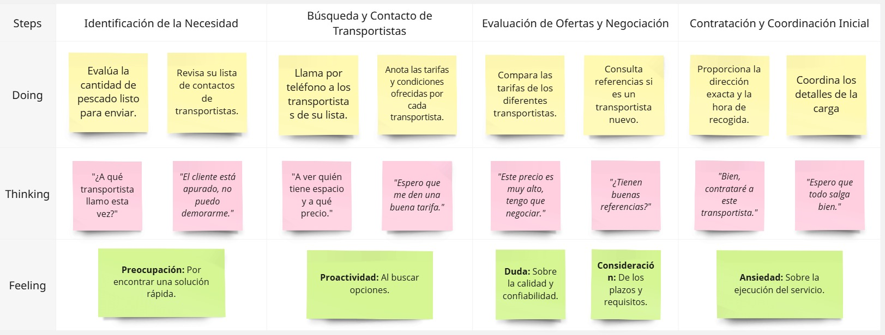

## 2.4. Ubiquitous Language

**Transportista :**

Definición: Es un usuario registrado en la aplicación con el rol de Transportista. Ofrece servicios de transporte de carga y puede gestionar las cargas aceptadas y completadas a través de la plataforma. El transportista indica la información de su vehículo, su disponibilidad, y puede aceptar o rechazar ofertas de envío. Recibe pagos a través de la aplicación y puede calificar a los Remitentes.
Sinónimos: Conductor, Camionero, Transportista de carga.

**Remitente :**

Definición: Es un usuario registrado en la aplicación con el rol de Remitente (en nuestro caso, un empresario pesquero). Publica necesidades de envío de productos pesqueros, especificando detalles como tipo de carga, volumen, destino y requisitos (ej. temperatura). Puede revisar ofertas de transportistas, seleccionar uno y realizar el pago a través de la aplicación. También puede calificar a los Transportistas.
Sinónimos: Cargador, Cliente (del transporte), Emisor (de la carga).

**Envío (Carga):**

Definición: Es una solicitud de transporte de mercancías publicada por un Remitente. Contiene detalles sobre la carga, el origen, el destino, los requisitos especiales (ej. refrigeración), el precio ofrecido (opcional) y los plazos. Es visible para los Transportistas que cumplan con los criterios.
Sinónimos: Oferta de carga, Solicitud de transporte, Trabajo (para el transportista).

**Oferta (de Transporte):**

Definición: Es la propuesta de un Transportista en respuesta a un Envío publicado por un Remitente. Incluye el precio que el transportista cobra por realizar el servicio y puede contener información adicional como tiempo estimado de entrega.
Sinónimos: Puja, Propuesta de precio, Cotización (del transportista).

**Viaje (Transporte):**

Definición: Es el servicio de transporte de una carga desde el origen hasta el destino, una vez que un Transportista ha aceptado la oferta de un Remitente. Incluye el estado del transporte (en curso, completado).
Sinónimos: Servicio de transporte, Ruta, Traslado.

**Estado del Envío:**

Definición: Es la información actualizada sobre la situación actual de un Viaje, incluyendo si la carga ha sido recogida, está en tránsito o ha sido entregada. El Transportista actualiza esta información a través de la aplicación.
Sinónimos: Seguimiento, Status del viaje.

**Calificación (Reseña):**

Definición: Es la evaluación y comentario que un usuario (Transportista o Remitente) realiza sobre la experiencia con la otra parte una vez completado el Viaje. Las calificaciones contribuyen a la reputación de los usuarios dentro de la plataforma.
Sinónimos: Puntuación, Valoración, Feedback.

## Capítulo III: Requirements Specification

### 3.1. To-Be Scenario Mapping

**Segmento de empresa de transportes**

Utiliza la aplicación para recibir solicitudes de envío por parte de clientes, ofrecer cotizaciones personalizadas y gestionar los datos logísticos de cada servicio. Este perfil busca flexibilidad en la fijación de precios y claridad en la comunicación con el cliente para brindar un servicio eficiente y seguro. El siguiente mapeo describe las fases, pensamientos y emociones que atraviesa durante el uso de la plataforma.(Ver figura 3.1)

  

<em>Figura 3.1: To-Be Scenario Mapping de la empresa de transporte.</em>

**Segmento de empresario pesquero**

Busca empresas de transporte confiables para enviar sus paquetes de forma segura y eficiente. Este perfil valora poder comparar opciones, tener claridad en los precios y recibir información específica sobre el transporte asignado. El siguiente mapeo muestra las fases, pensamientos y emociones que experimenta al utilizar la aplicación para solicitar y coordinar un servicio de transporte.(Ver figura 3.2)

  

<em>Figura 3.2: To-Be Scenario Mapping del empresario pesquero.</em>

**Enlace del To-Be Scenario Mapping:** [Ver en Miro](https://miro.com/app/board/uXjVID8wvf0=/?share_link_id=911528094729)

### 3.2. User Stories

<table>
<colgroup>
<col style="width: 20%" />
<col style="width: 20%" />
<col style="width: 20%" />
<col style="width: 20%" />
<col style="width: 20%" />
</colgroup>
<thead>
<tr>
<th style="text-align: left;">Epic/Story ID</th>
<th style="text-align: left;">Título</th>
<th style="text-align: left;">Descripción</th>
<th style="text-align: left;">Criterios de aceptación</th>
<th style="text-align: left;">Relacionado con (Epic ID)</th>
</tr>
<tr>
<th style="text-align: left;">E1</th>
<th style="text-align: left;">Diseño de la Lading Page</th>
<td style="text-align: left;">
<strong>Como</strong> Empresario 
pesquero o Empresa de transportes

<strong>Quiero</strong> ver una página web en la cual tenga
información del servicio que voy a utilizar

<strong>Para</strong> tener una vista más clara del servicio que nos
proporcionarán
</td>
<td style="text-align: left;"></td>
<td style="text-align: center;"></td>
</tr>
<tr>
<th style="text-align: left;">E1-US01</th>
<th style="text-align: left;">Barra de Navegación en la Landing
Page</th>
<td>
<strong>Como</strong> Empresario pesquero o Empresa de
transportes

<strong>Quiero</strong> ver una barra de navegación con una buena
estructura informática

<strong>Para</strong> poder acceder a las secciones más relevantes
del servicio
</td>
<td style="text-align: left;">

<strong>Escenario 1: El empresario pesquero o la empresa transportista accede a la landing page.</strong>

<strong>Dado que </strong>el usuario se encuentra en la Landing Page,

<strong>Cuando </strong>accede a la página,

<strong>Entonces </strong>la barra de navegación es visible en la parte superior de la página.

<strong>Escenario 2: El usuario navega a diferentes secciones.</strong>

<strong>Dado que </strong>el usuario se encuentra en la Landing Page,

<strong>Cuando </strong>hace clic en un enlace de la barra de navegación,

<strong>Entonces </strong>es dirigido a la sección correspondiente sin necesidad de recargar.

<strong>Escenario 3: El usuario visualiza la barra en diferentes dispositivos.</strong>

<strong>Dado que </strong>el usuario se encuentra en la Landing Page usando un dispositivo móvil o de escritorio,

<strong>Cuando </strong>visualiza la Landing Page,

<strong>Entonces </strong>la barra de navegación se ajusta de manera adecuada al tamaño de la pantalla, mostrando un menú desplegable en dispositivos móviles si es necesario.

</td>
<td style="text-align: center;">1</td>
</tr>
<tr>
<th style="text-align: left;">E1-US02</th>
<th style="text-align: left;">Información sobre el servicio
brindado</th>
<td>
<strong>Como</strong> Empresario pesquero o Empresa de
transportes

<strong>Quiero</strong> que al ingresar a la página web me muestre la
información de los servicios que me van a brindar

<strong>Para</strong> entender qué beneficios obtendré al usar la
aplicación web
</td>
<td style="text-align: left;">

<strong>Escenario 1: El usuario accede a la información sobre los beneficios del servicio.</strong>

<strong>Dado que </strong>el usuario está navegando en el sitio web,

<strong>Cuando </strong>accede a la sección de beneficios del servicio,

<strong>Entonces </strong>encuentra información clara y detallada sobre cómo el servicio puede beneficiarlo.

<strong>Escenario 2: El usuario comprende los beneficios del servicio.</strong>

<strong>Dado que </strong>el usuario está leyendo sobre los beneficios del servicio,

<strong>Cuando </strong>revisa la información proporcionada,

<strong>Entonces </strong>entiende cómo el servicio puede resolver sus problemas o mejorar sus procesos.

</td>
<td style="text-align: center;">1</td>
</tr>
<tr>
<th>E1-US03</th>
<th style="text-align: left;">Información sobre el procedimiento de uso
de la aplicación web</th>
<td>
<strong>Como</strong> Empresario pesquero o Empresa de
transportes

<strong>Quiero</strong> visualizar el procedimiento que tendría que
hacer para usar este servicio

<strong>Para</strong> así conocer el grado de satisfacción que tendre
al momento de usar la aplicación web
</td>
<td style="text-align: left;">

<strong>Escenario 1: El usuario visualiza el como se usa la aplicación web.</strong>

<strong>Dado que </strong>el usuario está navegando en el sitio web,

<strong>Cuando </strong>llega a la seccion de “Como Funciona”,

<strong>Entonces </strong>entiende mas sobre el funcionamiento de la aplicacion web.

</td>
<td style="text-align: center;">1</td>
</tr>
<tr>
<th>E1-US04</th>
<th style="text-align: left;">Conocer los testimonios de clientes
pasados</th>
<td>
<strong>Como</strong> Empresario pesquero o Empresa de
transportes

<strong>Quiero</strong> leer algunos testimonios de clientes
anteriores

<strong>Para</strong> evaluar la experiencia de otras
personas
</td>
<td style="text-align: left;">

<strong>Escenario 1: El usuario accede a testimonios visibles.</strong>

<strong>Dado que </strong>el usuario está navegando en el sitio web,

<strong>Cuando </strong>llega a la sección de testimonios de clientes,

<strong>Entonces </strong>ve claramente los testimonios destacados de clientes anteriores.

<strong>Escenario 2: El usuario evalúa el impacto de los testimonios.</strong>

<strong>Dado que </strong>el usuario está considerando contratar el servicio,

<strong>Cuando </strong>revisa los testimonios de clientes anteriores,

<strong>Entonces </strong>se siente más seguro en su decisión al ver que otros han tenido experiencias positivas y beneficios tangibles con el servicio.

</td>
<td style="text-align: center;">1</td>
</tr>
<tr>
<th>E1-US05</th>
<th style="text-align: left;">Conocer las ventajas de la aplicación
web</th>
<td>
<strong>Como</strong> Empresario pesquero o Empresa de
transportes

<strong>Quiero</strong> conocer las ventajas que tiene la aplicación
frente a otras aplicaciones similares

<strong>Para</strong> tomar la decisión de tomar o no el
servicio
</td>
<td style="text-align: left;">

<strong>Escenario 1: Visualización clara de beneficios destacados.</strong>

<strong>Dado que </strong>el usuario está navegando en la landing page,

<strong>Cuando </strong>ingrese a la sección de beneficios,

<strong>Entonces </strong>podrá visualizar una lista clara y detallada de las ventajas que ofrece la aplicación frente a otras plataformas.

<strong>Escenario 2: Comparativa visual de características.</strong>

<strong>Dado que </strong>el usuario desea comparar la aplicación con otras opciones del mercado,

<strong>Cuando </strong>acceda a la sección de ventajas,

<strong>Entonces </strong>podrá visualizar si los beneficios son mejores que la competencia

</td>
<td style="text-align: center;">1</td>
</tr>
<tr>
<th>E1-US06</th>
<th style="text-align: left;">Contacto</th>
<td>
<strong>Como</strong> Empresario pesquero o Empresa de
transportes

<strong>Quiero</strong> enviar una solicitud a los dueños de la
aplicación web

<strong>Para</strong> poder conocer más sobre su trabajo y/o que me
den más detalles de la misma
</td>
<td style="text-align: left;">

<strong>Escenario 1: Envío exitoso de solicitud de contacto.</strong>

<strong>Dado que </strong>el usuario ha llenado el formulario de contacto,

<strong>Cuando </strong>complete todos los campos requeridos y presione el botón de enviar,

<strong>Entonces </strong>el sistema debe confirmar que la solicitud fue enviada correctamente.

<strong>Escenario 2: Validación de campos obligatorios en el formulario de contacto.</strong>

<strong>Dado que </strong>el usuario desea enviar una solicitud de contacto,

<strong>Cuando </strong>intente enviar el formulario sin llenar todos los campos requeridos,

<strong>Entonces </strong>el sistema debe mostrar mensajes de error indicando qué campos faltan completar.

</td>
<td style="text-align: center;">1</td>
</tr>
<tr>
<th>E1-US07</th>
<th style="text-align: left;">Cambiar idiomas</th>
<td>
<strong>Como</strong> Empresario pesquero o Empresa de
transportes

<strong>Quiero</strong> cambiar el idioma de la página web de Inglés
al Español

<strong>Para</strong> así poder comprender el contenido
</td>
<td style="text-align: left;">

<strong>Escenario 1: Selección exitosa de idioma desde el menú.</strong>

<strong>Dado que </strong>el usuario visualiza la página en inglés,

<strong>Cuando </strong>seleccione la opción de idioma "Español" desde el menú de configuración o selector de idioma,

<strong>Entonces </strong>todo el contenido visible de la página debe actualizarse automáticamente en idioma español.

<strong>Escenario 2: Conservación de idioma en navegación.</strong>

<strong>Dado que </strong>el usuario ha cambiado el idioma a "Español",

<strong>Cuando </strong>snavegue a otra sección o página dentro del mismo sitio,

<strong>Entonces </strong>el idioma seleccionado debe mantenerse sin reiniciarse a inglés hasta que el usuario decida cambiarlo nuevamente.

</td>
<td style="text-align: center;">1</td>
</tr>
<tr>
<th>E2</th>
<th style="text-align: left;">Interfaz de acceso a la aplicación
web</th>
<td>
<strong>Como</strong> Empresario pesquero o Empresa de
transportes

<strong>Quiero</strong> registrarme a la aplicación web

<strong>Para</strong> identificar qué tipo de usuario soy
</td>
<td style="text-align: left;"></td>
<td style="text-align: center;"></td>
</tr>
<tr>
<th>E2-US08</th>
<th style="text-align: left;">Registro para de la empresa prestadora de
vehículos</th>
<td>
<strong>Como</strong> Empresa de transportes

<strong>Quiero</strong> llenar mi información

<strong>Para</strong> así darme a conocer
</td>
<td style="text-align: left;">

<strong>Escenario 1: Registro completo con información obligatoria.</strong>

<strong>Dado que </strong>la empresa de transportes desea registrarse en la plataforma,

<strong>Cuando </strong>complete todos los campos obligatorios del formulario de registro,

<strong>Entonces </strong>la aplicación debe validar los datos y permitir el registro exitoso.

<strong>Escenario 2: Confirmación visual de registro exitoso.</strong>

<strong>Dado que </strong>la empresa transportista ha completado correctamente el formulario de registro,

<strong>Cuando </strong>haga clic en el botón "Registrar" y los datos sean validados sin errores,

<strong>Entonces </strong>la aplicación debe mostrar una notificación o mensaje emergente que confirme que el registro fue exitoso.

</td>
<td style="text-align: center;">2</td>
</tr>
<tr>
<th>E2-US09</th>
<th style="text-align: left;">Registro para el empresario pesquero</th>
<td>
<strong>Como</strong> Empresario pesquero

Quiero llenar mi información

<strong>Para</strong> luego tener comunicación con la empresa
prestadora de vehículos
</td>
<td style="text-align: left;">

<strong>Escenario 1: Registro completo con información obligatoria.</strong>

<strong>Dado que </strong>el empresario pesquero desea registrarse en la plataforma,

<strong>Cuando </strong>complete todos los campos obligatorios del formulario de registro(Correo personal, contraseña),

<strong>Entonces </strong>la aplicación registrará sus datos de manera exitosa.

<strong>Escenario 2: Confirmación visual de registro exitoso.</strong>

<strong>Dado que </strong>el empresario pesquero ha completado correctamente el formulario de registro,

<strong>Cuando </strong>haga clic en el botón "Registrar" y los datos sean validados sin errores,

<strong>Entonces </strong>la aplicación debe mostrar una notificación o mensaje emergente que confirme que el registro fue exitoso.

</td>
<td style="text-align: center;">2</td>
</tr>
<tr>
<th>E2-US10</th>
<th style="text-align: left;">Ingreso a la aplicación</th>
<td>
<strong>Como</strong> Empresario pesquero o Empresa de
transportes

<strong>Quiero</strong> ingresar mis datos

<strong>Para</strong> empezar a hacer uso de la aplicación
web
</td>
<td style="text-align: left;">

<strong>Escenario 1: Ingreso correcto con credenciales válidas.</strong>

<strong>Dado que </strong>el empresario pesquero o empresa de transportes ya tiene una cuenta registrada,

<strong>Cuando </strong>ingresa su correo electrónico y contraseña correctamente en el formulario de inicio de sesión,

<strong>Entonces </strong>la aplicación debe permitir el acceso a su panel principal según su tipo de usuario.

<strong>Escenario 2: Mensaje de error al ingresar datos incorrectos.</strong>

<strong>Dado que </strong>el empresario pesquero o empresa de transportes ingresa sus datos en el formulario de inicio,

<strong>Cuando </strong>introduzca un correo o contraseña incorrecta,

<strong>Entonces </strong>la aplicación debe mostrar un mensaje de error claro indicando que las credenciales son inválidas.

</td>
<td style="text-align: center;">2</td>
</tr>
<tr>
<th style="text-align: left;">E3</th>
<th style="text-align: left;">Interfaz clara e intuitiva para el
empresario pesquero</th>
<td>
<strong>Como</strong> Empresario pesquero

<strong>Quiero</strong> poder comprender e interactuar con el
servicio que la aplicación web me está proporcionando

<strong>Para</strong> así poder generar mis solicitudes de una manera
clara y correcta sin temor a equivocación
</td>
<td style="text-align: left;"></td>
<td style="text-align: center;"></td>
</tr>
<tr>
<th style="text-align: left;">E3-US11</th>
<th style="text-align: left;">Seccion de busqueda</th>
<td>
<strong>Como</strong> Empresario pesquero

<strong>Quiero</strong> poder realizar búsquedas por distritos

<strong>Para</strong> así poder filtrar la búsqueda de empresas de
transportes
</td>
<td style="text-align: left;">

<strong>Escenario 1: Búsqueda exitosa por distrito.</strong>

<strong>Dado que </strong>el empresario pesquero accede a la sección de búsqueda de empresas de transportes,

<strong>Cuando </strong>ingresa el nombre de un distrito en el campo de búsqueda y ejecuta la búsqueda,

<strong>Entonces </strong>el sistema debe mostrar únicamente las empresas de transporte que operan en el distrito seleccionado.

<strong>Escenario 2: Mensaje cuando no hay resultados para un distrito en específico.</strong>

<strong>Dado que </strong>el empresario pesquero realiza una búsqueda por distrito,

<strong>Cuando </strong>ingresa un distrito donde no hay empresas registradas,

<strong>Entonces </strong>el sistema debe mostrar un mensaje indicando que no se encontraron resultados para ese distrito.

</td>
<td style="text-align: center;">3</td>
</tr>
<tr>
<th style="text-align: left;">E3-US12</th>
<th style="text-align: left;">Información de la empresa</th>
<td>
<strong>Como</strong> Empresario pesquero

<strong>Quiero</strong> observar información de la empresa de
transporte luego de la búsqueda

<strong>Para</strong> así poder elegir la que mejor me
convenga
</td>
<td style="text-align: left;">

<strong>Escenario 1: Visualización de información detallada de la empresa.</strong>

<strong>Dado que </strong>el empresario pesquero ha realizado una búsqueda de empresas de transporte,

<strong>Cuando </strong>selecciona una empresa de la lista de resultados,

<strong>Entonces </strong>la aplicación debe mostrar información detallada como: nombre de la empresa, descripción breve, distritos de entrega, foto entre otros.

<strong>Escenario 2: Visualización de información resumida desde la lista de resultados.</strong>

<strong>Dado que </strong>el empresario pesquero ha realizado una búsqueda de empresas de transporte,

<strong>Cuando </strong>observa la lista de resultados,

<strong>Entonces </strong>cada empresa debe mostrar de forma resumida su nombre, una breve descripción, distritos de entrega y una imagen representativa antes de que el usuario acceda al detalle completo.

</td>
<td style="text-align: center;">3</td>
</tr>
<tr>
<th style="text-align: left;">E3-US13</th>
<th style="text-align: left;">Solicitar el servicio a la empresa
prestadora de vehículos</th>
<td>
<strong>Como</strong> Empresario pesquero

<strong>Quiero</strong> poder seleccionar la empresa de transporte
adecuada

<strong>Para</strong> así poder brindar la información necesaria para
que realice mi servicio
</td>
<td style="text-align: left;">

<strong>Escenario 1: Selección de la empresa de transporte desde los resultados de búsqueda.</strong>

<strong>Dado que </strong>el empresario pesquero ha realizado una búsqueda y ha encontrado varias empresas,

<strong>Cuando </strong>selecciona una o varias empresas de transporte de la lista,

<strong>Entonces </strong>el sistema debe redirigirlo a un formulario donde pueda ingresar la información detallada de su solicitud de servicio.

<strong>Escenario 2: Llenado de formulario con los datos del paquete.</strong>

<strong>Dado que </strong>el empresario pesquero ha seleccionado la empresa de transporte y ha sido redirigido al formulario de solicitud,

<strong>Cuando </strong>el empresario rellena los campos correspondientes a las dimensiones, cantidad y peso del paquete,

<strong>Entonces </strong>el sistema debe permitirle ingresar los datos de manera correcta y debe validar que todos los campos obligatorios estén completos antes de enviar la solicitud.

<strong>Escenario 3: Confirmación de envío de la solicitud de servicio.</strong>

<strong>Dado que </strong>el empresario pesquero ha completado el formulario de solicitud para una empresa de transporte,

<strong>Cuando </strong> envía la información,

<strong>Entonces </strong>el sistema debe mostrar una notificación o mensaje de confirmación indicando que la solicitud fue enviada correctamente.

</td>
<td style="text-align: center;">3</td>
</tr>
<tr>
<th style="text-align: left;">E3-US14</th>
<th style="text-align: left;">Gestionar solicitudes enviadas</th>
<td>
<strong>Como</strong> Empresario pesquero

<strong>Quiero</strong> tener un apartado en el cual pueda ver las
solicitudes que hice

<strong>Para</strong> poder gestionar los precios que me ofrecieron
por el servicio que deseo
</td>
<td style="text-align: left;">

<strong>Escenario 1: Visualización de solicitudes enviadas.</strong>

<strong>Dado que </strong>el empresario pesquero ha enviado varias solicitudes a diferentes empresas de transporte,

<strong>Cuando </strong>accede a la sección de "Solicitudes enviadas" en su cuenta,

<strong>Entonces </strong>el sistema debe mostrar una lista con todas las solicitudes previas, con detalles como la empresa seleccionada, estado de la solicitud (aceptada, pendiente, rechazada) y precio ofrecido por cada una.

<strong>Escenario 2: Gestión de precios ofrecidos.</strong>

<strong>Dado que </strong>el empresario pesquero ha recibido varias ofertas de precios de diferentes empresas,

<strong>Cuando </strong>accede a una solicitud enviada y revisa los precios ofrecidos,

<strong>Entonces </strong>el sistema debe permitirle aceptar o rechazar las ofertas según lo desee.

<strong>Escenario 3: Aceptar una sola oferta entre varias solicitadas.</strong>

<strong>Dado que </strong>el empresario pesquero ha solicitado el servicio de varias empresas de transporte y ha recibido varias ofertas,

<strong>Cuando </strong>accede a la sección de "Solicitudes enviadas" y revisa las ofertas,

<strong>Entonces </strong>el sistema debe permitirle aceptar solo una oferta, y una vez aceptada, las otras ofertas deben marcarse como rechazadas automáticamente.

</td>
<td style="text-align: center;">3</td>
</tr>
<tr>
<th style="text-align: left;">E3-US15</th>
<th style="text-align: left;">Pagar a la empresa seleccionada</th>
<td>
<strong>Como</strong> Empresario pesquero

<strong>Quiero</strong> pagar el servicio que haya seleccionado

<strong>Para</strong> así confirmarle a la empresa de transporte que
estoy de acuerdo con su cotización
</td>
<td style="text-align: left;">

<strong>Escenario 1: Realizar el pago del servicio seleccionado.</strong>

<strong>Dado que </strong>el empresario pesquero ha aceptado una oferta de una empresa de transporte,

<strong>Cuando </strong>decide proceder con el pago,

<strong>Entonces </strong>el sistema debe permitirle realizar el pago utilizando su método de pago preferido (tarjeta de crédito, transferencia, etc.)

<strong>Escenario 2: Notificación de un pago exitoso.</strong>

<strong>Dado que </strong>el empresario pesquero ya pagó por el servicio,

<strong>Cuando </strong>la transacción es procesada correctamente,

<strong>Entonces </strong>el sistema debe notificar al empresario pesquero que el pago fue exitoso.

</td>
<td style="text-align: center;">3</td>
</tr>
<tr>
<th style="text-align: left;">E3-US16</th>
<th style="text-align: left;">Obtener información del vehículo
repartidor</th>
<td>
<strong>Como</strong> Empresario pesquero

<strong>Quiero</strong> tener la información del vehículo que
enviarán mi producto

<strong>Para</strong> así poder tener un seguimiento de sus
datos
</td>
<td style="text-align: left;">

<strong>Escenario 1: Visualización de la información del vehículo asignado.</strong>

<strong>Dado que </strong>el empresario pesquero ha solicitado el servicio de transporte,

<strong>Cuando </strong>se le asigna un vehículo para la entrega,

<strong>Entonces </strong>el sistema debe mostrar la información completa del vehículo, incluyendo el modelo, la placa y el nombre del conductor.

</td>
<td style="text-align: center;">3</td>
</tr>
<tr>
<th style="text-align: left;">E4</th>
<th>Interfaz clara e intuitiva para la empresa prestadora de
vehículos</th>
<td>
<strong>Como</strong> Empresa de transportes

<strong>Quiero</strong> poder comprender e interactuar con el
servicio que la aplicación web me está proporcionando

<strong>Para</strong> así poder generar las solicitudes de una manera
clara y correcta sin temor a equivocación
</td>
<td style="text-align: left;"></td>
<td style="text-align: center;"></td>
</tr>
<tr>
<th style="text-align: left;">E4-US17</th>
<th style="text-align: left;">Gestión de solicitudes recibidas</th>
<td>
<strong>Como</strong> Empresa de
transportes

<strong>Quiero</strong> observar los detalles de la información de
los empresarios pesqueros

<strong>Para</strong> poder aceptar y gestionar una cotización o
rechazar la solicitud
</td>
<td style="text-align: left;">

<strong>Escenario 1: Visualización de detalles de la solicitud.</strong>

<strong>Dado que </strong>soy una empresa de transportes con solicitudes recibidas de empresarios pesqueros,

<strong>Cuando </strong>accedo a la sección de "Solicitudes recibidas" en la plataforma,

<strong>Entonces </strong>debo poder ver toda la información relevante de la solicitud, como el nombre del empresario, tipo de producto, cantidad, lugar de recogida y entrega, y fecha.

<strong>Escenario 2: Aceptar o rechazar la solicitud.</strong>

<strong>Dado que </strong>estoy revisando una solicitud de una empresa pesquera,

<strong>Cuando </strong>presiono los botones "Aceptar" o "Rechazar" en la solicitud correspondiente,

<strong>Entonces </strong>el sistema debe actualizar el estado de la solicitud y reflejar mi decisión correctamente en el panel de control del cliente.

</td>
<td style="text-align: center;">4</td>
</tr>
<tr>
<th style="text-align: left;">E4-US18</th>
<th style="text-align: left;">Gestión de pagos</th>
<td>
<strong>Como</strong> Empresa de transportes

<strong>Quiero</strong> realizar un seguimiento de quien realizo el
pago o cancelo el servicio

<strong>Para</strong> poder continuar con el proceso del servicio a
prestar
</td>
<td style="text-align: left;">

<strong>Escenario 1: Visualizar estado de pago.</strong>

<strong>Dado que </strong>soy una empresa de transportes con servicios solicitados por empresas pesqueras,

<strong>Cuando </strong>accedo al historial o listado de servicios en la sección de pagos de la plataforma,

<strong>Entonces </strong>edebo poder visualizar si el servicio fue pagado o cancelado.

</td>
<td style="text-align: center;">4</td>
</tr>
<tr>
<th style="text-align: left;">E4-US19</th>
<th style="text-align: left;">Enviar información del vehículo hacia el
empresario pesquero</th>
<td>
<strong>Como</strong> Empresa de transportes

<strong>Quiero</strong> enviar informacion necesaria del vehículo

<strong>Para</strong> que el empresario pesquero pueda gestionar la
entrega
</td>
<td style="text-align: left;">

<strong>Escenario 1: Enviar información del vehículo después de aceptar la solicitud.</strong>

<strong>Dado que </strong>he aceptado una solicitud de transporte realizada por una empresa pesquera,

<strong>Cuando </strong>accedo a la solicitud aceptada desde el panel de gestión de servicios,

<strong>Entonces </strong>debo poder completar y enviar los datos del vehículo asignado (marca, modelo, placa, nombre y contacto del conductor).

<strong>Escenario 2: Confirmación del envío de información.</strong>

<strong>Dado que </strong>he enviado correctamente la información del vehículo a la empresa pesquera,

<strong>Cuando </strong>presiono el botón de "Enviar información del vehículo" en la plataforma,

<strong>Entonces </strong>el sistema debe mostrarme una confirmación visual del envío exitoso.

</td>
<td style="text-align: center;">4</td>
</tr>
<tr>
<th style="text-align: left;">E5</th>
<th style="text-align: left;">Backend Api</th>
<td>
<strong>Como</strong> desarrollador

<strong>Quiero</strong> utilizar la API de un servicio de backend

<strong>Para</strong> que el usuario pueda usar la
aplicación
</td>
<td style="text-align: left;"></td>
<td style="text-align: center;"></td>
</tr>
<tr>
<th style="text-align: left;">E5-US20</th>
<th style="text-align: left;">Agregar una empresa prestadora de
vehículos</th>
<td><strong>Como</strong> desarrollador

<strong>Quiero</strong> agregar una empresa de transporte a través
del backend

<strong>Para</strong> que esté disponible para la empresa
pesquera
</td>
<td style="text-align: left;">

<strong>Escenario 1: Registro exitoso de empresa de transporte.</strong>

<strong>Dado que </strong>tengo acceso al backend y cuento con los datos necesarios de una empresa prestadora de vehículos,

<strong>Cuando </strong>envío una solicitud POST con los datos completos al endpoint correspondiente,

<strong>Entonces </strong>la API debe permitir almacenar la información de la empresa correctamente en la base de datos.

</td>
<td style="text-align: center;">5</td>
</tr>
<tr>
<th style="text-align: left;">E5-US21</th>
<th style="text-align: left;">Agregar solicitud del empresario
pesquero</th>
<td>
<strong>Como</strong> desarrollador

<strong>Quiero</strong> agregar los datos de la solicitud de la
empresa pesquera mediante el backend

<strong>Para</strong> que la empresa de transporte pueda utilizar
esos datos
</td>
<td style="text-align: left;">

<strong>Escenario 1: Registro exitoso de la solicitud de transporte.</strong>

<strong>Dado que </strong>tengo acceso al backend y recibo los datos de una solicitud generada por una empresa pesquera,

<strong>Cuando </strong>realizo una petición POST con información como: nombre del empresario, tipo de producto, cantidad, origen, destino y fecha de envío,

<strong>Entonces </strong>la API debe permitir guardar correctamente los datos de la solicitud en la base de datos.

</td>
<td style="text-align: center;">5</td>
</tr>
<tr>
<th style="text-align: left;">E5-US22</th>
<th style="text-align: left;">Gestionar usuarios</th>
<td>
<strong>Como</strong> desarrollador

<strong>Quiero</strong> gestionar usuarios a través del backend

<strong>Para</strong> poder controlar el acceso y permisos de cada
usuario en el sistema
</td>
<td style="text-align: left;">

<strong>Escenario 1: Creación y registro de usuarios con rol asignado.</strong>

<strong>Dado que </strong>tengo acceso al backend y recibo los datos de registro de un nuevo usuario,

<strong>Cuando </strong>realizo una solicitud POST al endpoint de usuarios con los datos correspondientes,

<strong>Entonces </strong>la API debe permitir registrar al usuario junto con su rol (por ejemplo: empresa pesquera o empresa de transporte).

</td>
<td style="text-align: center;">5</td>
</tr>
</thead>
<tbody>
</tbody>
</table>

### 3.3. Impact Mapping

**Segmento de empresa de transportes**

El siguiente Impact Mapping muestra de manera clara cómo las empresas de transporte logran organizar sus procesos dentro de la aplicación, permitiendo definir precios, gestionar solicitudes y brindar confianza a sus clientes mediante la asignación de vehículos y conductores. Esta herramienta ayuda a visualizar las funcionalidades clave que permitirán a las empresas ofrecer un servicio seguro y eficiente.(Ver figura 3.3)

  

<em>Figura 3.3: Impact Mapping del segmento de Empresa de Transportes.</em>

**Segmento de empresario pesquero**

A continuación, se presenta el Impact Mapping enfocado en los empresarios pesqueros, que buscan seleccionar de forma segura y rápida a empresas de transporte confiables para el envío de sus productos. Este mapeo permite identificar las funcionalidades necesarias para mejorar su experiencia en la búsqueda, selección y mayor manejo en el cuidado de sus paquetes.(Ver figura 3.4)

  

<em>Figura 3.4: Impact Mapping del segmento de Empresario pesquero.</em>

### 3.4. Product Backlog

<table border="1">
  <tr>
    <th>#Order</th>
    <th>User Story ID</th>
    <th>Titúlo</th>
    <th>Descripción</th>
    <th>Story Points</th>
  </tr>
  <tr>
    <td align="center">1</td>
    <td>E3-US11</td>
    <td>Sección de búsqueda</td>
    <td>Como Empresario pesquero quiero poder realizar búsquedas por distritos para así poder filtrar la búsqueda de empresas de transportes</td>
    <td align="center">8</td>
  </tr>
  <tr>
    <td align="center">2</td>
    <td>E3-US13</td>
    <td>Solicitar el servicio a la empresa prestadora de vehículos</td>
    <td>Como Empresario pesquero quiero poder seleccionar la empresa de transporte adecuada para así poder brindar la información necesaria para que realice mi servicio</td>
    <td align="center">8</td>
  </tr>
  <tr>
    <td align="center">3</td>
    <td>E3-US14</td>
    <td>Gestionar solicitudes enviadas</td>
    <td>Como Empresario pesquero quiero tener un apartado en el cual pueda ver las solicitudes que hice para poder gestionar los precios que me ofrecieron por el servicio que deseo</td>
    <td align="center">8</td>
  </tr>
  <tr>
    <td align="center">4</td>
    <td>E4-US18</td>
    <td>Gestión de pagos</td>
    <td>Como Empresa de transportes quiero realizar un seguimiento de quien realizo el pago o cancelo el servicio para poder continuar con el proceso del servicio a prestar</td>
    <td align="center">8</td>
  </tr>
  <tr>
    <td align="center">5</td>
    <td>E4-US19</td>
    <td>Enviar información del vehículo hacia el empresario pesquero</td>
    <td>Como Empresa de transportes quiero enviar informacion necesaria del vehículo para que el empresario pesquero pueda gestionar la entrega</td>
    <td align="center">8</td>
  </tr>
  <tr>
    <td align="center">6</td>
    <td>E2-US08</td>
    <td>Registro para de la empresa prestadora de vehículos</td>
    <td>Como Empresa de transportes quiero llenar mi información para así darme a conocer</td>
    <td align="center">5</td>
  </tr>
  <tr>
    <td align="center">7</td>
    <td>E2-US09</td>
    <td>Registro para de el empresario pesquero</td>
    <td>Como Empresario pesquero quiero llenar mi información para luego tener comunicación con la empresa prestadora de vehículos</td>
    <td align="center">5</td>
  </tr>
  <tr>
    <td align="center">8</td>
    <td>E3-US15</td>
    <td>Pagar a la empresa seleccionada</td>
    <td>Como Empresario pesquero quiero pagar el servicio que haya seleccionado para así confirmarle a la empresa de transporte que estoy de acuerdo con su cotización</td>
    <td align="center">5</td>
  </tr>
  <tr>
    <td align="center">9</td>
    <td>E3-US16</td>
    <td>Obtener información del vehículo repartidor</td>
    <td>Como Empresario pesquero quiero tener la información del vehículo que enviarán mi producto para así poder tener un seguimiento de sus datos</td>
    <td align="center">5</td>
  </tr>
  <tr>
    <td align="center">10</td>
    <td>E4-US17</td>
    <td>Gestión de solicitudes recibidas</td>
    <td>Como Empresa de transportes quiero observar los detalles de la información de los empresarios pesqueros para poder aceptar y gestionar una cotización o rechazar la solicitud</td>
    <td align="center">5</td>
  </tr>
  <tr>
    <td align="center">11</td>
    <td>E1-US01</td>
    <td>Barra de Navegación en la Landing Page</td>
    <td>Como Empresario pesquero o Empresa de transportes quiero ver una página web en la cual tenga información del servicio que voy a utilizar para tener una vista más clara del servicio que nos proporcionarán</td>
    <td align="center">3</td>
  </tr>
  <tr>
    <td align="center">12</td>
    <td>E1-US02</td>
    <td>Información sobre el servicio brindado</td>
    <td>Como Empresario pesquero o Empresa de transportes quiero que al ingresar a la página web me muestre la información de los servicios que me van a brindar para entender qué beneficios obtendré al usar la aplicación web</td>
    <td align="center">3</td>
  </tr>
  <tr>
    <td align="center">13</td>
    <td>E1-US05</td>
    <td>Conocer las ventajas de la aplicación web</td>
    <td>Como Empresario pesquero o Empresa de transportes quiero conocer las ventajas que tiene la aplicación frente a otras aplicaciones similares para tomar la decisión de tomar o no el servicio</td>
    <td align="center">3</td>
  </tr>
  <tr>
    <td align="center">14</td>
    <td>E3-US12</td>
    <td>Información de la empresa</td>
    <td>Como Empresario pesquero quiero observar información de la empresa de transporte luego de la búsqueda para así poder elegir la que mejor me convenga</td>
    <td align="center">3</td>
  </tr>
  <tr>
    <td align="center">15</td>
    <td>E5-US20</td>
    <td>Agregar una empresa prestadora de vehículos</td>
    <td>Como desarrollador quiero agregar una empresa de transporte a través del backend para que esté disponible para la empresa pesquera</td>
    <td align="center">3</td>
  </tr>
  <tr>
    <td align="center">16</td>
    <td>E5-US21</td>
    <td>Agregar solicitud del empresario pesquero</td>
    <td>Como desarrollador quiero agregar los datos de la solicitud de la empresa pesquera mediante el backend para que la empresa de transporte pueda utilizar esos datos</td>
    <td align="center">3</td>
  </tr>
  <tr>
    <td align="center">17</td>
    <td>E5-US22</td>
    <td>Gestionar usuarios</td>
    <td>Como desarrollador quiero gestionar usuarios a través del backend para poder controlar el acceso y permisos de cada usuario en el sistema</td>
    <td align="center">3</td>
  </tr>
  <tr>
    <td align="center">18</td>
    <td>E1-US04</td>
    <td>Conocer los testimonios de clientes pasados</td>
    <td>Como Empresario pesquero o Empresa de transportes quiero leer algunos testimonios de clientes anteriores para evaluar la experiencia de otras personas</td>
    <td align="center">2</td>
  </tr>
    <tr>
    <td align="center">19</td>
    <td>E1-US06</td>
    <td>Contacto</td>
    <td>Como Empresario pesquero o Empresa de transportes quiero enviar una solicitud a los dueños de la aplicación web para poder conocer más sobre su trabajo y/o que me den más detalles de la misma</td>
    <td align="center">2</td>
  </tr>
  <tr>
    <td align="center">20</td>
    <td>E2-US10</td>
    <td>Ingreso a la aplicación</td>
    <td>Como Empresario pesquero o Empresa de transportes quiero ingresar mis datos para empezar a hacer uso de la aplicación web</td>
    <td align="center">2</td>
  </tr>
  <tr>
    <td align="center">21</td>
    <td>E1-US03</td>
    <td>Información sobre el procedimiento de uso de la aplicación web</td>
    <td>Como Empresario pesquero o Empresa de transportes quiero visualizar el procedimiento que tendría que hacer para usar este servicio para así conocer el grado de satisfacción que tendre al momento de usar la aplicación web</td>
    <td align="center">1</td>
  </tr>
    <tr>
    <td align="center">22</td>
    <td>E1-US07</td>
    <td>Cambiar idiomas</td>
    <td>Como Empresario pesquero o Empresa de transportes quiero cambiar el idioma de la página web de Inglés al Español para así poder comprender el contenido</td>
    <td align="center">1</td>
  </tr>
</table>

## Capítulo IV: Product Design

### 4.1. Style Guidelines

#### 4.1.1. General Style Guidelines

**Branding**

Hemos seleccionado el nombre "**PescaGo**" junto con un logo que representa un barco pesquero estilizado.
El logo ha sido elegido porque simboliza de manera directa y visual la esencia de la actividad que la aplicación busca facilitar: el transporte y comercio relacionado con la pesca.
El barco es un ícono universalmente reconocido en el sector pesquero, lo que permite que tanto empresarios del rubro como empresas de transporte se identifiquen fácilmente con la plataforma.

El nombre "PescaGo" combina dos conceptos clave:
"Pesca", que remite directamente al sector pesquero, principal público objetivo de la plataforma.
Y "Go", que en inglés significa “en movimiento”, sugiriendo rapidez y eficiencia, atributos esenciales de la aplicación, que busca conectar empresas de transporte con empresarios pesqueros de forma ágil y segura. (ver figura 4.1)

  

<em>Figura 4.1: Logo de PescaGo.</em>

**Tipografías**

Títulos:

Se utilizó la tipografía Inria Sans en sus variantes Bold, Regular y Light para los títulos, ya que esta fuente transmite claridad visual, permitiendo que la información este ordenada y tenga un estilo profesional a la estructura de la plataforma. (Ver figura 4.2)

  

<em>Figura 4.2: Topografía de los titulos.</em>

Botones:

Se utilizo estos estilos de botones, sencillo y claros para que el usuario se puede sentir a gusto con la plataforma. (Ver figura 4.3)

  

<em>Figura 4.3: Diferentes estilos de los botones.</em>

Parráfos:

En los párrafos se optó por la tipografía Inria Sans en su estilo Regular, ya que ofrece una lectura fluida y cómoda, facilitando la comprensión del contenido. (Ver figura 4.4)

  

<em>Figura 4.4: Topografía de los parráfos.</em>

Iconos:

Se usaron estos iconos para una mejor comprensición de las funcionalidades que ofrece la plataforma. (Ver figura 4.5)

  

<em>Figura 4.5: Diferentes estilos de los iconos .</em>

Colores:

Se eligieron tonos de azul, combinando matices claros y oscuros, porque el azul transmite confianza, seguridad y frescura, valores esenciales en el rubro de transporte y pesca. (Ver figura 4.6)

  

<em>Figura 4.6: Paleta de colores .</em>

#### 4.1.2. Web Style Guidelines

En el diseño web de PescaGo se ha adoptado una línea visual limpia y moderna que transmite confianza y cercanía, valores esenciales en el sector pesquero y logístico. La paleta de colores utiliza tonos azules, que evocan el mar y generan tranquilidad, combinando variantes claras y oscuras para lograr contraste y guiar la atención del usuario. Se ha seleccionado la tipografía Inria Sans por su estilo versátil y legible, usando pesos bold, regular y light para diferenciar jerarquías de información, facilitando la comprensión del contenido. Los botones y formularios mantienen un estilo uniforme y simple, ayudando al usuario a completar sus tareas sin distracciones. Esta combinación de elementos visuales busca ofrecer una experiencia profesional, clara y accesible, adecuada tanto para empresarios pesqueros como para empresas de transporte.

### 4.2. Information Architecture

#### 4.2.1. Organization Systems

Para lograr una navegación intuitiva y una estructura de contenido clara en las experiencia web de PescaGo, hemos optado por aplicar diferentes sistemas de organización según el tipo de información que se presenta. A continuación, se detallan las decisiones adoptadas:

**Organización visual del contenido**

1. **Visual Hierarchy:**

   Se utiliza en páginas clave como la Landing Page, el panel de control del usuario, la sección de búsqueda de servicios y el seguimiento de envíos. Esta estructura permite resaltar la información más importante mediante títulos grandes en Inria Sans Bold, contrastes de color azul y una disposición visual que guía al usuario hacia las acciones prioritarias.

2. **Step-by-Step:**

   Se aplica en procesos como el registro de usuarios, la solicitud de transporte, la creación de rutas y la generación de órdenes. Aquí, la información se presenta paso a paso, ayudando al usuario a completar tareas mediante formularios claros y botones sencillos, diseñados para una experiencia sin distracciones.

3. **Matricial:**

   Está presente en secciones donde el usuario necesita comparar información, como el historial de envíos, opciones de transporte y reportes estadísticos. Mediante tablas, íconos representativos y etiquetas claras, lo cual, facilita el análisis visual simultáneo de múltiples elementos.

**Esquemas de categorización del contenido**

1. **Alfabético:**

   Se utiliza en listados como empresas de transporte, rutas disponibles o productos registrados. Esta forma de organización permite búsquedas rápidas y efectivas cuando el usuario ya tiene una referencia textual clara.

2. **Cronológico:**

   Se emplea en el historial de pedidos, entregas, actualizaciones y actividad reciente del usuario. Presentar la información en orden temporal facilita el seguimiento de acciones pasadas y la revisión de eventos recientes de manera eficiente.

3. **Por tópicos:**

   Se implementa en la sección de ayuda, artículos informativos, donde el contenido se agrupa por temas como logística, seguridad o recomendaciones del sector pesquero. Esta clasificación permite una navegación enfocada según los intereses del usuario.

4. **Según audiencia:**

   La plataforma distingue entre perfiles como empresarios pesqueros y empresas de transporte. Cada uno accede a una interfaz personalizada con contenido y funcionalidades adaptadas a sus necesidades específicas, mejorando la experiencia de uso.

#### 4.2.2. Labeling Systems

Dentro de la plataforma de PescaGo el sistema de etiquetado ha sido diseñado con un enfoque simple, claro y familiar, para asegurar que los usuarios puedan enteder y navegar en la platafoma sin dificultad. Las etiquetas que se van a emplear utilizan un lenguaje directo, con un número mínimo de palabras, priorizando la comprensión rápida en la aplicación web.

En las **etiquetas de navegación principales** seleccionadas tenemos las etiquetas de _Inicio_, _Buscar transporte_, _Mis pedidos_, _Mi cuenta_, _Ayuda_ y _Cerrar sesión_. Estas etiquetas fueron seleccionadas, ya que son las más comunes y para los usuarios será de fácil identificación.

Dentro de las **etiquetas para formularios** seleccionadas tenemos etiquetas como _Nombre_, _Correo electrónico_, _Tipo de carga_, _Fecha de envío_, _Destino_, _Agregar ruta_, _Confirmar_ o _Cancelar_. Se evita el uso de frases largas o ambiguas, facilitando una experiencia fluida en cada paso del proceso.

Las **etiquetas para secciones de usuarios** que seleccionamos son _Pedidos activos_, _Historial de envíos_, _Estadísticas_, _Rutas registradas_ o _Notificaciones_, las cuales nos permiten una organización clara de las secciones internas.

Por último, hemos considerado las **etiquetas por rol de usuario**. Por ejemplo, los transportistas encontrarán etiquetas como _Ofertas recibidas_, _Ruta asignada_ y _Registrar disponibilidad_, mientras que los empresarios pesqueros verán opciones como _Solicitar transporte_ o _Ver entregas_. Esta diferenciación permite personalizar la experiencia según el perfil del usuario.

#### 4.2.3. SEO Tags and Meta Tags

Para garantizar que PescaGo sea fácilmente encontrado por motores de búsqueda y que su presentación en los resultados de búsqueda sea clara y atractiva, se han definido etiquetas SEO y metaetiquetas específicas tanto para la Landing Page como para la Web Application. Estas etiquetas ayudan a mejorar el posicionamiento orgánico (SEO), incrementar la visibilidad en línea y transmitir confianza a los usuarios desde el primer contacto.

### Landing Page

PescaGo: Plataforma de Transporte y Comercio Pesquero

**Meta Description:**

PescaGo optimiza la logística de tus productos marinos conectando a transportistas especializados con emprendedores del sector pesquero.

**Meta Keywords:**

Pesca, Transporte pesquero, Logística marítima, Envíos pesqueros, Plataforma pesquera, Conectar transporte pesca, PescaGo Perú, Comercio pesquero digital

### Web Application

PescaGo: Panel de Usuario - Gestión de Envíos y Rutas

**Meta Description:**

Accede a tu cuenta en PescaGo para gestionar envíos, registrar rutas, recibir notificaciones y optimizar tu operación logística en el sector pesquero.

**Meta Keywords:**

Gestión de envíos, Transporte marítimo, Logística pesquera, Rutas, Plataforma logística, Seguimiento de envíos

#### 4.2.4. Searching Systems

En lo que respeta a los sistemas de búsqueda, PescaGo ha sido diseñado para ofrecer una experiencia de búsqueda intuitiva y eficaz.

Para los empresarios, esta implementación está enfocada directamente para la búsqueda de empresas transportistas y utilizar los filtros para luego visualizar toda la información mediante Cards visuales. Dentro de estas Cards se observará información como el **Nombre de la empresa**, **Descripción de la Empresa** y los distritos de cobertura.

  

<em>Figura 4.7: Captura del boceto de búsqueda de empresas transportistas.</em>

  

<em>Figura 4.8: Captura del boceto de lista de Cards con información de empresas de transporte.</em>

#### 4.2.5. Navigation Systems

**Para Empresarios Pesqueros**

El sistema de navegación para empresarios pesqueros está diseñado con una estructura clara y eficiente. En la parte superior de la pantalla se encuentra una barra de navegación principal que incluye el logo de PescaGo y un menú desplegable con las opciones más importantes: **Inicio**, **Búsqueda de Empresa de Transportistas**, **Estado de Solicitudes**, **Servicios Contratados**.

**Para Empresas de Transporte**

La navegación para transportistas sigue un enfoque diferente, optimizado para sus necesidades específicas. Se implemetó un menú principal que cuenta con las principales opciones: **Inicio**, **Solicitudes para cotizar** y **Servicio Confirmado**.

  

<em>Figura 4.9: Captura del boceto de los sistemas de navegación dentro de la plataforma.</em>

### 4.4. Web Applications UX/UI Design

#### 4.4.1. Web Applications Wireframes

**Inicio de sesión**

Se muestra a continuación la Wireframe de inicio de sesión que es para ambos segmentos, para hacer mas accesible el ingreso solo se pidio correo y contraseña. (Ver figura 4.9)

  

<em>Figura 4.10: Captura del boceto de inicio de sesión.</em>

**Registro de la empresa transportista**

Para registrarse le pedira los datos basicos para que asi sea mas factible mostrar esa informacion al segmento de empresa pesquera. (Ver figura 4.10)

  

<em>Figura 4.11: Captura del boceto del registro de la empresa transportista.</em>

**Registro del empresario pesquero**

Para registrase lo mas rapido posible y hacer uno de la plataforma , solo se le pide el nombre, correo y contraseña. (Ver figura 4.11)

  

<em>Figura 4.11: Captura del boceto del registro de empresario pesquero.</em>

**Funcionalidades de la empresa transportista**

A continuación se mostrará todos los bocetos con las funcionalidades que realizara la empresa transportista en la plataforma. Como por ejemplo, solicitudes para cotizar y sus servicios confirmados. (Ver figuras 4.12)

  

<em>Figura 4.13: Capturas de los bocetos con las funcionalidades de la empresa transportista.</em>

**Funcionalidades del empresario pesquero**

A continuación se mostrará todos los bocetos con las funcionalidades que realizara el empresario pesquero en la plataforma. Como por ejemplo, Búsqueda de empresas transportistas, Estado de Solicitudes y sus Servicios Contratados. (Ver figuras 4.13)

  

<em>Figura 4.14: Capturas de los bocetos con las funcionalidades del empresario pesquero.</em>

**Enlace del Figma :** [Ver en Figma](https://www.figma.com/design/6G4202Wv0UNJR3e3yA9GHs/Untitled?node-id=0-1&m=dev&t=4WCujskndBN3NXUK-1)

#### 4.4.2. Web Applications Wireflow Diagrams

**user goal:** 
**Como** Empresario pesquero o Empresa de transportes
**quiero** registrarme a la aplicación web
**Para** identificar qué tipo de usuario soy. (Ver figura 4.14)

  

<em>Figura 4.15: Wireflow Diagrams del ingreso a PescaGo.</em>

**user goal:** 
**Como** Empresa de transportes
**quiero** poder comprender e interactuar con el servicio que la aplicación web me está proporcionando
**Para** así poder generar las solicitudes de una manera clara y correcta sin temor a equivocación. (Ver figura 4.15)

  

<em>Figura 4.16: Wireflow Diagrams de la empresa transportista.</em>

**user goal:** 
**Como** Empresario pesquero
**quiero** poder comprender e interactuar con el servicio que la aplicación web me está proporcionando
**Para** así poder generar mis solicitudes de una manera clara y correcta sin temor a equivocación. (Ver figura 4.16)

  

<em>Figura 4.17: Wireflow Diagrams del empresario pesquero.</em>

**Enlace del Figma :** [Ver en Figma](https://www.figma.com/design/6G4202Wv0UNJR3e3yA9GHs/Untitled?node-id=26-378&m=dev&t=wIVDlU15xFdh7fHu-1)

#### 4.4.3. Web Applications Mock-ups

**Inicio de sesión**

Se muestra a continuación los mock-ups de inicio de sesión que es para ambos segmentos. (Ver figura 4.17)

  

<em>Figura 4.18: Web Applications del inicio de sesión.</em>

**Mock-ups de la empresa transportista**

A continuación se mostrará todos los bocetos con las funcionalidades que realizara la empresa transportista en la plataforma. Como por ejemplo su registro, solicitudes para cotizar y sus servicios confirmados. (Ver figuras 4.18)

  

<em>Figura 4.19: Web Applications Mock-ups de la empresa transportista.</em>

**Mock-ups del empresario pesquero**

A continuación se mostrará todos los bocetos con las funcionalidades que realizara el empresario pesquero en la plataforma. Como por ejemplo su registro, Búsqueda de empresas transportistas, Estado de Solicitudes y sus Servicios Contratados. (Ver figuras 4.19)

  

<em>Figura 4.20: Web Applications Mock-ups del empresario pesquero.</em>

**Enlace del Figma :** [Ver en Figma](https://www.figma.com/design/6G4202Wv0UNJR3e3yA9GHs/Untitled?node-id=26-379&m=dev&t=4WCujskndBN3NXUK-1)

#### 4.4.4. Web Applications User Flow Diagrams

**- User goal:** 
**Como Empresario pesquero o Empresa de transportes quiero registrarme a la aplicación web Para identificar qué tipo de usuario soy.**  
En el dashboard de PescaGo, ambos tipos de usuarios ingresarán a la aplicación web a través de la landing page. Una vez dentro de la página de inicio,
deberán registrarse para poder utilizar la plataforma. Para ello, deben hacer clic en la opción “¿Deseas registrarte?”.

A continuación, se les presentarán dos opciones: Empresa Transportista o Empresario Pesquero.

Si selecciona Empresa Transportista, deberá completar un formulario con los siguientes datos: nombre de la empresa, una breve descripción,
correo electrónico y contraseña. Luego, deberá hacer clic en “Registrarse” para finalizar el proceso.

Si selecciona Empresario Pesquero, deberá llenar el formulario correspondiente con: nombre del empresario, correo electrónico y contraseña.
Finalmente, deberá hacer clic en “Registrarse” para completar su registro.

Si ya cuentan con un usuaio en PescaGo, pueden entrar de manera directa a la aplicación web.

Para una mejor comprensión del flujo, puede consultar el diagrama ilustrativo. (Ver figura 4.20)

  

<em>Figura 4.21: Web Applications User Flow Diagrams del inicio de sesión.</em>

**- User goal:** 
**Como Empresa de transportes quiero poder comprender e interactuar con el servicio que la aplicación web me está proporcionando Para así poder generar las solicitudes de una manera clara y correcta sin temor a equivocación.**  
La página de inicio para el usuario Empresa Transportista cuenta con dos funcionalidades principales:

**1. Solicitudes para Cotizar** 
En este apartado, podrá visualizar todas las solicitudes enviadas por los Empresarios Pesqueros que requieren sus servicios para transportar paquetes.
Si desea revisar los detalles de un paquete antes de tomar una decisión (aceptar o rechazar la solicitud), deberá hacer clic sobre el ícono del paquete. Al hacerlo, se abrirá una ventana flotante que mostrará información detallada, como el tamaño, la cantidad y el peso, entre otros datos relevantes.

En caso de no estar interesado en alguna solicitud, podrá seleccionarla y cancelarla, indicando de este modo que no aceptará realizar ese servicio.También se puede aplicar si desea cancelar una gran cantidad de solicitudes.
Por otro lado, si decide aceptar una solicitud y desea enviar una propuesta económica, deberá hacer clic en el botón "Cotizar", donde podrá ingresar el precio total por el servicio solicitado.
Una vez completada la cotización, la solicitud aparecerá marcada con un check en el apartado "Cotizar", indicando que la propuesta ha sido enviada correctamente.

**2. Servicio Confirmado** 
En esta sección, se mostrarán todas las solicitudes que ya han sido confirmadas y pagadas por los clientes.
Dentro de cada solicitud, encontrará la opción "Información de Envío", donde deberá completar un formulario con los datos del vehículo y del conductor que realizará la entrega. Es importante llenar esta información lo antes posible para brindar confianza y seguridad al cliente sobre quién será responsable del traslado.
Una vez completado el formulario, deberá hacer clic en "Enviar". Cuando la información haya sido enviada correctamente, la solicitud mostrará un check en el apartado "Información de Envío", indicando que el proceso se ha completado.

Para una mejor comprensión del flujo, puede consultar el diagrama ilustrativo. (Ver figura 4.21)

  

<em>Figura 4.22: Web Applications User Flow Diagrams de la empresa transportista.</em>

**- User goal:** 
**Como Empresario pesquero quiero poder comprender e interactuar con el servicio que la aplicación web me está proporcionando Para así poder generar mis solicitudes de una manera clara y correcta sin temor a equivocación.**  
La página de inicio para el usuario Empresario Pesquero cuenta con tres funcionalidades principales:

**1. Búsqueda de Empresas** 
En esta sección, se podrán visualizar todas las empresas transportistas registradas en PescaGo. El usuario tendrá acceso a un apartado de filtros que permite buscar empresas por distrito, facilitando así la selección sin necesidad de revisar cada empresa manualmente.
Además, se mostrará una breve descripción de cada empresa para que el usuario pueda tomar una decisión informada. Una vez seleccionadas las empresas que considera adecuadas para enviar su paquete, deberá hacer clic en "Enviar solicitud" y completar un formulario con los datos específicos del paquete, tales como: dimensiones, peso, cantidad, entre otros. Al finalizar, deberá hacer clic en "Enviar" y la solicitud será enviada a todas las empresas seleccionadas.

**2. Estado de Solicitudes** 
Esta sección permite al usuario visualizar el estado actual de sus solicitudes. Los estados posibles son:

- Pendiente: la empresa aún no ha revisado la solicitud.

- Rechazada: la empresa ha decidido no aceptar el servicio.

- Aceptada: la empresa ha aprobado la solicitud y ha definido un precio, el cual se mostrará en la columna "Precio" de la tabla.

Si el usuario no está conforme con las ofertas recibidas, podrá seleccionar aquellas propuestas que no le interesan y hacer clic en "Cancelar" para descartarlas.
Si, por el contrario, desea aceptar una de las ofertas, solo deberá seleccionar la empresa que le resulte conveniente y proceder con el pago correspondiente. Para ello, deberá hacer clic en la opción "Pagar" dentro de la tabla. Una vez elegida esta opción, podrá seleccionar entre los diferentes métodos de pago disponibles y completar el formulario con la información solicitada. Una vez finalizado este proceso, la contratación quedará registrada.

**3. Servicios Contratados** 
En esta sección, el usuario podrá visualizar todos los servicios de transporte que ya han sido pagados. Aquí encontrará información relevante sobre la empresa contratada, los detalles del paquete y un apartado adicional con los datos del vehículo y del conductor asignado.
Si este último campo aparece como Pendiente, significa que la empresa aún está completando la información, la cual será actualizada y enviada al usuario a la brevedad posible.

Para una mejor comprensión del flujo, puede consultar el diagrama ilustrativo. (Ver figura 4.22).

  

<em>Figura 4.23: Web Applications User Flow Diagrams del empresario pesquero.</em>

**Enlace del Miro :** [Ver en Miro](https://miro.com/welcomeonboard/TFg1SVlscDQwdGlNWHZhNkpSeUE5aWhnRm51ZURXc2YvNjRrTlBsS3BwVHdnbE05SFFVSFpwMCtSKzZ0MHUwUk44VU1kYXVaL0pLbDBwaVNnTzVvRnZ5RXlDZ2dXMHg4ZmEzS0plNWNZZDMzUEk3YzYrSG4rb3djRVJhL2I2dGxnbHpza3F6REdEcmNpNEFOMmJXWXBBPT0hdjE=?share_link_id=756884883545)

### 4.5. Web Applications Prototyping.

Durante la creación de los flujos de acción para los prototipos, se consideraron las diferentes formas en que los usuarios podrían interactuar con la aplicación web. Los prototipos fueron diseñados de manera interactiva, permitiendo que cada sección garantice una experiencia de usuario intuitiva y funcional.
Asimismo, se tomaron como referencia los Diagramas de Flujo de Usuario y los Wireflow Diagrams, los cuales contribuyeron a una mejor comprensión y organización de cada funcionalidad dentro de la aplicación.
Como parte del proceso, se elaboró un video demostrativo donde se interactúa con el prototipo, con el fin de mostrar de manera visual la experiencia de navegación y el flujo de uso propuesto para los usuarios. Además, se incluye una imagen referencial del prototipo. (Ver figura 4.23)

  

<em>Figura 4.24: Captura de video sobre la interacción con el prototipo.</em>

**Enlace del Clipchamp :** [Ver en Video](https://upcedupe-my.sharepoint.com/:v:/g/personal/u20201c131_upc_edu_pe/Efpo172zIoBCqdcPsvyc_CYBYJRY-YugLBOZwhibyoZ5lw?e=XpmDJD&nav=eyJyZWZlcnJhbEluZm8iOnsicmVmZXJyYWxBcHAiOiJTdHJlYW1XZWJBcHAiLCJyZWZlcnJhbFZpZXciOiJTaGFyZURpYWxvZy1MaW5rIiwicmVmZXJyYWxBcHBQbGF0Zm9ybSI6IldlYiIsInJlZmVycmFsTW9kZSI6InZpZXcifX0%3D)

### 4.6. Domain-Driven Software Architecture.

#### 4.6.1. Software Architecture Context Diagram.

El Diagrama de Contexto muestra una vista general de la Plataforma PescaGo, sus usuarios y los sistemas externos con los que interactúa.

- **Plataforma PescaGo:** Plataforma web que conecta empresarios pesqueros y empresas de transporte para facilitar el transporte de productos pesqueros.
- **Empresario Pesquero:** Interactúa con PescaGo para crear solicitudes de transporte, seleccionar empresas de transporte, pagar servicios y rastrear envíos.
- **Empresa Transportista:** Usa PescaGo para recibir solicitudes de transporte, enviar cotizaciones, proporcionar información de vehículos/conductores y gestionar servicios confirmados.
- **Payment Gateway:** Sistema externo que PescaGo usa para procesar pagos de servicios de transporte.
- **Email/Notification Service:** Envía confirmaciones, actualizaciones y notificaciones a los usuarios.

  

#### 4.6.2. Software Architecture Container Diagrams.

El Diagrama de Contenedores muestra los principales componentes (contenedores) de la Plataforma PescaGo y sus interacciones con usuarios y sistemas externos.

- **Web Application:** Interfaz basada en navegador (Angular/Vue) donde los usuarios interactúan con PescaGo para realizar tareas como crear solicitudes y rastrear envíos.
- **Backend API:** API RESTful (Spring Boot/.NET) que maneja la lógica de negocio, procesa solicitudes y se comunica con la base de datos y sistemas externos.
- **Database:** Base de datos relacional que almacena datos de usuarios, solicitudes, cotizaciones, servicios confirmados, vehículos y conductores.
- **Notification Service:** Servicio interno que envía correos electrónicos o notificaciones a los usuarios (por ejemplo, confirmando una solicitud o pago).

  

#### 4.6.3. Software Architecture Components Diagrams.

El Diagrama de Componentes detalla los componentes internos del Backend API, organizados en contextos acotados (Bounded Contexts) siguiendo los principios de Domain-Driven Design (DDD).

- **User Management Context:**
  - _User Controller:_ Recibe solicitudes HTTP para operaciones relacionadas con usuarios.
  - _User Service:_ Implementa la lógica de negocio para la gestión de usuarios (por ejemplo, validar correos únicos).
  - _User Repository:_ Realiza operaciones CRUD en las entidades _Usuario_, _EmpresarioPesquero_ y _EmpresaTransportista_ en la base de datos.
- **Transport Request Context:**
  - _Request Controller:_ Recibe solicitudes HTTP para crear, actualizar y rastrear solicitudes de transporte.
  - _Request Service:_ Gestiona el ciclo de vida de _Solicitud_, _Cotizacion_ y _ServicioConfirmado_.
  - _Request Repository:_ Realiza operaciones CRUD en las entidades relacionadas con solicitudes.
- **Vehicle Management Context:**
  - _Vehicle Controller:_ Recibe solicitudes HTTP para gestionar datos de vehículos y conductores.
  - _Vehicle Service:_ Valida y gestiona datos de _Vehiculo_ y _Conductor_.
  - _Vehicle Repository:_ Realiza operaciones CRUD en las entidades relacionadas con vehículos.
- **Payment Context:**
  - _Payment Service:_ Se comunica con el Payment Gateway para procesar pagos de servicios confirmados.
- **Notification Context:**
  - _Notification Service:_ Envía notificaciones (por ejemplo, correos electrónicos) a los usuarios cuando una solicitud es aceptada o un pago es procesado.

**Interacciones:**

- La Web Application envía solicitudes HTTP a los controladores (_User Controller_, _Request Controller_, _Vehicle Controller_).
- El _Request Service_ interactúa con el _Payment Service_ para procesar pagos después de crear un _ServicioConfirmado_.
- El _Request Service_ usa el _Notification Service_ para enviar actualizaciones a los usuarios.
- Todos los repositorios (_User Repository_, _Request Repository_, _Vehicle Repository_) interactúan con la Database para almacenar y recuperar datos.

  

### 4.7. Software Object-Oriented Design.

En dicha sección se verá la estructuración de nuestra star-up que será reevaluada a lo largo de nuestro proyecto.

#### 4.7.1. Class Diagrams.

  

#### 4.7.2. Class Dictionary.

- Usuario: Entidad abstracta que representa a cualquier usuario del sistema. Contiene la información básica de - autenticación (correo electrónico y contraseña) y el tipo de usuario (empresario pesquero o empresa - transportista).

- EmpresarioPesquero: Entidad que representa a un empresario pesquero, un tipo específico de usuario. Contiene - información adicional como su nombre y mantiene una colección de las solicitudes de transporte que ha creado y - los servicios que ha contratado.

- EmpresaTransportista: Entidad que representa a una empresa de transportes, otro tipo específico de usuario. - Contiene información adicional como el nombre de la empresa y su descripción, y mantiene colecciones de las - cotizaciones que ha enviado, los servicios confirmados, sus vehículos y sus conductores.

- Paquete: Entidad que representa un paquete que necesita ser transportado. Contiene información sobre su tamaño, - cantidad, peso y una descripción opcional.

- Solicitud: Entidad que representa una petición de transporte creada por un empresario pesquero para un paquete específico. Contiene el estado de la solicitud, la fecha de creación, y referencias al empresario que la creó y al paquete asociado. También mantiene una colección de las cotizaciones recibidas.

- Cotizacion: Entidad que representa una oferta de precio realizada por una empresa transportista en respuesta a una solicitud. Contiene el precio, la fecha de la cotización y referencias a la solicitud y a la empresa que la realizó.

- ServicioConfirmado: Entidad que representa un acuerdo formal para un servicio de transporte, resultante de la aceptación de una cotización por parte del empresario pesquero. Contiene información sobre la fecha de - confirmación, el método de pago, el estado del envío y referencias a la solicitud original, la empresa - transportista contratada, el vehículo asignado y el conductor asignado.

- Vehiculo: Entidad que representa un vehículo utilizado por una empresa de transportes. Contiene información como - la placa y el modelo, y una referencia a la empresa propietaria.

- Conductor: Entidad que representa a un conductor empleado por una empresa de transportes. Contiene su nombre, número de licencia y una referencia a la empresa para la que trabaja.

### 4.8. Database Design.

#### 4.8.1. Database Diagram.

  

## Capítulo V: Product Implementation, Validation & Deployment  
### 5.1. Software Configuration Management
En esta sección describimos los productos de software que hemos usado en el proyecto.
  #### 5.1.1. Software Development Environment Configuration
  
  - Project Management
  
    - Github: (https://github.com/)
        
        Es donde organizamos el proyecto. Aquí está la organización, la cual contiene 4 repositorios: Informe, Landing Page, Frontend y Backend
    
  - Requirements Management

    - Pivotal Tracker: (https://www.pivotaltracker.com/)

        Es un software que usamos para gestionar los proyectos y establecer las historias de usuario del proyecto

  - Product UX/UI Design
    
    - UXPressia: (https://uxpressia.com/)

        Acá diseñamos las User Persona, User Journey Mapping y Empathy Mapping
    
    - Figma: (https://www.figma.com/es-es/)

        Acá hicimos los diseños de la landing page y de la aplicación web (wireframes, mockups y prototipos)

  - Software Development
    - Git: Es un software de control de versiones para desarrollar el proyecto
    - Github: Es un sistema de control de versiones de Git
    - HTML5: Es un lenguaje de marcado que sirve para estructurar la página
    - CSS3: Es un lenguaje de hojas de estilo en cascada que le da estilo a la página (hace que una  página sea visualmente más atractiva)
    - JavaScript: Es un lenguje de programación que genera interactividad y dinamismo a una sitio web
    - VSCode: Es el editor de código fuente para el desarrollo de la landing page
    - Angular: Es un framework que usaremos para el desarrollo frontend de la aplicación web

  - Software Deployment
    - Netlify: Plataforma para desplegar la landing page

  #### 5.1.2. Source Code Management

  Utilizamos Github como plataforma, así como un sistema de control de versiones.
  
  Para ello se creó una organización para el proyecto del equipo. En esta organización, se crearon 4 repositorios, los cuales corresponden al informe del proyecto, la landing page, el frontend y el backend.
  
  - Organización del proyecto: https://github.com/1ASI0729-2510-4321-devvolution
    - Informe: https://github.com/1ASI0729-2510-4321-devvolution/PescaGo-Report
    - Landing page: https://github.com/1ASI0729-2510-4321-devvolution/PescaGo-LandingPage
    - Frontend: https://github.com/1ASI0729-2510-4321-devvolution/PescaGo-Frontend
    - Backend: https://github.com/1ASI0729-2510-4321-devvolution/PescaGo-Backend

  Gitflow Decidimos utilizar este modelo de trabajo ya que permite mantener el codigo ordenado al dividirlo en ramas, de tal forma que nos facilita trabajar colaborativamente. Las ramas que se utilizaron son:

  - Main: En esta rama se encuentra el código que se encuentra en producción.
  - Develop: En esta rama se encuentra el código que se encuentra en desarrollo.
  - Feature: En esta rama se encuentran las nuevas funcionalidades que se están desarrollando.

  Conventional commits Se utilizó el estándar de commits convencionales para mantener un historial de cambios limpio y ordenado. Los commits se dividen en los siguientes tipos:

  - feat: Se utiliza para nuevas funcionalidades.
  - fix: Se utiliza para corrección de errores.
  - chore: Se utiliza para cambios en el código que no afectan la funcionalidad.
  - refactor: Se utiliza para cambios en el código que no afectan la funcionalidad.

  #### 5.1.3. Source Code Style Guide & Conventions

  Para desarrollar nuestro proyecto hemos requerido de algunas nomenclaturas, referencias y lenguajes para la solución.
  
  Tecnologias: Utilizamos HTML5, CSS3 y JavaScript para el desarrollo de la landing page.

  - HTML: Para el lenguaje HTML, nos planteamos utilizar las convenciones descritas en la guía “HTML Style Guide and Coding Conventions”:
  
    - Usar nombres de elementos en minúsculas.
    - Cerrar todos los elementos HTML.
    - Usar nombres de atributos en minúsculas.
    - Usar atributos en imágenes.
    - Evitar líneas de código largas.
    - Usar sintaxis simple para los enlaces para las hojas de estilo y para cargar script externos

  - CSS: Para el lenguaje CSS, utilizaremos las siguientes prácticas para alcanzar un código coherente, sostenible y ordenado:

    - Utilizar minúsculas y guiones para los nombres de propiedades.
    - Utilizar un espacio después de los dos puntos y un punto y coma para separar pares -  propiedad-valor.
    - Agrupar reglas CSS relacionadas y separarlas con una línea en blanco.
    - Utilizar nombres de clases que sean descriptivos y reflejen el propósito del elemento.
    - Separar los nombres de las clases y ID con un guión

  Herramientas: Nos apoyamos de las tecnologías más utilizadas y recomendadeas para el desarrollo web, como los son Webstorm, Git, GitHub, LudcidChart, Figma y Miro.

  #### 5.1.4. Software Deployment Configuration

  Implementaremos la landing page utilizando Netlify, una plataforma que facilita el despliegue y hosting de sitios web estáticos. El proceso implica conectar un repositorio de Github a Netlify. Una vez conectado, Netlify se encarga de construir y desplegar automáticamente la landing page cada vez que se realicen cambios y se suban al repositorio. Simplemente necesitamos autorizar a Netlify a acceder al repositorio de Github que contiene los archivos de la landing page, y la plataforma se encargará del resto, proporcionando una URL pública para acceder al sitio web.

### 5.2. Landing Page, Services & Applications Implementation
  #### 5.2.1. Sprint 1
   #### 5.2.1.1. Sprint Planning 1
  
  <table border="1px" align="center">
      <tr>
          <th>Sprint #</th>
          <th>Sprint 1</th>
      </tr>
      <tr> 
          <td colspan="2" style="text-align: center;">Sprint Planning Background</td>
      </tr>
      <tr>
          <td style="font-weight: bold;">Date</td>
          <td>07-04-2025</td>
      </tr>
      <tr>
          <td style="font-weight: bold;">Time</td>
          <td>8:00 pm - 10:00 pm</td>
      </tr>
      <tr>
          <td style="font-weight: bold;">Location</td>
          <td>Canal de Voz de Discord</td>
      </tr>
      <tr>
          <td style="font-weight: bold;">Prepared By</td>
          <td>Belleza Tello, Paolo Eduardo</td>
      </tr>
      <tr>
          <td style="font-weight: bold;">Attendees (to planning meeting)</td>
          <td>
              Belleza Tello, Paolo Eduardo 
              Fernandez Alva, María Fernanda 
              Macavilca Quispe, Ian 
              Prado Vargas, Mario Benjamín 
              Ramos Argüelles, Alexandra Belen 
          </td>
      </tr>
      <tr>
          <td style="font-weight: bold;">Sprint 1 Review Summary</td>
          <td>Se desarrolló la landing page a partir de los diseños de wireframe, mockup y  prototipo, para luego implementar el código en HTML, CSS y JavaScript.</td>
      </tr>
      <tr>
          <td style="font-weight: bold;">Sprint 1 Retrospective Summary</td>
          <td>Buscaremos ser más precisos con los plazos de entrega de los avances. La comunicación entre el equipo fue positiva y todos contribuyeron con ideas al proyecto.</td>
      </tr>
      <tr> 
          <td colspan="2" style="text-align: center;">Sprint Goal & User Stories</td>
      </tr>
      <tr>
          <td style="font-weight: bold;">Sprint 1 Goal</td>
          <td>
              El objetivo principal de este sprint es la creación de la landing page de nuestro   producto. Esperamos que esta página ofrezca una experiencia visualmente atractiva y   una información concisa, lo cual se validará con la interacción de los usuarios en  cada parte.
          </td>
      </tr>
      <tr>
          <td style="font-weight: bold;">Sprint 1 Velocity</td>
          <td>18</td>
      </tr>
      <tr>
          <td style="font-weight: bold;">Sum of Story Points</td>
          <td>18</td>
      </tr>
    </table>

   #### 5.2.1.2. Sprint Backlog 1

   En esta seccion mostramos las tareas que se realizaron en este sprint.

   [Link del tablero de trello](https://trello.com/b/2f2fee81/pescago)
    
| Sprint # | Sprint 1 | | | | | | |
|:-- | :-- | :-- | :-- | :-- | :-- | :-- | :-- |
| Epic/ Story | | Work-Item | | | | | |
| Id | Title | Id | Title | Description | Estimation (Hours) | Assigned To | Status (To-Do / In-Process/ To- Review/ Done) |
| E1-US01 | Barra de Navegación en la Landing Page | W01 | Barra de Navegación | Facilitar el acceso a las secciones más relevantes del servicio |  4 | Prado Vargas, Mario Benjamín | Done  |
| E1-US02 | Información sobre el servicio brindado | W02 | Info Trasfondo del Servicio | La página web debe mostrar la información de los servicios que me van a brindar |  4 | Prado Vargas, Mario Benjamín | Done  |
| E1-US03 | Información sobre el procedimiento de uso de la aplicación web | W03 | Info Uso del Servicio | Mostrar el procedimiento que tendría que hacer un usuario para usar este servicio | 4  | Prado Vargas, Mario Benjamín |  Done |
| E1-US04 | Conocer los testimonios de clientes pasados | W04 | Sección Testimonios | Mostrar algunos testimonios de "clientes anteriores" |4   | Prado Vargas, Mario Benjamín | Done  |
| E1-US05 | Conocer las ventajas de la aplicación web | W05 | Sección Beneficios | Mostrar las ventajas que tiene la aplicación frente a otras aplicaciones similares |  4 | Prado Vargas, Mario Benjamín | Done  |
| E1-US06 | Contacto | W06 | Sección Contactos | Sección con información de contacto | 4  | Prado Vargas, Mario Benjamín | Done  |
| E1-US07 | Cambiar idiomas | W07 | Botón Idiomas | Cambiar el idioma de la página web de Inglés al Español  y viceversa| 4  | Prado Vargas, Mario Benjamín |  To-Do |

   #### 5.2.1.3. Development Evidence for Sprint Review

   <table>
    <tr>
     <td><strong>Repository</strong></td>
     <td><strong>Branch</strong></td>
     <td><strong>Commit Id</strong></td>
     <td><strong>Commit Message</strong></td>
     <td><strong>Commit Message Body</strong></td>
     <td><strong>Commited on (Date)</strong></td>
    </tr>
    <tr>
     <td>PescaGo-LandingPage</td>
     <td>main</td>
     <td>81b0748</td>
     <td>Create index.html</td>
     <td>Add base code to the index.html doc</td>
     <td>24/04/2025</td>
    </tr>
    <tr>
     <td>PescaGo-LandingPage</td>
     <td>main</td>
     <td>09032da</td>
     <td>feat: add navbar</td>
     <td></td>
     <td>24/04/2025</td>
    </tr>
    <tr>
     <td>PescaGo-LandingPage</td>
     <td>main</td>
     <td>dc8a856</td>
     <td>feat: add hero section</td>
     <td></td>
     <td>24/04/2025</td>
    </tr>
    <tr>
     <td>PescaGo-LandingPage</td>
     <td>main</td>
     <td>59a0490</td>
     <td>feat: Adding the Features Section</td>
     <td></td>
     <td>24/04/2025</td>
    </tr>
    <tr>
     <td>PescaGo-LandingPage</td>
     <td>main</td>
     <td>9671f7d</td>
     <td>feat: Adding the Works Section</td>
     <td></td>
     <td>24/04/2025</td>
    </tr> 
    <tr>
     <td>PescaGo-LandingPage</td>
     <td>main</td>
     <td>99cff96</td>
     <td>feat: add testimonials section</td>
     <td></td>
     <td>24/04/2025</td>
    </tr> 
    <tr>
     <td>PescaGo-LandingPage</td>
     <td>main</td>
     <td>2ca13af</td>
     <td>feat: add Why Choose Us Section</td>
     <td></td>
     <td>24/04/2025</td>
    </tr> 
    <tr>
     <td>PescaGo-LandingPage</td>
     <td>main</td>
     <td> 249afd7</td>
     <td>Create script.js</td>
     <td></td>
     <td>24/04/2025</td>
    </tr> 
    <tr>
     <td>PescaGo-LandingPage</td>
     <td>main</td>
     <td>0a3ab9e</td>
     <td>feat: add footer and bootstrap</td>
     <td></td>
     <td>24/04/2025</td>
    </tr> 
    <tr>
     <td>PescaGo-LandingPage</td>
     <td>main</td>
     <td>23fb61f</td>
     <td>Create style.css</td>
     <td></td>
     <td>24/04/2025</td>
    </tr> 
    <tr>
     <td>PescaGo-LandingPage</td>
     <td>main</td>
     <td>aff84c2</td>
     <td>feat: Animation added</td>
     <td></td>
     <td>24/04/2025</td>
    </tr>
    <tr>
     <td>PescaGo-LandingPage</td>
     <td>main</td>
     <td>13c3ffb</td>
     <td>feat: Add base styles and hero section to style.css</td>
     <td></td>
     <td>24/04/2025</td>
    </tr>
    <tr>
     <td>PescaGo-LandingPage</td>
     <td>main</td>
     <td>4b09311</td>
     <td>feat: add styles for primary buttons and section layout with transitions</td>
     <td></td>
     <td>24/04/2025</td>
    </tr>
    <tr>
     <td>PescaGo-LandingPage</td>
     <td>main</td>
     <td>3d77f25</td>
     <td>docs: add styles</td>
     <td></td>
     <td>24/04/2025</td>
    </tr>
    <tr>
     <td>PescaGo-LandingPage</td>
     <td>main</td>
     <td>3ee40be</td>
     <td>Create logo.svg</td>
     <td></td>
     <td>24/04/2025</td>
    </tr>
    <tr>
     <td>PescaGo-LandingPage</td>
     <td>main</td>
     <td>ba13e90</td>
     <td>feat: add footer and bootstrap</td>
     <td></td>
     <td>24/04/2025</td>
    </tr>
    <tr>
     <td>PescaGo-LandingPage</td>
     <td>main</td>
     <td>c17b832</td>
     <td>docs: add image and assets folder</td>
     <td>Created the `assets` folder and uploaded an image for use as the logo.</td>
     <td>24/04/2025</td>
    </tr>
   </table>

   #### 5.2.1.4. Testing Suite Evidence for Sprint Review

   
Para la entrega del Sprint 1, nos enfocamos en lograr el desarrollo completo y el despliegue del Landing Page.

| Repository   | Branch | Commit Id | Commit Message                      | Commit Message Body | Commited On |
| ------------ | ------ | --------- | ----------------------------------- | ------------------- | ----------- |
| PescaGo-LandingPage | main   | 81b0748   | Create index.html | - | 24/04/2025  |

   #### 5.2.1.5. Execution Evidence for Sprint Review
   
   En este sprint, el equipo logro desplegar la primera versión de la landing page satisfactoriamente, en este punto se mostrara la evidencia de ello.   
   
   #### Inicio
   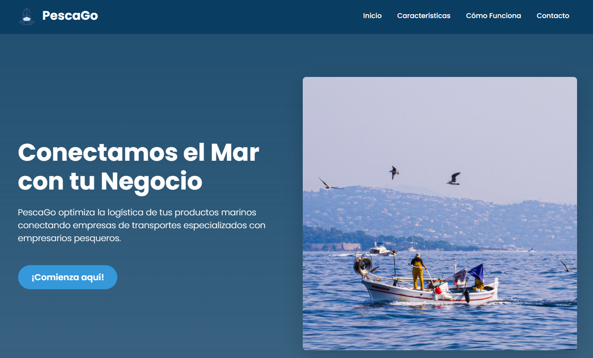

   #### Caracteristicas
   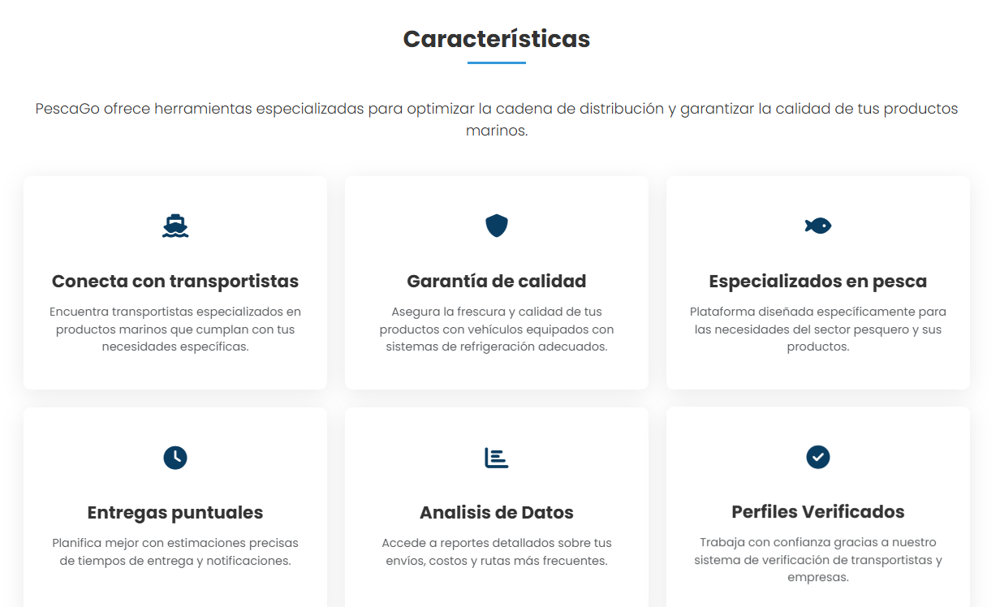

   #### Cómo Funciona
   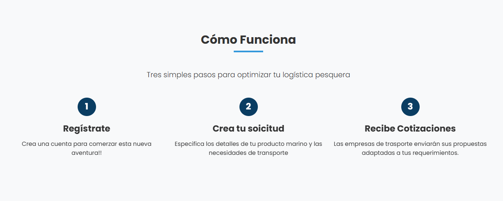

   #### Testimonios
   

   #### Beneficios
   

   #### Contacto
      

   #### 5.2.1.6. Services Documentation Evidence for Sprint Review
   
   Link de la landing page desployada: https://pescago.netlify.app/

   #### 5.2.1.7. Software Deployment Evidence for Sprint Review

   Para el desarrollo de la landing page, se usó lo siguiente:
   
   - HTML: Para la estructura de la landing page
   - CSS: Para darle estilos a la landing page
   - JS: Para darle dinamismo a la landing page
   - Git: Es el sistema de control de versiones
   - Github: Software online para almacenar repositorios Git

   #### 5.2.1.8. Team Collaboration Insights during Sprint

   
A continuación, se compartirá la tabla de colaboradores del repositorio de Github para identificar a cada miembro del equipo:

| Username (GitHub) | Nombre                          |
| ----------------- | ------------------------------- |
| AleRamosA                     | Ramos Argüelles, Alexandra Belen |
| PaoloBellezaTelloo            | Belleza Tello, Paolo Eduardo |
| MariaFernandaFernandezAlva    | Fernandez Alva, María Fernanda    |
| IanMQ                         | Macavilca Quispe, Ian      |
| mariopvdev                    | Prado Vargas, Mario Benjamín     |
  

#### 5.2.2. Sprint 2
   #### 5.2.2.1. Sprint Planning 2

En esta parte mostramos las tareas que se realizaron en este sprint.

Link del Trello: [Ir a Trello](https://trello.com/invite/b/6821201064fc162fd1070c4b/ATTIe7594534dfacff282c80125476e30b4a12551FAF/pescago)

Vista del Sprint Backlog 1 en Trello:

    

  

<table border="1px" align="center">
      <tr>
          <th style="font-weight: bold;" >Sprint #</th>
          <th style="font-weight: bold;" >Sprint 2</th>
      </tr>
      <tr> 
          <td colspan="2" style="font-weight: bold;">Sprint Planning Background</td>
      </tr>
      <tr>
          <td style="font-weight: bold;">Date</td>
          <td>13-05-2025</td>
      </tr>
      <tr>
          <td style="font-weight: bold;">Time</td>
          <td>5:00 pm - 10:00 pm</td>
      </tr>
      <tr>
          <td style="font-weight: bold;">Location</td>
          <td>Canal de Voz de Discord</td>
      </tr>
      <tr>
          <td style="font-weight: bold;">Prepared By</td>
          <td>Prado Vargas, Mario Benjamín</td>
      </tr>
      <tr>
          <td style="font-weight: bold;">Attendees (to planning meeting)</td>
          <td>
              Belleza Tello, Paolo Eduardo 
              Fernandez Alva, María Fernanda 
              Macavilca Quispe, Ian 
              Prado Vargas, Mario Benjamín 
              Ramos Argüelles, Alexandra Belen 
          </td>
      </tr>
      <tr>
          <td style="font-weight: bold;">Sprint 1 Review Summary</td>
          <td>Se recomienda incluir funciones innovadoras, mejorar los detalles técnicos con diagramas y pruebas de usabilidad, y reforzar la documentación con buenas prácticas de código y un mejor llamado a la acción en la landing page.</td>
      </tr>
      <tr>
          <td style="font-weight: bold;">Sprint 1 Retrospective Summary</td>
          <td>El equipo logró organizarse y completar las tareas planificadas, a pesar de algunos desafíos iniciales relacionados con la coordinación y la gestión del tiempo. Se identificó la necesidad de mejorar la comunicación interna y definir mejor los roles desde el inicio. </td>
      </tr>
      <tr> 
          <td colspan="2" style="font-weight: bold;">Sprint Goal & User Stories</td>
      </tr>
      <tr>
          <td style="font-weight: bold;">Sprint 2 Goal</td>
          <td>
              El objetivo principal de este sprint es desarrollar el frontend de nuestra aplicación PescaGo, con especial enfoque en implementar las funcionalidades clave para los usuarios.
          </td>
      </tr>
      <tr>
          <td style="font-weight: bold;">Sprint 2 Velocity</td>
          <td>8</td>
      </tr>
      <tr>
          <td style="font-weight: bold;">Sum of Story Points</td>
          <td>67</td>
      </tr>
    </table>

   #### 5.2.2.2. Aspect Leaders and Collaborators

<table border="1" style="border-collapse: collapse; text-align: center;">
  <tr>
    <th>Team Member (Last Name, First Name)</th>
    <th>GitHub Username</th>
    <th>Inicio de sesion & Registro</th>
    <th>Solicitudes para cotizar</th>
    <th>Servicio Confirmado</th>
    <th>Búsqueda de empresas transportistas</th>
    <th>Estado de Solicitudes</th>
    <th>Servicios Contratados</th>
  </tr>
  <tr>
    <td>Ramos Argüelles, Alexandra Belen</td>
    <td>AleRamosA</td>
    <td>L</td>
    <td>C</td>
    <td>C</td>
    <td>C</td>
    <td>C</td>
    <td>C</td>
  </tr>
  <tr>
    <td>Belleza Tello, Paolo Eduardo</td>
    <td>PaoloBellezaTelloo</td>
    <td>C</td>
    <td>L</td>
    <td>C</td>
    <td>C</td>
    <td>C</td>
    <td>C</td>
  </tr>
  <tr>
    <td>Fernandez Alva, María Fernanda</td>
    <td>MariaFernandaFernandezAlva</td>
    <td>C</td>
    <td>C</td>
    <td>L</td>
    <td>C</td>
    <td>C</td>
    <td>C</td>
  </tr>
  <tr>
    <td>Macavilca Quispe, Ian</td>
    <td>IanMQ</td>
    <td>C</td>
    <td>C</td>
    <td>C</td>
    <td>L</td>
    <td>C</td>
    <td>C</td>
  </tr>
  <tr>
    <td>Prado Vargas, Mario Benjamín</td>
    <td>mariopvdev</td>
    <td>C</td>
    <td>C</td>
    <td>C</td>
    <td>C</td>
    <td>L</td>
    <td>L</td>
  </tr>
</table>

  #### 5.2.2.3. Sprint Backlog 2

<table border="1" cellspacing="0" cellpadding="4">
  <tr>
    <th style="text-align: center;"><b>Sprint #</b></th>
    <th colspan="7" style="text-align: center;"><b>Sprint 2</b></th>
  </tr>
  <tr>
    <td colspan="2" style="text-align: center;"><b>User Story</b></td>
    <td colspan="6" style="text-align: center;"><b>Work-item / Task</b></td>
  </tr>
  <tr>
    <td style="text-align: center;"><b>ID</b></td>
    <td style="text-align: center;"><b>Title</b></td>
    <td style="text-align: center;"><b>ID</b></td>
    <td style="text-align: center;"><b>Title</b></td>
    <td style="text-align: center;"><b>Description</b></td>
    <td style="text-align: center;"><b>Estimation (hours)</b></td>
    <td style="text-align: center;"><b>Assigned To</b></td>
    <td style="text-align: center;"><b>Status</b></td>
  </tr>

  <tr>
    <td>E3-US11</td>
    <td>Sección de búsqueda</td>
    <td>T1</td>
    <td>Solicitud de búsqueda</td>
    <td>Implementacion de una busqueda de empresas por filtro</td>
    <td style="text-align: center;">8h</td>
    <td>Macavilca Quispe, Ian</td>
    <td style="text-align: center;">Done</td>
  </tr>

  <tr>
    <td>E3-US13</td>
    <td>Solicitar el servicio a la empresa prestadora de vehículos</td>
    <td>T2</td>
    <td>Solicitud del servicio</td>
    <td>Implementacion de un boton para enviar una solicitud a la empresa</td>
    <td style="text-align: center;">8h</td>
    <td>Macavilca Quispe, Ian</td>
    <td style="text-align: center;">Done</td>
  </tr>

  <tr>
    <td>E3-US14</td>
    <td>Gestionar solicitudes enviadas</td>
    <td>T3</td>
    <td>Solicitudes enviadas</td>
    <td>Implementación de una tabla con informacion de cada solicitud</td>
    <td style="text-align: center;">7h</td>
    <td>Belleza Tello, Paolo</td>
    <td style="text-align: center;">Done</td>
  </tr>

  <tr>
    <td>E4-US18</td>
    <td>Gestión de pagos</td>
    <td>T4</td>
    <td>Pagos</td>
    <td>Implementar una tabla con donde se pueda visualizar los clientes que pagaron por el servicio.</td>
    <td style="text-align: center;">7h</td>
    <td>Fernandez Alva, Maria</td>
    <td style="text-align: center;">Done</td>
  </tr>

  <tr>
    <td>E4-US19</td>
    <td>Enviar información del vehículo hacia el empresario pesquero</td>
    <td>T5</td>
    <td>Informacion del vehículo</td>
    <td>Implementar un formulario para el registro de vehículos y para conductores</td>
    <td style="text-align: center;">6h</td>
    <td>Fernandez Alva, Maria</td>
    <td style="text-align: center;">Done</td>
  </tr>

  <tr>
    <td>E2-US08</td>
    <td>Registro para de la empresa prestadora de vehículos</td>
    <td>T6</td>
    <td>Información de la empresa</td>
    <td>Implementación de un formulario para el llenado de los datos generales</td>
    <td style="text-align: center;">5h</td>
    <td>Ramos Argüelles, Belen</td>
    <td style="text-align: center;">Done</td>
  </tr>

  <tr>
    <td>E2-US09</td>
    <td>Registro para de el empresario pesquero</td>
    <td>T7</td>
    <td>Información del empresario</td>
    <td>Implementación de un formulario para el llenado de los datos generales</td>
    <td style="text-align: center;">5h</td>
    <td>Ramos Argüelles, Belen</td>
    <td style="text-align: center;">Done</td>
  </tr>

  <tr>
    <td>E3-US15</td>
    <td>Pagar a la empresa seleccionada</td>
    <td>T8</td>
    <td>Pagar servicio</td>
    <td>Implementar un botón para pagar de manera rápida</td>
    <td style="text-align: center;">4h</td>
    <td>Prado Vargas, Mario</td>
    <td style="text-align: center;">Done</td>
  </tr>

  <tr>
    <td>E3-US16</td>
    <td>Obtener información del vehículo repartidor</td>
    <td>T9</td>
    <td>Información del vehiculo como conductor</td>
    <td>Implementar una tabla con todos los datos requeridos</td>
    <td style="text-align: center;">4h</td>
    <td>
      Prado Vargas, Mario
      Macavilca Quispe, Ian
    </td>
    <td style="text-align: center;">Done</td>
  </tr>

  <tr>
    <td>E3-US17</td>
    <td>Gestión de solicitudes recibidas</td>
    <td>T10</td>
    <td>Solicitudes recibidas</td>
    <td>Implementación para cotizar las solicitudes de los empresarios pesqueros</td>
    <td style="text-align: center;">4h</td>
    <td>Belleza Tello, Paolo</td>
    <td style="text-align: center;">Done</td>
  </tr>

  <tr>
    <td>E2-US10</td>
    <td>Ingreso a la aplicación</td>
    <td>T11</td>
    <td>Inicio de sesión</td>
    <td>Implementación de dos botones para seleccionar el usuario que desea ser</td>
    <td style="text-align: center;">2h</td>
    <td>Ramos Argüelles, Belen</td>
    <td style="text-align: center;">Done</td>
  </tr>
</table>

   #### 5.2.2.4. Development Evidence for Sprint Review.
En esta sección, se presentan los commits realizados en el repositorio del frontend en GitHub. Estos commits reflejan el progreso y las mejoras implementadas durante el sprint 2, proporcionando una visión detallada de las actividades de desarrollo y las contribuciones del equipo.

Link del repositorio: [PescaGo - Frontend](https://github.com/1ASI0729-2510-4321-devvolution/PescaGo-Frontend)

<table border="1" cellpadding="5" cellspacing="0">
  <tr>
    <th>Repository</th>
    <th>Branch</th>
    <th>Commit Id</th>
    <th>Commit Message</th>
    <th>Commit Message Body</th>
    <th>Commited on (Date)</th>
  </tr>
  <tr>
    <td>PescaGo - Frontend</td>
    <td>main</td>
    <td>a947b63</td>
    <td>feat: implementar filtro de búsqueda por nombre</td>
    <td>Funcionalidad de búsqueda</td>
    <td>9/05/2025</td>
  </tr>
  <tr>
    <td>PescaGo - Frontend</td>
    <td>main</td>
    <td>424601e</td>
    <td>feat: add carrier confirmed-services component</td>
    <td>Funcionalidad del carrier</td>
    <td>10/05/2025</td>
  </tr>
  <tr>
    <td>PescaGo - Frontend</td>
    <td>main</td>
    <td>5835ab5</td>
    <td>feat: add carrier packet-details component</td>
    <td>Detalles del carrier</td>
    <td>11/05/2025</td>
  </tr>
  <tr>
    <td>PescaGo - Frontend</td>
    <td>main</td>
    <td>6fb067b</td>
    <td>refactor: initiate project restructuring to align with DDD and modular architecture</td>
    <td>Restructurar las carpetas del proyecto</td>
    <td>12/05/2025</td>
  </tr>
  <tr>
    <td>PescaGo - Frontend</td>
    <td>main</td>
    <td>0bf3632</td>
    <td>feat: add provideHttpClient() to app.config.ts</td>
    <td>Implementación de la Api local</td>
    <td>13/05/2025</td>
  </tr>
  <tr>
    <td>PescaGo - Frontend</td>
    <td>main</td>
    <td>9e044fb</td>
    <td>feat: add component Home</td>
    <td>Página Principal</td>
    <td>13/05/2025</td>
  </tr>
  <tr>
    <td>PescaGo - Frontend</td>
    <td>main</td>
    <td>3d0d134</td>
    <td>feat: add component payment form</td>
    <td>Formulario de pago</td>
    <td>13/05/2025</td>
  </tr>
  <tr>
    <td>PescaGo - Frontend</td>
    <td>main</td>
    <td>ee9bedd</td>
    <td>feat: add methods for payment gateway</td>
    <td>Funcionalidad de los metodos de pago</td>
    <td>13/05/2025</td>
  </tr>
  <tr>
    <td>PescaGo - Frontend</td>
    <td>main</td>
    <td>559dd00</td>
    <td>feat: add describe to request-status</td>
    <td>Funcionalidad de los estados de solicitudes</td>
    <td>13/05/2025</td>
  </tr>
</table>

   #### 5.2.2.5. Execution Evidence for Sprint Review

En el Sprint 2 hemos logrado implementar las funcionalidades más relevantes para los usuarios principales: el empresario pesquero y la empresa transportista.

A continuación, se presentan capturas de pantalla de las vistas implementadas.

* <strong>Inicio de sesión y registro</strong>

    

    

 

* <strong>Registro de Empresa Transportista</strong>

    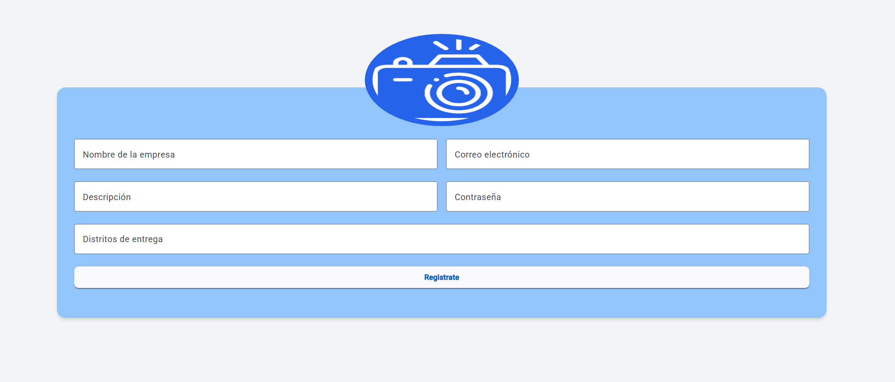

 

* <strong>Registro de Empresario Pesquero</strong>

    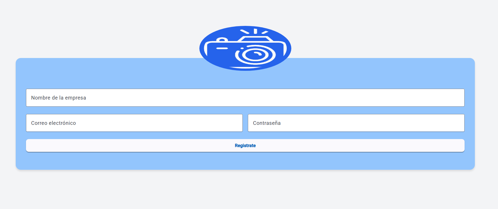

 

* <strong>Pantalla de inicio de la Empresa Transportista</strong>

    

 

* <strong>Funcionalidad de la solicitudes para cotizar</strong>

    

    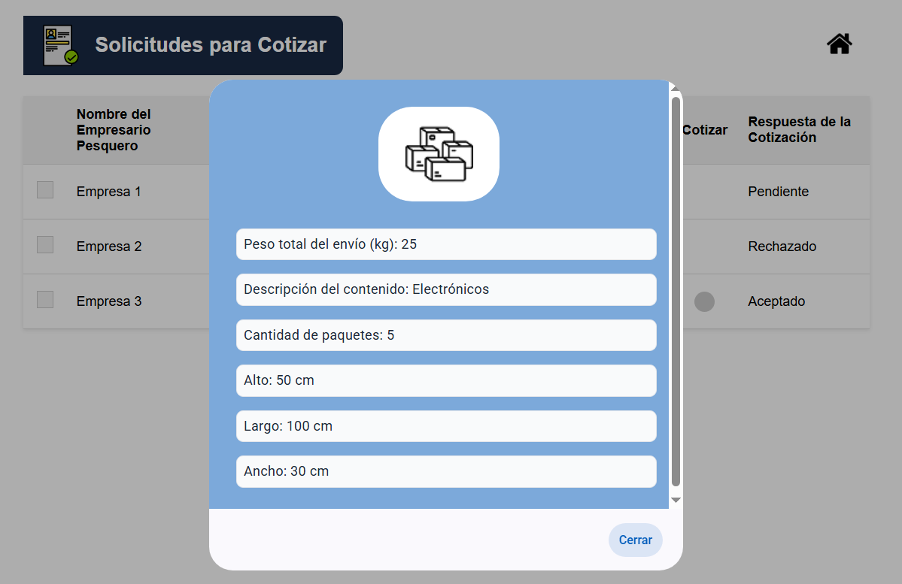

    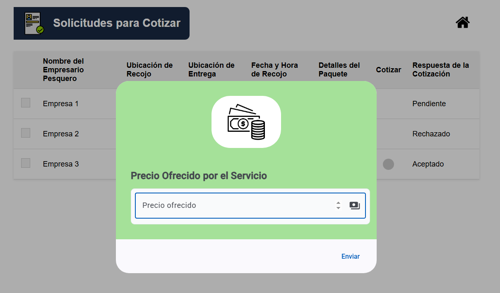

 

* <strong>Funcionalidad de Servicio Confirmado</strong>

    

 

* <strong>Pantalla de inicio del Empresario Pesquero</strong>

    

 

* <strong>Funcionalidad de Búsqueda de empresas transportistas</strong>

    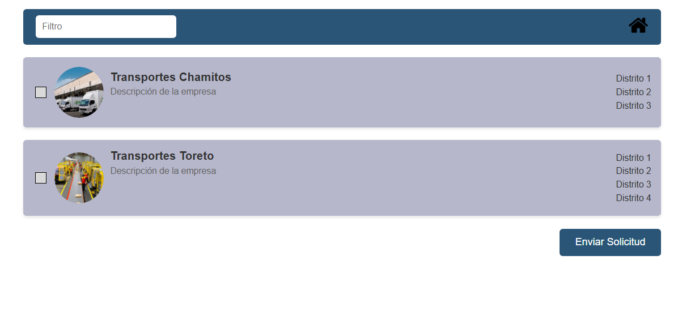

    

 

* <strong>Funcionalidad de Estado de Solicitudes</strong>

    

    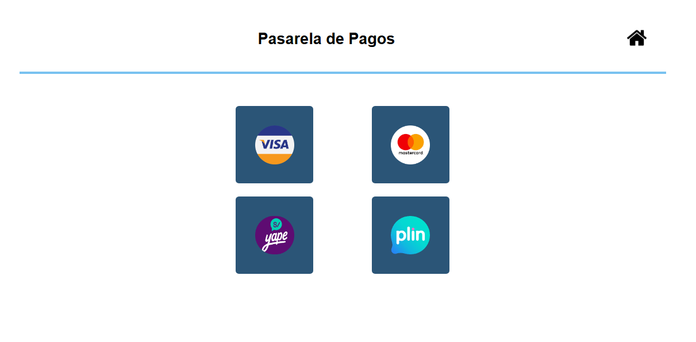

    

 

* <strong>Funcionalidad de Servicios Contratados</strong>

    

   #### 5.2.2.6. Services Documentation Evidence for Sprint Review

Durante el Sprint 2, utilizamos servicios HTTP mediante JSON Server, lo cual nos permitió crear una fake API para simular el backend de la aplicación.
Para este sprint, contamos con los siguientes endpoints principales:

-Empresa Transportista

-Empresario Pesquero

* <strong>Captura de la estructura del users - requests (db.json):</strong>

 
   
   

 

* <strong>Captura de la estructura del entrepreneurs - carries (db.json):</strong>

 
   
   

 

* <strong>Captura de la Fake API en funcionamiento:</strong>

  * **GET**

    
 
       
      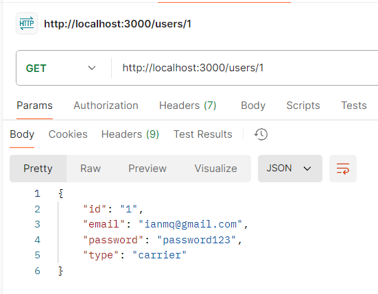 
    
 

  * **POST**

    
 
      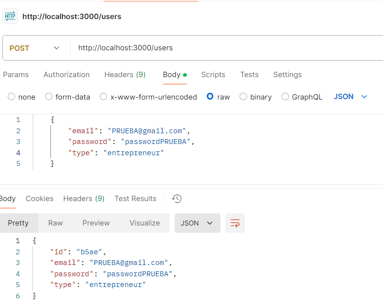 
    
 

  * **PUT**

    
 
      
    
 

  * **DELETE**

    
 
      
      
    
 

   #### 5.2.2.7. Software Deployment Evidence for Sprint Review.

Durante el Sprint 2, se desplegó el frontend para permitir la integración y validación de las funcionalidades desarrolladas. Utilizamos vercel para el despliegue del frontend.

1. Haz `fork` del repositorio (si el proyecto no es tuyo). Ve al repositorio original en GitHub, haz clic en el botón `Fork` (esquina superior derecha) y se creará una copia del repositorio en tu cuenta.

    
  

     

2. Conecta el proyecto a [Vercel](https://vercel.com) iniciando sesión con tu cuenta de GitHub.

    
  

     

3. Haz clic en `Add New Project` y luego en `Project`.

    
  

     

4. Selecciona tu repositorio (el fork o el que hayas creado), haz clic en `Import` (esto tomará unos segundos), asegúrate de que esté seleccionado el **Framework Preset: `Angular`** y luego haz clic en `Deploy`.

    
  

    
  

     

5. Espera a que finalice el proceso (puede tardar un poco la primera vez). Después, haz clic en `Continue to Dashboard`.

    
  

     

6. Finalmente, Vercel te mostrará el enlace de tu aplicación web desplegada.

    
  

A continuación, se presentan el link que evidencia el despliegue:

* <strong>Despliegue del Frontend</strong>: [PescaGo-Frontend](url)

#### 5.2.2.8. Team Collaboration Insights during Sprint. 

El equipo desarrolló el frontend por ramas con la finalidad de desarrollar cada sección de manera individual para optimizar el mantenimientoy colaboración durante el sprint. 

Link del GitHub con a la participación: [Pulse de GitHub](https://github.com/1ASI0729-2510-4321-devvolution/PescaGo-Frontend/pulse)

A continuación, se presentarán las tareas asignadas a cada integrante del equipo, así como el insight del equipo a través de la plataforma GitHub:

<table border="1">
  <tr>
    <th>Integrante</th>
    <th>Actividad</th>
  </tr>
  <tr>
    <td>Ramos Argüelles, Alexandra Belen</td>
    <td>Se encargó del inicio de sesión como los registros para ambos segmentos objetivos</td>
  </tr>
  <tr>
    <td>Belleza Tello, Paolo Eduardo</td>
    <td>Se encargó de realizar la funcionalidad "Solicitudes para cotizar" del segmento objetivo: Empresa Transportista</td>
  </tr>
  <tr>
    <td>Fernandez Alva, María Fernanda</td>
    <td>Se encargó de realizar la funcionalidad "Servicio Confirmado" del segmento objetivo: Empresa Transportista</td>
  </tr>
  <tr>
    <td>Macavilca Quispe, Ian</td>
    <td>Se encargó de realizar la funcionalidad "Búsqueda de empresas transportistas" del segmento objetivo: Empresario Pesquero. Tambien elaboró una parte de la funcionalidad "Servicios Contratados"</td>
  </tr>
  <tr>
    <td>Prado Vargas, Mario Benjamín</td>
    <td>Se encargó de realizar la funcionalidad "Estado de Solicitudes" del segmento objetivo: Empresario Pesquero. Tambien termino elaborar la funcionalidad "Servicios Contratados"</td>
  </tr>
</table>

Con la finalidad de identificar a cada integrante del equipo, presentaremos una tabla con los usuarios de los colaboradores en el repositorio de GitHub.

<table border="1">
  <tr>
    <th>Username (GitHub)</th>
    <th>Nombre</th>
  </tr>
  <tr>
    <td>AleRamosA</td>
    <td>Ramos Argüelles, Alexandra Belen</td>
  </tr>
  <tr>
    <td>PaoloBellezaTelloo</td>
    <td>Belleza Tello, Paolo Eduardo</td>
  </tr>
  <tr>
    <td>MariaFernandaFernandezAlva</td>
    <td>Fernandez Alva, María Fernanda</td>
  </tr>
  <tr>
    <td>IanMQ</td>
    <td>Macavilca Quispe, Ian Fernanda</td>
  </tr>
  <tr>
    <td>mariopvdev</td>
    <td>Prado Vargas, Mario Benjamín</td>
  </tr>
</table>

A continuación, se mostrarán las capturas de participación:

* <strong>Captura de los commits realizados</strong>

    

* <strong>Captura de la contribución de los integrantes</strong>

    

#### 5.2.3. Sprint 3
   #### 5.2.3.1. Sprint Planning 3

En esta parte mostramos las tareas que se realizaron en este sprint.

Link del Trello: [Ir a Trello](https://trello.com/invite/b/6821201064fc162fd1070c4b/ATTIe7594534dfacff282c80125476e30b4a12551FAF/pescago)

Vista del Sprint Backlog 3 en Trello:

    

  

<table border="1px" align="center">
      <tr>
          <th style="font-weight: bold;" >Sprint #</th>
          <th style="font-weight: bold;" >Sprint 3</th>
      </tr>
      <tr> 
          <td colspan="2" style="font-weight: bold;">Sprint Planning Background</td>
      </tr>
      <tr>
          <td style="font-weight: bold;">Date</td>
          <td>13-06-2025</td>
      </tr>
      <tr>
          <td style="font-weight: bold;">Time</td>
          <td>8:00 pm - 10:00 pm</td>
      </tr>
      <tr>
          <td style="font-weight: bold;">Location</td>
          <td>Canal de Voz de Discord</td>
      </tr>
      <tr>
          <td style="font-weight: bold;">Prepared By</td>
          <td>Prado Vargas, Mario Benjamín</td>
      </tr>
      <tr>
          <td style="font-weight: bold;">Attendees (to planning meeting)</td>
          <td>
              Belleza Tello, Paolo Eduardo 
              Fernandez Alva, María Fernanda 
              Macavilca Quispe, Ian 
              Prado Vargas, Mario Benjamín 
              Ramos Argüelles, Alexandra Belen 
          </td>
      </tr>
      <tr>
          <td style="font-weight: bold;">Sprint 2 Review Summary</td>
          <td>El profesor nos indicó que debemos implementar una API externa como una API de pagos.</td>
      </tr>
      <tr>
          <td style="font-weight: bold;">Sprint 2 Retrospective Summary</td>
          <td>El equipo logró organizarse y completar las tareas planificadas. Se logró implementar una API externa para el proyecto</td>
      </tr>
      <tr> 
          <td colspan="2" style="font-weight: bold;">Sprint Goal & User Stories</td>
      </tr>
      <tr>
          <td style="font-weight: bold;">Sprint 3 Goal</td>
          <td>
              El objetivo principal de este sprint es desarrollar el backend de nuestra aplicación PescaGo, con especial enfoque en implementar un buen manejo de la estructura del proyecto como sus validaciones y seguridades.
          </td>
      </tr>
      <tr>
          <td style="font-weight: bold;">Sprint 3 Velocity</td>
          <td>5</td>
      </tr>
      <tr>
          <td style="font-weight: bold;">Sum of Story Points</td>
          <td>25</td>
      </tr>
    </table>

   #### 5.2.3.2. Aspect Leaders and Collaborators

<table border="1" style="border-collapse: collapse; text-align: center;">
  <tr>
    <th>Team Member (Last Name, First Name)</th>
    <th>GitHub Username</th>
    <th>Registro de los dos segmentos objetivos</th>
    <th>Validación de los datos en inicio de sesión</th>
    <th>Solicitud del servicio</th>
    <th>Solicitud de los datos del vehiculo y conductor</th>
    <th>Envio del dato de la cotización</th>
  </tr>
  <tr>
    <td>Ramos Argüelles, Alexandra Belen</td>
    <td>AleRamosA</td>
    <td>L</td>
    <td>C</td>
    <td>C</td>
    <td>C</td>
    <td>C</td>
  </tr>
  <tr>
    <td>Belleza Tello, Paolo Eduardo</td>
    <td>PaoloBellezaTelloo</td>
    <td>C</td>
    <td>L</td>
    <td>C</td>
    <td>C</td>
    <td>C</td>
  </tr>
  <tr>
    <td>Fernandez Alva, María Fernanda</td>
    <td>MariaFernandaFernandezAlva</td>
    <td>C</td>
    <td>C</td>
    <td>L</td>
    <td>C</td>
    <td>C</td>
  </tr>
  <tr>
    <td>Macavilca Quispe, Ian</td>
    <td>IanMQ</td>
    <td>C</td>
    <td>C</td>
    <td>C</td>
    <td>L</td>
    <td>C</td>
  </tr>
  <tr>
    <td>Prado Vargas, Mario Benjamín</td>
    <td>mariopvdev</td>
    <td>C</td>
    <td>C</td>
    <td>C</td>
    <td>C</td>
    <td>L</td>
  </tr>
</table>

  #### 5.2.3.3. Sprint Backlog 3

<table border="1" cellspacing="0" cellpadding="4">
  <tr>
    <th style="text-align: center;"><b>Sprint #</b></th>
    <th colspan="7" style="text-align: center;"><b>Sprint 3</b></th>
  </tr>
  <tr>
    <td colspan="2" style="text-align: center;"><b>User Story</b></td>
    <td colspan="6" style="text-align: center;"><b>Work-item / Task</b></td>
  </tr>
  <tr>
    <td style="text-align: center;"><b>ID</b></td>
    <td style="text-align: center;"><b>Title</b></td>
    <td style="text-align: center;"><b>ID</b></td>
    <td style="text-align: center;"><b>Title</b></td>
    <td style="text-align: center;"><b>Description</b></td>
    <td style="text-align: center;"><b>Estimation (hours)</b></td>
    <td style="text-align: center;"><b>Assigned To</b></td>
    <td style="text-align: center;"><b>Status</b></td>
  </tr>

  <tr>
    <td>E5-US20</td>
    <td>Agregar una empresa prestadora de vehículos</td>
    <td>T1</td>
    <td>Datos de la empresa transportista</td>
    <td>Desarrollar una solicitud POST con los datos completados de la empresa transportista.</td>
    <td style="text-align: center;">5h</td>
    <td>Ramos Argüelles, Belen</td>
    <td style="text-align: center;">Done</td>
  </tr>

  <tr>
    <td>E5-US21</td>
    <td>Agregar solicitud del empresario pesquero</td>
    <td>T2</td>
    <td>Solicitud del servicio</td>
    <td>Desarrollar la petición POST con los respectivos datos como: nombre del empresario, tipo de producto, cantidad, origen, destino y fecha de envío.</td>
    <td style="text-align: center;">5h</td>
    <td>Macavilca Quispe, Ian</td>
    <td style="text-align: center;">Done</td>
  </tr>

  <tr>
    <td>E5-US22</td>
    <td>Gestionar usuarios</td>
    <td>T3</td>
    <td>Registro de cuenta</td>
    <td>Desarrollar las respectivas validaciones como en el correo y contraseña que ingrese el usuario a la hora de regitrarse.</td>
    <td style="text-align: center;">5h</td>
    <td>Belleza Tello, Paolo</td>
    <td style="text-align: center;">Done</td>
  </tr>

  <tr>
    <td>E5-US23</td>
    <td>Información sobre vehiculo y conductor</td>
    <td>T4</td>
    <td>Datos del vehiculo y conductor</td>
    <td>Desarrollar un Get para la optención de los datos para enviar al empresario pesquero</td>
    <td style="text-align: center;">5h</td>
    <td>Prado Vargas, Mario</td>
    <td style="text-align: center;">Done</td>
  </tr>

  <tr>
    <td>E5-US24</td>
    <td>Envio del dato de la cotización</td>
    <td>T5</td>
    <td>Dato de la cotización</td>
    <td>Desarrollar un Get para la optención del precio del servicio y transferirlo a empresario pesquero</td>
    <td style="text-align: center;">5h</td>
    <td>Fernandez Alva, Maria</td>
    <td style="text-align: center;">Done</td>
  </tr>

</table>

   #### 5.2.3.4. Development Evidence for Sprint Review.
En esta sección, se presentan los commits realizados en el repositorio del backend en GitHub. Estos commits reflejan el progreso y las mejoras implementadas durante el sprint 3, proporcionando una visión detallada de las actividades de desarrollo y las contribuciones del equipo.

Link del repositorio: [PescaGo - Backend](https://github.com/1ASI0729-2510-4321-devvolution/PescaGo-Backend)

<table border="1" cellpadding="5" cellspacing="0">
  <tr>
    <th>Repository</th>
    <th>Branch</th>
    <th>Commit Id</th>
    <th>Commit Message</th>
    <th>Commit Message Body</th>
    <th>Commited on (Date)</th>
  </tr>
  <tr>
    <td>PescaGo - Backend</td>
    <td>main</td>
    <td>a947b63</td>
    <td>feat: ---</td>
    <td>------</td>
    <td>14/06/2025</td>
  </tr>
  <tr>
    <td>PescaGo - Backend</td>
    <td>main</td>
    <td>424601e</td>
    <td>feat: ---</td>
    <td>------</td>
    <td>14/06/2025</td>
  </tr>
  <tr>
    <td>PescaGo - Backend</td>
    <td>main</td>
    <td>5835ab5</td>
    <td>feat: ---</td>
    <td>------</td>
    <td>14/06/2025</td>
  </tr>
  <tr>
    <td>PescaGo - Backend</td>
    <td>main</td>
    <td>6fb067b</td>
    <td>feat: ---</td>
    <td>------</td>
    <td>14/06/2025</td>
  </tr>
  <tr>
    <td>PescaGo - Backend</td>
    <td>main</td>
    <td>0bf3632</td>
    <td>feat: ---</td>
    <td>------</td>
    <td>14/06/2025</td>
  </tr>
  <tr>
    <td>PescaGo - Backend</td>
    <td>main</td>
    <td>9e044fb</td>
    <td>feat: ---</td>
    <td>------</td>
    <td>14/06/2025</td>
  </tr>
</table>

   #### 5.2.3.5. Execution Evidence for Sprint Review

En el Sprint 3 hemos logrado implementar las validaciones como los llamados principales (GET-POST-DELETE-PUT) más relevantes para el correcto llamado de los datos

A continuación, se presentan capturas de los endpoints en swagger.

    

    

    

    

 

   #### 5.2.3.6. Services Documentation Evidence for Sprint Review

Durante el Sprint 3, hemos integrado nuestra API desarrollada con Java y Spring Boot. A continuación, se detallan los endpoints principales que nuestro equipo creó, organizados por Bounded Context.

<table>
	<tbody>
		<tr>
			<td>Bounded Context</td>
			<td colspan="2">Gestión de Empresas Transportistas</td>
		</tr>
		<tr>
			<td>Entity</td>
			<td>Endpoint URL</td>
			<td>Swagger</td>
		</tr>
		<tr>
			<td>---</td>
			<td>api/v1/----</td>
			<td></td>
		</tr>
		<tr>
			<td>---</td>
			<td>api/v1/----</td>
			<td></td>
		</tr>
    <tr>
			<td>---</td>
			<td>api/v1/----</td>
			<td></td>
		</tr>
    <tr>
			<td>---</td>
			<td>api/v1/----</td>
			<td></td>
		</tr>
	</tbody>
</table>

<table>
	<tbody>
		<tr>
			<td>Bounded Context</td>
			<td colspan="2">Gestión de Empresarios Pesqueros</td>
		</tr>
		<tr>
			<td>Entity</td>
			<td>Endpoint URL</td>
			<td>Swagger</td>
		</tr>
		<tr>
			<td>---</td>
			<td>api/v1/----</td>
			<td></td>
		</tr>
		<tr>
			<td>---</td>
			<td>api/v1/----</td>
			<td></td>
		</tr>
    <tr>
			<td>---</td>
			<td>api/v1/----</td>
			<td></td>
		</tr>
    <tr>
			<td>---</td>
			<td>api/v1/----</td>
			<td></td>
		</tr>
	</tbody>
</table>

   #### 5.2.3.7. Software Deployment Evidence for Sprint Review.

Durante el Sprint 3, se desplegó el backend para permitir la integración y validación de las funcionalidades desarrolladas. Utilizamos Railway para el despliegue del backend.

1. **Crea tu cuenta en Railway**  
   Entra a [Railway](https://railway.com/) e inicia sesión con tu cuenta de GitHub

    

      
    
 

2. **Conecta tu repositorio**  
   Haz clic en `New Project`, después elige la opción `Deploy from GitHub Repo` y seleccionas el repositorio del backend

    

      
    
 

3. **Configurar las Variables de Entorno**  
   Ve a la pestaña `Variables` y haz clic en `Raw Editor`. Pega todas las variables de entorno necesarias (como en el archivo `application.properties` o `application.yml` de tu backend). Luego haz clic en `Update Variables`, presiona `Apply changes` y finalmente en `Deploy` para aplicar y ejecutar el backend.

    

      
    
 

3. **Despliegue del Backend**  
   Espera a que el estado del `deployment` pase de `building` a `active`. Una vez activo, ve a `Settings` → `Networking` para copiar el link desplegado de tu backend.

    **Enlace del Despliegue del Backend:** [PescaGo - Backend]()

#### 5.2.3.8. Team Collaboration Insights during Sprint. 

El equipo desarrolló el backend por ramas con la finalidad de desarrollar cada sección de manera individual para optimizar el mantenimientoy colaboración durante el sprint. 

Link del GitHub con a la participación: [Pulse de GitHub](https://github.com/1ASI0729-2510-4321-devvolution/PescaGo-Backend/pulse)

A continuación, se presentarán las tareas asignadas a cada integrante del equipo, así como el insight del equipo a través de la plataforma GitHub:

<table border="1">
  <tr>
    <th>Integrante</th>
    <th>Actividad</th>
  </tr>
  <tr>
    <td>Ramos Argüelles, Alexandra Belen</td>
    <td>-------</td>
  </tr>
  <tr>
    <td>Belleza Tello, Paolo Eduardo</td>
    <td>-------</td>>
  </tr>
  <tr>
    <td>Fernandez Alva, María Fernanda</td>
    <td>-------</td>
  </tr>
  <tr>
    <td>Macavilca Quispe, Ian</td>
    <td>-------</td>
  </tr>
  <tr>
    <td>Prado Vargas, Mario Benjamín</td>
    <td>-------</td>
  </tr>
</table>

Con la finalidad de identificar a cada integrante del equipo, presentaremos una tabla con los usuarios de los colaboradores en el repositorio de GitHub.

<table border="1">
  <tr>
    <th>Username (GitHub)</th>
    <th>Nombre</th>
  </tr>
  <tr>
    <td>AleRamosA</td>
    <td>Ramos Argüelles, Alexandra Belen</td>
  </tr>
  <tr>
    <td>PaoloBellezaTelloo</td>
    <td>Belleza Tello, Paolo Eduardo</td>
  </tr>
  <tr>
    <td>MariaFernandaFernandezAlva</td>
    <td>Fernandez Alva, María Fernanda</td>
  </tr>
  <tr>
    <td>IanMQ</td>
    <td>Macavilca Quispe, Ian Fernanda</td>
  </tr>
  <tr>
    <td>mariopvdev</td>
    <td>Prado Vargas, Mario Benjamín</td>
  </tr>
</table>

A continuación, se mostrarán las capturas de participación:

* <strong>Captura de los commits realizados</strong>

    

* <strong>Captura de la contribución de los integrantes</strong>

    

## 5.3. Validation Interviews.

### 5.3.1. Diseño de Entrevistas.

En esta sección se redactaron las preguntas para las entrevistas a fin de obtener la información necesaria acerca de la aplicación, viendo aspectos a mantener y a mejorar.

**Preguntas principales:**

   1. ¿Cómo te llamas?
   2. ¿Qué edad tienes?
   3. ¿Cuál es tu profesión?

**Preguntas sobre la Landing Page:**

   1. ¿La información presentada en la landing page te pareció clara y fácil de entender?
   2. ¿Sientes que la landing page comunica bien los beneficios que PescaGo puede ofrecer a una empresa transportista / empresario pesquero como la tuya?
   3. ¿Qué opinas sobre los videos incluidos? ¿Te ayudaron a comprender mejor el funcionamiento y propósito de la plataforma?
   4. ¿Te parece útil tener un botón que redirige directamente a la aplicación web? ¿Lo encontraste fácilmente?

**Preguntas para la empresa transportista:**

   1. ¿Cómo fue tu experiencia registrándote como empresa transportista? ¿Fue sencillo identificar tu tipo de usuario y llenar los datos?
   2. ¿Qué te pareció la opción de ingresar manualmente los distritos a los que llega tu servicio de transporte? ¿Te resultó fácil? ¿Cambiarías algo de esa parte del registro?
   3. ¿La información mostrada en la tabla de solicitudes es clara y suficiente para que puedas decidir si quieres cotizar?
   4. ¿El proceso para cotizar una solicitud (ingresar precio) te pareció intuitivo? o ¿Te gustaría agregar algo más?
   5. ¿Qué opinas de la funcionalidad para eliminar varias solicitudes al mismo tiempo? ¿Te resulta útil?
   6. ¿Te parece útil la columna “Tipo de pago” en la tabla de servicios confirmados? ¿O te gustaría que también se mostrara el monto pagado por el servicio?
   7. ¿Fue fácil llenar y enviar los datos del envío (vehículo, placa, conductor)? ¿Agregarías o quitarías algo de esos datos?
   8. En general, cómo fue tu experiencia usando PescaGo como empresa transportista? ¿Qué fue lo que más te gustó? ¿Qué mejorarías?

**Preguntas para la empresario pesquero:**

   1. ¿Te resultó útil la lista de empresas transportistas disponibles como la información mostrada (imagen, nombre, descripción, distritos) fue suficiente para elegir a cuál(es) enviar la solicitud?
   2. ¿Te he útil el filtro por nombre de empresa o te gustaría tener otro tipo de filtro?
   3. ¿El formulario para enviar una solicitud te pareció claro y fácil de llenar? ¿Hubo algún campo que te generó dudas o que sientes que podría mejorarse?
   4. ¿Te quedó claro qué significa cada estado (pendiente, rechazado, aceptado)? ¿Agregarías algún mensaje o ayuda adicional?
   5. ¿El proceso de pago fue claro para ti? , ¿Te sentiste cómodo con las opciones de pago disponibles (tarjeta, plin, yape)?
   6. ¿La información que te brinda la tabla de servicios contratados te pareció completa? ¿Fue útil conocer de antemano los datos del vehículo y del conductor?
   7. En general, cómo fue tu experiencia usando PescaGo como empresario pesquero? ¿Qué fue lo que más te gustó? ¿Qué mejorarías?

### 5.3.2. Registro de Entrevistas.

**Link de todas las entrevistas:** [URL Entrevistas]()

**Entrevistado 1**

<table border="1" style="text-align: left;">
  <tbody>
    <tr>
      <td colspan="1" rowspan="6"></td>
            <td colspan="1" rowspan="1"><strong>Nombre del entrevistado:
             
            </strong> Nombre del entrevistado
              Apellido del entrevistado
            </td>
    </tr>
        <tr>
            <td>
            <strong>Edad: </strong> - años
             
            </td>
        </tr>
        <tr>
            <td>
            <strong>Distrito:</strong> 
             Los Olivos
            </td>
        </tr>
        <tr>
            <td>
            <strong>Nombre del entrevistador:</strong>
             Nombre 
             Apellido
            </td>
        </tr>
        <tr>
            <td>
            <strong>Timming: </strong>
             -- 
            <strong>Duración: </strong>
             04:19:00
            </td>
        </tr>      
  </tbody>
</table>

<strong>Resumen: </strong> 
resumen de la entrevistas

**Entrevistado 2**

<table border="1" style="text-align: left;">
  <tbody>
    <tr>
      <td colspan="1" rowspan="6"></td>
            <td colspan="1" rowspan="1"><strong>Nombre del entrevistado:
             
            </strong> Nombre del entrevistado
              Apellido del entrevistado
            </td>
    </tr>
        <tr>
            <td>
            <strong>Edad: </strong> - años
             
            </td>
        </tr>
        <tr>
            <td>
            <strong>Distrito:</strong> 
             Los Olivos
            </td>
        </tr>
        <tr>
            <td>
            <strong>Nombre del entrevistador:</strong>
             Nombre 
             Apellido
            </td>
        </tr>
        <tr>
            <td>
            <strong>Timming: </strong>
             -- 
            <strong>Duración: </strong>
             04:19:00
            </td>
        </tr>      
  </tbody>
</table>

<strong>Resumen: </strong> 
resumen de la entrevistas

**Entrevistado 3**

<table border="1" style="text-align: left;">
  <tbody>
    <tr>
      <td colspan="1" rowspan="6"></td>
            <td colspan="1" rowspan="1"><strong>Nombre del entrevistado:
             
            </strong> Nombre del entrevistado
              Apellido del entrevistado
            </td>
    </tr>
        <tr>
            <td>
            <strong>Edad: </strong> - años
             
            </td>
        </tr>
        <tr>
            <td>
            <strong>Distrito:</strong> 
             Los Olivos
            </td>
        </tr>
        <tr>
            <td>
            <strong>Nombre del entrevistador:</strong>
             Nombre 
             Apellido
            </td>
        </tr>
        <tr>
            <td>
            <strong>Timming: </strong>
             -- 
            <strong>Duración: </strong>
             04:19:00
            </td>
        </tr>      
  </tbody>
</table>

<strong>Resumen: </strong> 
resumen de la entrevistas

**Entrevistado 4**

<table border="1" style="text-align: left;">
  <tbody>
    <tr>
      <td colspan="1" rowspan="6"></td>
            <td colspan="1" rowspan="1"><strong>Nombre del entrevistado:
             
            </strong> Nombre del entrevistado
              Apellido del entrevistado
            </td>
    </tr>
        <tr>
            <td>
            <strong>Edad: </strong> - años
             
            </td>
        </tr>
        <tr>
            <td>
            <strong>Distrito:</strong> 
             Los Olivos
            </td>
        </tr>
        <tr>
            <td>
            <strong>Nombre del entrevistador:</strong>
             Nombre 
             Apellido
            </td>
        </tr>
        <tr>
            <td>
            <strong>Timming: </strong>
             -- 
            <strong>Duración: </strong>
             04:19:00
            </td>
        </tr>      
  </tbody>
</table>

<strong>Resumen: </strong> 
resumen de la entrevistas

### 5.3.3. Evaluaciones según heurísticas.

## 5.4. Video About-the-Product.

En esta sección se presenta el contenido del video About the Product, dirigido a los visitantes de la Landing Page que desean conocer más sobre PescaGo.

El video muestra tanto la Landing Page como la aplicación web de PescaGo, permitiendo a los usuarios explorar sus principales funcionalidades. El tono del video está alineado con la identidad del producto, lo que garantiza una comunicación clara, coherente y cercana al público objetivo.

Además, se incluyen testimonios positivos de usuarios pertenecientes a cada segmento objetivo entrevistado durante la fase de validación. Estos testimonios destacan los beneficios y la satisfacción obtenida al utilizar la plataforma, reforzando la propuesta de valor de PescaGo.
 

  

 

**Link :** [About-the-product]()

## Conclusiones

### Conclusiones y recomendaciones

Tras un periodo de cuatro semanas de trabajo intensivo, se ha completado exitosamente el primer sprint del proyecto. Durante esta fase inicial, se abordaron aspectos fundamentales para el desarrollo de la aplicación web.

En primer lugar, se llevó a cabo un exhaustivo análisis de la experiencia del usuario (UX) con el objetivo de comprender en profundidad las necesidades de los futuros usuarios y determinar la manera más eficaz de satisfacerlas a través de una interfaz intuitiva y eficiente. La elaboración de diagramas AS-IS y TO-BE permitió visualizar el estado actual y el estado futuro deseado del flujo de trabajo dentro de la aplicación, identificando áreas susceptibles de mejora y optimización.

Adicionalmente, se desarrolló un backlog de historias de usuario, lo cual facilitó la priorización de las funcionalidades esenciales que serán implementadas en las siguientes etapas del proyecto. Este backlog constituirá una guía para el desarrollo continuo, asegurando el enfoque en la consecución de los objetivos previamente establecidos.

Asimismo, se dedicó un esfuerzo significativo al diseño y desarrollo de la página de inicio (landing page) de la aplicación, la cual representará la primera interacción de los usuarios con la plataforma. Se elaboraron mockups detallados para esta página, garantizando la coherencia con los principios de diseño definidos durante el análisis UX.

En resumen, este primer sprint ha permitido establecer una base sólida para el proyecto, alineando los objetivos y definiendo una hoja de ruta clara para las fases venideras. El trabajo colaborativo y la meticulosa atención al detalle han sido cruciales para alcanzar los resultados obtenidos hasta el momento, y el equipo se encuentra en una posición favorable para avanzar en las próximas etapas de desarrollo.

## Bibliografía

## Anexos
  
    
              
              
              
