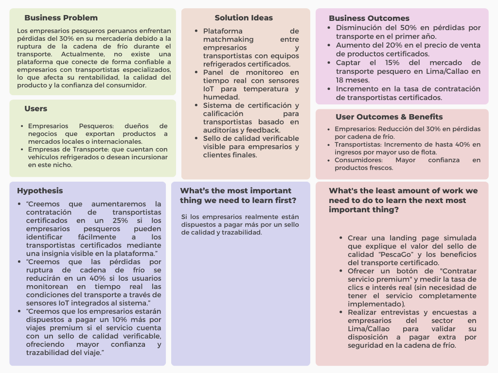

# Capítulo I: Introducción

## 1.1. Startup Profile

### 1.1.1. Descripción de la Startup

Devvolution es una startup fundada por estudiantes de Ingeniería de Software de la Universidad Peruana de Ciencias Aplicadas (UPC), con el propósito de desarrollar soluciones tecnológicas frente a problemáticas actuales. En esta ocasión, hemos identificado los desafíos que enfrentan los empresarios del sector pesquero, especialmente la falta de un servicio que garantice la calidad y el adecuado transporte de sus productos.

Como respuesta, presentamos PescaGo, una plataforma que busca facilitar la comunicación y coordinación entre empresarios pesqueros y empresas de transporte, asegurando así una cadena de distribución más eficiente y confiable.

### 1.1.2. Perfiles de integrantes del equipo

| Nombres y Apellidos |  Código  | Carrera | Conocimientos técnicos/ Habilidades | Foto |
|----------|------------|----------|------------|------|
| Alexandra Belen Ramos Argüelles | U202215164 | Ingeniería de Software | **Frontend:** Angular, Vue y Flutter. **Backend:** Desarrollo de APIs REST con Spring Boot y .NET.  **Conocimientos adicionales:** C++, C# Python, gestión de bases de datos.||
| Maria Fernanda Fernandez Alva | U20201C131 | Ingeniería de Software | **Frontend:** Angular y Vue . **Backend:** Desarrollo de APIs REST con Spring Boot y .NET.  **Conocimientos adicionales:** C++, C# , gestión de bases de datos. También cuento con base en TypeScript, HTML y algo de CSS. Actualmente estoy fortaleciendo mis habilidades en bases de datos a través de cursos de SQL. |  |
||||||

## 1.2. Solution Profile

PescaGo fue concebido con el objetivo de brindar una solución a los empresarios pesqueros que enfrentaban dificultades para trasladar productos marinos. Por ello, a través de nuestra plataforma buscamos establecer un canal de comunicación eficiente entre los empresarios del sector pesquero y las empresas de transporte que cuentan con equipos en excelentes condiciones.

Gracias a esta iniciativa, las empresas de transporte adquieren mayor conocimiento sobre los requerimientos del rubro y pueden garantizar que la mercadería se traslade en condiciones óptimas, asegurando su calidad y frescura.

### 1.2.1. Antecedentes y problemática

En el Perú, se ha registrado un incremento significativo en el consumo de productos marinos, alcanzando un aumento del 39 % en comparación con años anteriores ([El Comercio, 2025](https://elcomercio.pe/lima/sucesos/consumo-de-productos-marinos-aumento-39-en-el-peru-revela-produce-noticia/?ref=ecr)). Este crecimiento resalta la importancia de garantizar que dichos productos se encuentren en condiciones óptimas para su consumo, lo que implica que deben estar frescos o debidamente congelados, siguiendo protocolos estrictos que eviten infecciones o la propagación de bacterias.

Ante esta necesidad, los empresarios del sector requieren servicios de transporte especializados, que cuenten con espacios refrigerados y control de temperatura, además de otras condiciones adecuadas que aseguren la correcta preservación de estos alimentos durante su traslado.

**Principales problemáticas identificadas:**

* **Control de temperatura:** En algunas entregas de los productos se presentaron fluctuaciones de temperatura aceleraron la descomposición, afectando la textura, el sabor y el olor de los productos.
* **Cadena de frío:** Romper la cadena de frío puede causar crecimiento bacteriano, pérdida de frescura y rechazo comercial debido a los estándares no cumplidos.

**Técnica de las 5W's y 2H's**

**¿What? - ¿Cuál es el problema?**

Los empresarios pesqueros enfrentan dificultades para trasladar sus productos marinos en condiciones óptimas, debido a la falta de transporte especializado que garantice el mantenimiento de la cadena de frío y el control adecuado de la temperatura.

**¿When? - ¿Cuando se ve el problema?**

El problema aparece durante el proceso de traslado de los productos, especialmente en las etapas de carga, transporte y descarga, donde se pueden presentar fluctuaciones de temperatura o rupturas en la cadena de frío.

**¿Where? - ¿Dónde se origina el problema?**

Esto sucede principalmente en las zonas de transporte marítimo y terreste dentro del territorio peruano, desde los puntos de pesca o procesamiento hasta los de distribución o venta de productos.

**¿Who? - ¿A quién le sucede?**

A los empresarios del sector pesquero, quienes pierden calidad en su mercadería; también a las empresas de transporte que no cuenta con un canal de comunicación para informar sobre sus servicios, y a los consumidores finales, quienes podrían verse afectados por productos en mal estado.

**¿Why? - ¿Por qué sucede el problema?**

El problema sucede debido a la falta de equipos de transporte de refrigerado adecuados, desconocimientotécnico de las condiciones que requieren los productos marinos, y una escasa comunicación entre empresarios pesqueros y empresas de transporte especializadas.

**¿How? - ¿Cómo se diferencia el problema del estado normal (óptimo)?**

En un estado óptimo, los productos marinos se trasladan bajo temperaturas controladas y constantes, preservando su frescura, sabor y seguridad alimentaria. En cambio, con el problema actual, hay fluctuaciones térmicas que afectan la calidad, provocan contaminación y pérdidas económicas.

**¿How Much? - ¿Cuántos problemas se dan en un dia?**

Se estima que múltiples entregas diarias presentan incidencias, especialmente en temporadas de alta demanda. Estas fallas pueden representar pérdidas significativas para los empresarios y una disminución en la confianza del consumidor.

### 1.2.2. Lean UX Process

#### 1.2.2.1. Lean UX Problem Statements

**Problem Statement:**

Los empresarios peruanos del sector pesquero enfretan pérdidas del 30% en su mercadería debido a la falta de acceso a transportistas especializados en cadena de frío, lo que impacta su rentabilidad y la confianza del consumidor. Actualmente, no existe un sistema que conecte a estos actores con garantías de calidad y monitoreo tiempo real. PescaGo busca resolver esta brecha mediante una plataforma digital que certifique transportistas y genere transperencia en el proceso, asegurando productos frescos y reduciendo pérdida económicas.
 
 * **Domain:** Logística y transporte de productos perecederos.
 * **Customer Segments:** Dentro de los segmentos tenemos a Empresarios pesqueros que exportan a mercados locales y Empresas de transporte.
 * **Pain points:** Los empresarios tienen un 30% de pérdidas por ruptura de cadena de frío. Las empresas de transporte presentan una falta de demanda estable para justificar inversión en equipos. 
 * **Gap:** No existe una plataforma que conecte empresarios con transportistas especializados y certifique condiciones óptimas de transporte.
 * **Visión/Strategy:** Ser el puente digital que garantice la cadena de frío en el transporte pesquero, reduciendo pérdidas y aumentando la confianza en el mercado.
 * **Initial Segment:** Empresarios pesqueros de Lima y Callao (80% de la producción nacional).

#### 1.2.2.2. Lean UX Assumptions

**Features:**
* jSistema de matchmaking entre empresarios pesqueros y transportistas con equipos refrigerados certificados.
* Panel de monitoreo en tiempo real con sensores IoT para temperatura/humedad durante el transporte.
* Sistema de certificación y calificaciones para transportistas basado en cumplimiento de estándares.

**Business Outcomes:**
* Reducción del 50% en pérdidas por mal transporte durante el primer año.
* 20% de aumento en el precio de venta de productos con "PescaGo".
* Captar el 15% del mercado de transporte pesquero en Lima/Callao en 18 meses.

**Users:**
* Empresario Pesquero: Desea minimizar pérdidas por transporte.
* Empresa de Transporte: Buscan obtener clientes recurrentes que justifiquen su inversión.

**User Outcomes & Benefits:**
* Disminución de mercancía: Evitar el porcentaje de pérdidas anuales.
* Mayor utilización de flota: Obtener un 40% más de ingresos por viajes.
* Confianza en calidad: Los consumidores presentan mayor disposición a pagar el precio de los productos.

**Business Assumptions:**
1. Existe una necesidad por parte de los empresarios para que la calidad de sus productos esté en buenas condiciones por lo que están dispuestos a adquirir el plan premium con el objetivo de encontrar empresas de transporte certificados.
2. Implementar sensores IoT ayudaría a proveer datos confiables.
3. Las auditorías semestrales a las empresas de transporte ayudarían a garatizar la transparecia y confiablidad de la plataforma.

#### 1.2.2.3. Lean UX Hypothesis Statements

#### Hipótesis del Proyecto:

* **Hipótesis 1:**
  
  **Creemos que** implementar un sistema de certificación con insignias visibles para los transportistas especializados aumentará su contratación en un 25%.
  
  **Sabremos que** estamos en el camino correcto.

  **Cuando observemos** un aumento en la tasa de finalización del proceso de certificación, alcanzando al menos 15 transportistas certificados por mes.

* **Hipótesis 2:**

    **Creemos que** la implementación de monitoreo en tiempo real mediante sensores IoT reducirá los incidentes de ruptura de la cadena de frío en un 40%.
  
  **Sabremos que** estamos en el camino correcto.

  **Cuando observemos** una reducción en las quejas relacionadas con la calidad del producto debido a problemas de temperatura durante el transporte.

* **Hipótesis 3:**
  
  **Creemos que**  los empresarios estarán dispuestos a pagar un 10% más por servicios de transporte que cuenten con un sello de calidad verificable.
  
  **Sabremos que** estamos en el camino correcto.

  **Cuando observemos** un incremento en los ingresos promedio por viaje debido a la adopción del servicio premium.
  

#### 1.2.2.4. Lean UX Canvas

## 1.3. Segmentos objetivo

Dentro de nuestra propuesta de solución, identificamos dos segmentos clave los cuales se encuentran involucrados en el problema.

* **Empresarios Pesqueros**
Pequeños y medianos exportadores de productos marinos en Lima y Callao, que enfrentan pérdidas por falta de transporte refrigerado especializado.
**Características demográficas:**
  * Ubicación: Principalmente Lima Metropolitana y Callao, donde se concentra el 80% de la producción y exportación pesquera del país.
  * Tamaño de empresa: MIPYMES
  * Edad: Mayores de 35
  * Sexo: Masculino y Femenino

* **Empresas de transporte**
  
  Flotas de transporte con capacidad refrigerada, pero con baja utilización debido a la falta de demanda especializada.
  **Características demográficas:**
    * Ubicación: Lima Metropolitana y Callao (distritos cercanos a puertos).
  * Tamaño de empresa: MIPYMES con 2 a 15 unidades vehiculares.
  * Edad: Entre 5 y 15 años de operación.
  * Sexo: Masculino y Femenino
