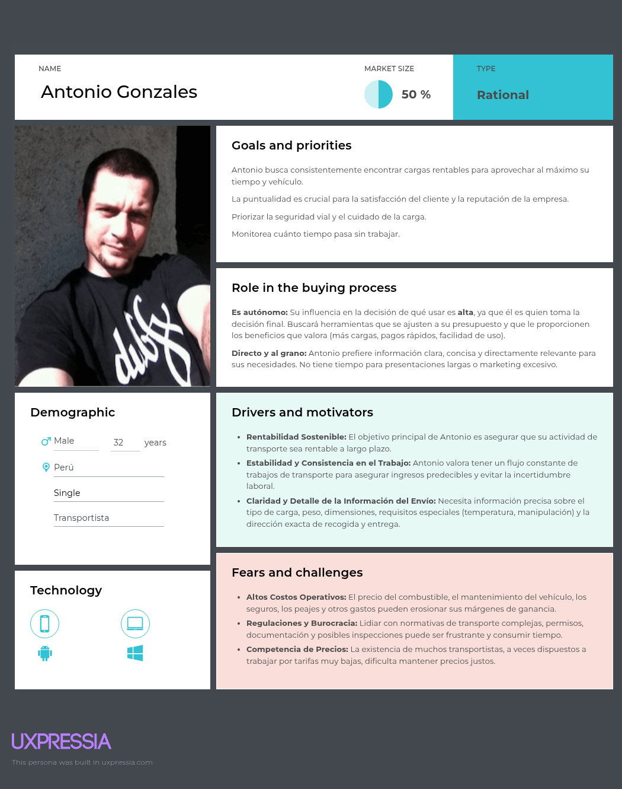
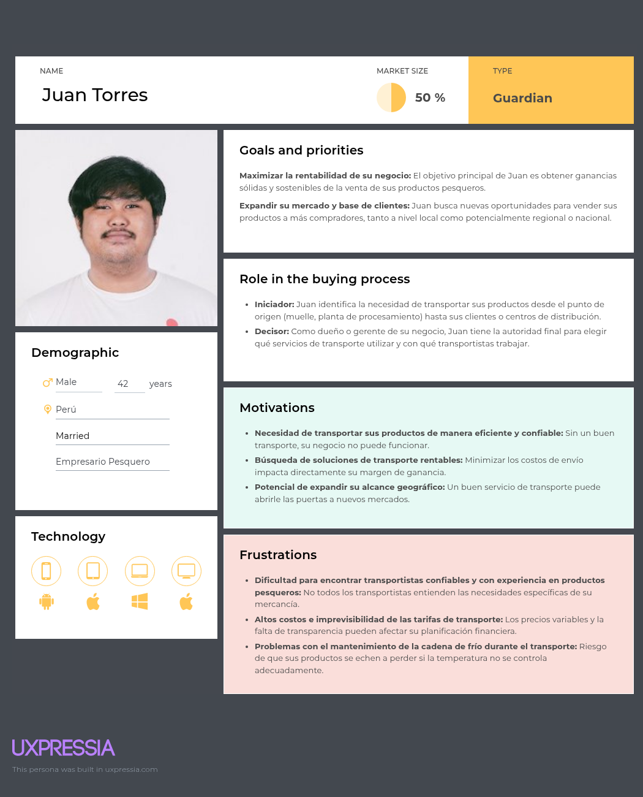

# Capítulo II: Requirements Elicitation & Analysis  
## 2.1. Competidores
Es vital para la estrategia y planificación de nuestro producto conocer a fondo el panorama competitivo. Por ello, en este apartado explicaremos quiénes son nuestros competidores y describiremos sus aspectos más relevantes.

| EMPRESA | DESCRIPCIÓN | IMAGEN |
|-|-|-|
| DeltaX | Esta se presenta como una plataforma digital de transporte para Latinoamérica, con operaciones específicas en Perú. Podría ser un competidor directo si conecta a generadores de carga con transportistas en la región. |  |
| Movil Move  | Se describe como una aplicación para empresas de transporte de pasajeros, carga, mensajería y domicilios en Perú. Si bien su enfoque parece ser más amplio, podría tener funcionalidades para conectar a empresas con necesidades de carga con transportistas disponibles. |  |
| Efletex   | Mencionada como una startup peruana que conecta proveedores y usuarios de transporte de carga a través de una app móvil. |  |

  ### 2.1.1. Análisis Competitivo  

En esta sección analizaremos nuestros competidores de manera profunda. Investigaremos sobre sus fortalezas, debilidades, oportunidades, amenazas, el perfil la empresa y de la solución, lo que brindan. Así, podemos refinar nuestras características y saber que es lo que tenemos en nuestro producto que capte más la atención de nuestro mercado objetivo.

| | |DeltaX|Movil Move|Efletex|
|-|-|-|-|-|
| |**Nombre y Logo**|  |  | |
|**Perfil**|**Overview**| Plataforma digital de transporte de carga que opera en América Latina, con un enfoque en Perú. Conecta a remitentes con transportistas disponibles, facilitando el transporte de mercancías.|Aplicación móvil diseñada para transporte de pasajeros, carga, mensajería y entregas a domicilio en Perú. Aunque se enfoca principalmente en el transporte de pasajeros, también ofrece servicios de entrega de carga.| Startup peruana que conecta proveedores y usuarios de transporte de carga a través de una aplicación móvil. Busca agilizar el proceso logístico para remitentes y transportistas.|
|**Ventaja competitiva**|**¿Qué valor ofrece a los clientes?**| Agiliza el proceso logístico para remitentes y transportistas. Proporciona una plataforma centralizada para que los remitentes encuentren y reserven servicios de transporte, mientras que ofrece a los transportistas acceso a una mayor cantidad de clientes potenciales. La plataforma también ofrece funciones como seguimiento en tiempo real, documentación automatizada y procesamiento de pagos, lo que hace que todo el proceso de envío sea más eficiente y transparente.|Proporciona una forma conveniente y eficiente para que individuos y empresas reserven servicios de transporte para pasajeros, carga o entregas. La aplicación ofrece seguimiento en tiempo real, pagos en línea y atención al cliente, lo que facilita la gestión de las necesidades de transporte.|Proporciona una forma conveniente y eficiente para que los remitentes encuentren y reserven servicios de transporte. La aplicación ofrece seguimiento en tiempo real, pagos en línea y atención al cliente, lo que facilita la gestión de las necesidades de envío.|
|**Perfil de Marketing**|**Mercado objetivo**| Principalmente pequeñas y medianas empresas en Perú que necesitan transportar mercancías dentro del país o a regiones vecinas.|Individuos y empresas en Perú que necesitan servicios de transporte para pasajeros, carga o entregas.|Principalmente pequeñas y medianas empresas en Perú que necesitan transportar mercancías dentro del país.|
|**Perfil de Marketing**|**Estrategias de marketing**| Se enfoca en campañas de marketing digital, como publicidad en redes sociales, optimización de motores de búsqueda y marketing de contenidos, para llegar a su público objetivo. También pueden asociarse con asociaciones de la industria y empresas de logística para ampliar su alcance y credibilidad.|Se enfoca en campañas de marketing digital, como publicidad en redes sociales, optimización de motores de búsqueda y marketing de contenidos, para llegar a su público objetivo. También pueden asociarse con empresas y organizaciones locales para ampliar su alcance y credibilidad.|Se enfoca en campañas de marketing digital, como publicidad en redes sociales, optimización de motores de búsqueda y marketing de contenidos, para llegar a su público objetivo. También pueden asociarse con asociaciones de la industria y empresas de logística para ampliar su alcance y credibilidad.|
|**Perfil de Producto**|**Productos & Servicios**|Plataforma digital que permite a los remitentes publicar sus requisitos de transporte y recibir ofertas de transportistas. La plataforma también ofrece funciones como seguimiento en tiempo real, documentación automatizada y procesamiento de pagos.|Aplicación móvil que permite a los usuarios reservar servicios de transporte para pasajeros, carga o entregas. La aplicación ofrece funciones como seguimiento en tiempo real, pagos en línea y atención al cliente.|Aplicación móvil que permite a los remitentes encontrar y reservar servicios de transporte. La aplicación ofrece funciones como seguimiento en tiempo real, pagos en línea y atención al cliente.|
|**Precios & Costos**| |Su modelo de precios probablemente se basa en una estructura de comisiones, donde cobran una tarifa por cada transacción exitosa facilitada a través de su plataforma. Las tarifas exactas pueden variar según el tipo de carga, la distancia y otros factores.|Su modelo de precios probablemente se basa en un modelo por viaje o por kilómetro. Los precios exactos pueden variar según el tipo de servicio, la distancia y otros factores.|Su modelo de precios probablemente se basa en una estructura de comisiones, donde cobran una tarifa por cada transacción exitosa facilitada a través de su plataforma. Las tarifas exactas pueden variar según el tipo de carga, la distancia y otros factores.|
|**Canales de distribución (Web y/o Móvil)**| |Opera principalmente a través de su sitio web y aplicación móvil, que ofrece una interfaz fácil de usar para remitentes y transportistas.|Disponible principalmente como aplicación móvil para dispositivos Android e iOS.|Disponible principalmente como aplicación móvil para dispositivos Android e iOS.|
|**Análisis SWOT**|**Fortalezas**| - Enfoque en el creciente mercado de logística latinoamericano.   - Plataforma fácil de usar con énfasis en la eficiencia y la transparencia.   - Potencial para ahorrar costos y tiempo tanto para remitentes como para transportistas.|- Enfoque en la creciente demanda de servicios de transporte bajo demanda en Perú.   - Aplicación móvil fácil de usar con énfasis en la comodidad y facilidad de uso.   - Potencial para ahorrar costos y tiempo para los usuarios.|- Enfoque en la creciente demanda de servicios logísticos en Perú.   - Aplicación móvil fácil de usar con énfasis en la comodidad y facilidad de uso.   - Potencial para ahorrar costos y tiempo para los remitentes.|
|**Análisis SWOT**|**Debilidades**|-Jugador relativamente nuevo en el mercado, en comparación con las empresas de logística establecidas.  - Es posible que deba invertir mucho en marketing y adquisición de clientes para ganar tracción.  - Depende de una conexión a Internet sólida para un funcionamiento sin problemas.|-Jugador relativamente nuevo en el mercado, en comparación con las empresas de transporte establecidas.  - Es posible que deba invertir mucho en marketing y adquisición de clientes para ganar tracción.  - Depende de una conexión a Internet sólida para un funcionamiento sin problemas.|- Jugador relativamente nuevo en el mercado, en comparación con las empresas de logística establecidas.  - Es posible que deba invertir mucho en marketing y adquisición de clientes para ganar tracción.  - Depende de una conexión a Internet sólida para un funcionamiento sin problemas.|
|**Análisis SWOT**|**Oportunidades**|- Creciente demanda de servicios logísticos en América Latina.  - Potencial para expandirse a otras regiones.  - Oportunidad de diferenciarse al centrarse en la tecnología y la innovación.|- Creciente demanda de servicios de transporte bajo demanda en Perú.  - Potencial para expandirse a otras regiones.  - Oportunidad de diferenciarse al centrarse en la tecnología y la innovación.|- Creciente demanda de servicios logísticos en Perú.  - Potencial para expandirse a otras regiones.  - Oportunidad de diferenciarse al centrarse en la tecnología y la innovación.|
|**Análisis SWOT**|**Amenazas**|- Competencia de empresas de logística establecidas con un fuerte reconocimiento de marca.  - Posibilidad de disrupciones tecnológicas que podrían afectar la funcionalidad de la plataforma.  - Fluctuaciones económicas que podrían afectar la demanda de servicios logísticos.|- Competencia de empresas de transporte establecidas con un fuerte reconocimiento de marca.  - Posibilidad de disrupciones tecnológicas que podrían afectar la funcionalidad de la plataforma.  - Fluctuaciones económicas que podrían afectar la demanda de servicios de transporte.|- Competencia de empresas de logística establecidas con un fuerte reconocimiento de marca.  - Posibilidad de disrupciones tecnológicas que podrían afectar la funcionalidad de la plataforma.  - Fluctuaciones económicas que podrían afectar la demanda de servicios logísticos.|

  ### 2.1.2. Estrategias y tácticas frente a competidores

|Estrategia|Tácticas|
|-|-|
|Diferenciación por nicho.|**Desarrollar funcionalidades específicas:** Implementar características diseñadas para las necesidades únicas del transporte de productos pesqueros, como campos detallados para especificar el tipo de pescado, estado (fresco, congelado), requisitos de manipulación (hielo, atmósfera controlada), y certificaciones sanitarias.   **Marketing de contenido especializado:** Crear guías, artículos de blog y webinars sobre las mejores prácticas en el transporte de productos pesqueros, regulaciones sanitarias, y la importancia de la cadena de frío. Esto te posicionará como un experto en el sector.   **Colaboraciones estratégicas:** Asociarte con asociaciones de pescadores, mercados mayoristas de pescado, y empresas de procesamiento de productos del mar para promocionar tu plataforma.|
|Ofrecer una estructura de precios competitiva y flexible.|**Tarifas de comisión competitivas:** Establecer tarifas de comisión que sean atractivas para ambas partes, considerando las particularidades del transporte refrigerado.   **Descuentos por volumen o lealtad:** Ofrecer incentivos a los usuarios frecuentes para fomentar la lealtad a la plataforma.   **Modelos de suscripción específicos:** Considerar modelos de suscripción con diferentes niveles de funcionalidades adaptados a las necesidades y volúmenes de envío de los emprendedores pesqueros (por ejemplo, basado en el número de envíos al mes o el volumen total).|
  
## 2.2. Entrevistas
  ### 2.2.1. Diseño de entrevistas
  
  #### Preguntas para Emprendedores Pesqueros:
  
  **Sobre su negocio actual:**

  - ¿Qué tipo de pescado vende principalmente? (fresco, congelado, etc.)
  - ¿Cuánto y con qué frecuencia envía?
  - ¿A dónde suele enviar?
  - ¿Cómo transporta sus productos ahora?
  - ¿Qué es lo más difícil del transporte actual para usted?
  - ¿Qué necesita de los vehículos de transporte? (refrigeración, etc.)
  - ¿Cómo se asegura de la calidad al llegar?
  - ¿Qué papeles o permisos son importantes para el transporte?
  
  **Sobre sus necesidades y expectativas:**

  - ¿Qué espera de una plataforma para encontrar transporte? 
  - ¿Qué funciones de una app serían clave para usted? (precio, seguimiento, comunicación, etc.)
  - ¿Qué necesita saber de un transportista antes de contratarlo? (experiencia, vehículo, referencias, etc.)
  - ¿Qué tan rápido necesita encontrar transporte?
  - ¿Qué tan importante es el precio vs. la calidad del servicio?
  - ¿Cómo prefiere comunicarse con los transportistas?
  - ¿Cómo le gustaría pagarles?
  - ¿Qué problemas de transporte de pescado le gustaría resolver con una app?
  - ¿Probaría una nueva plataforma? ¿Qué lo convencería?
  - ¿Cuánto pagaría por usar una app así? (por envío, suscripción, etc.)

  ####  Preguntas para Transportistas:
  
  **Sobre su negocio actual:**
  
  - ¿Qué tipo de carga transporta? ¿Tiene experiencia con refrigerados/perecederos?
  - ¿Qué vehículos refrigerados tiene y qué capacidad ofrecen?
  - ¿Qué rutas hace con más frecuencia?
  - ¿Cómo consigue clientes ahora?
  - ¿Qué es lo más difícil de encontrar cargas o gestionar su trabajo?
  - ¿Qué necesita saber de la carga antes de aceptarla?
  - ¿Cómo maneja los papeles y las pruebas de entrega?
  
  **Sobre sus necesidades y expectativas:**
  
  - ¿Qué espera de una plataforma para encontrar clientes?
  - ¿Qué funciones de una app serían clave para usted? (alertas de carga, detalles, precios, pagos, comunicación, etc.)
  - ¿Qué necesita saber de un cliente antes de aceptar un trabajo? (reputación, pagos, etc.)
  - ¿Qué tan importante es encontrar cargas rápido para no viajar vacío?
  - ¿Qué tan importante es que los detalles del envío sean claros?
  - ¿Cómo prefiere comunicarse con los clientes?
  - ¿Cómo le gustaría que le pagaran?
  - ¿Qué problemas del transporte le gustaría resolver con una app?
  - ¿Se uniría a una nueva plataforma? ¿Qué lo convencería?
  - ¿Qué tarifas o comisiones pagaría por usar una app así?
  - ¿Qué otras herramientas le serían útiles (rutas, gestión, etc.)?

  ### 2.2.2. Registro de entrevistas
  ### 2.2.3. Análisis de entrevistas
## 2.3. Needfinding
  ### 2.3.1. User Personas
  En esta sección se presentan personajes ficticios que representan los segmentos objetivos identificados y entrevistados mediante user personas. 

  **User Persona 1:**

  

  **User Persona 2:**

  

  ### 2.3.2. User Task Matrix
  ### 2.3.3. User Journey Mapping
  ### 2.3.4. Empathy Mapping
  ### 2.3.5. As-is Scenario Mapping
## 2.4. Ubiquitous Language 