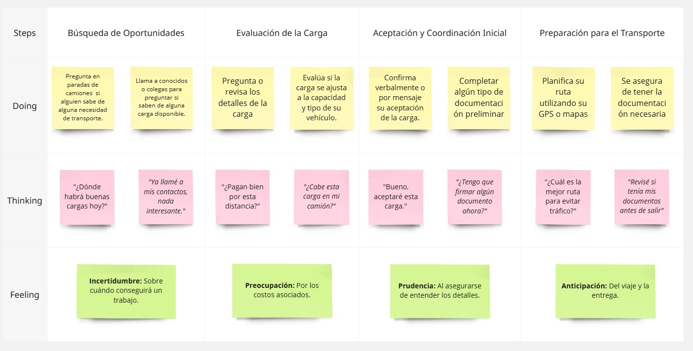
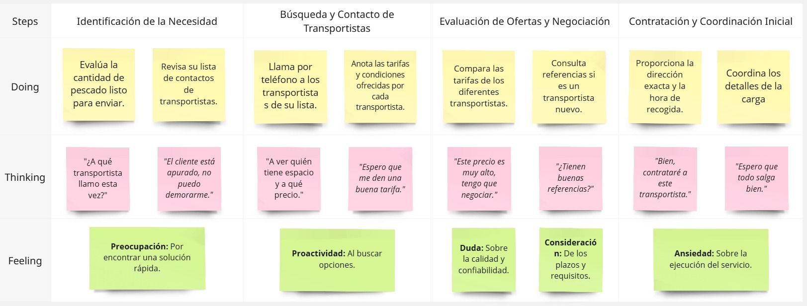

# Capítulo II: Requirements Elicitation & Analysis

## 2.1. Competidores

Es vital para la estrategia y planificación de nuestro producto conocer a fondo el panorama competitivo. Por ello, en este apartado explicaremos quiénes son nuestros competidores y describiremos sus aspectos más relevantes.

| EMPRESA    | DESCRIPCIÓN                                                                                                                                                                                                                                                                | IMAGEN                                        |
| ---------- | -------------------------------------------------------------------------------------------------------------------------------------------------------------------------------------------------------------------------------------------------------------------------- | --------------------------------------------- |
| DeltaX     | Esta se presenta como una plataforma digital de transporte para Latinoamérica, con operaciones específicas en Perú. Podría ser un competidor directo si conecta a generadores de carga con transportistas en la región.                                                    |        |
| Movil Move | Se describe como una aplicación para empresas de transporte de pasajeros, carga, mensajería y domicilios en Perú. Si bien su enfoque parece ser más amplio, podría tener funcionalidades para conectar a empresas con necesidades de carga con transportistas disponibles. |  |
| Efletex    | Mencionada como una startup peruana que conecta proveedores y usuarios de transporte de carga a través de una app móvil.                                                                                                                                                   |      |

### 2.1.1. Análisis Competitivo

En esta sección analizaremos nuestros competidores de manera profunda. Investigaremos sobre sus fortalezas, debilidades, oportunidades, amenazas, el perfil la empresa y de la solución, lo que brindan. Así, podemos refinar nuestras características y saber que es lo que tenemos en nuestro producto que capte más la atención de nuestro mercado objetivo.

|                                             |                                       | DeltaX                                                                                                                                                                                                                                                                                                                                                                                                                                                                              | Movil Move                                                                                                                                                                                                                                                                                          | Efletex                                                                                                                                                                                                                                                                                                    |
| ------------------------------------------- | ------------------------------------- | ----------------------------------------------------------------------------------------------------------------------------------------------------------------------------------------------------------------------------------------------------------------------------------------------------------------------------------------------------------------------------------------------------------------------------------------------------------------------------------- | --------------------------------------------------------------------------------------------------------------------------------------------------------------------------------------------------------------------------------------------------------------------------------------------------- | ---------------------------------------------------------------------------------------------------------------------------------------------------------------------------------------------------------------------------------------------------------------------------------------------------------- |
|                                             | **Nombre y Logo**                     |                                                                                                                                                                                                                                                                                                                                                                                                                                              |                                                                                                                                                                                                                                                        |                                                                                                                                                                                                                                                                   |
| **Perfil**                                  | **Overview**                          | Plataforma digital de transporte de carga que opera en América Latina, con un enfoque en Perú. Conecta a remitentes con transportistas disponibles, facilitando el transporte de mercancías.                                                                                                                                                                                                                                                                                        | Aplicación móvil diseñada para transporte de pasajeros, carga, mensajería y entregas a domicilio en Perú. Aunque se enfoca principalmente en el transporte de pasajeros, también ofrece servicios de entrega de carga.                                                                              | Startup peruana que conecta proveedores y usuarios de transporte de carga a través de una aplicación móvil. Busca agilizar el proceso logístico para remitentes y transportistas.                                                                                                                          |
| **Ventaja competitiva**                     | **¿Qué valor ofrece a los clientes?** | Agiliza el proceso logístico para remitentes y transportistas. Proporciona una plataforma centralizada para que los remitentes encuentren y reserven servicios de transporte, mientras que ofrece a los transportistas acceso a una mayor cantidad de clientes potenciales. La plataforma también ofrece funciones como seguimiento en tiempo real, documentación automatizada y procesamiento de pagos, lo que hace que todo el proceso de envío sea más eficiente y transparente. | Proporciona una forma conveniente y eficiente para que individuos y empresas reserven servicios de transporte para pasajeros, carga o entregas. La aplicación ofrece seguimiento en tiempo real, pagos en línea y atención al cliente, lo que facilita la gestión de las necesidades de transporte. | Proporciona una forma conveniente y eficiente para que los remitentes encuentren y reserven servicios de transporte. La aplicación ofrece seguimiento en tiempo real, pagos en línea y atención al cliente, lo que facilita la gestión de las necesidades de envío.                                        |
| **Perfil de Marketing**                     | **Mercado objetivo**                  | Principalmente pequeñas y medianas empresas en Perú que necesitan transportar mercancías dentro del país o a regiones vecinas.                                                                                                                                                                                                                                                                                                                                                      | Individuos y empresas en Perú que necesitan servicios de transporte para pasajeros, carga o entregas.                                                                                                                                                                                               | Principalmente pequeñas y medianas empresas en Perú que necesitan transportar mercancías dentro del país.                                                                                                                                                                                                  |
| **Perfil de Marketing**                     | **Estrategias de marketing**          | Se enfoca en campañas de marketing digital, como publicidad en redes sociales, optimización de motores de búsqueda y marketing de contenidos, para llegar a su público objetivo. También pueden asociarse con asociaciones de la industria y empresas de logística para ampliar su alcance y credibilidad.                                                                                                                                                                          | Se enfoca en campañas de marketing digital, como publicidad en redes sociales, optimización de motores de búsqueda y marketing de contenidos, para llegar a su público objetivo. También pueden asociarse con empresas y organizaciones locales para ampliar su alcance y credibilidad.             | Se enfoca en campañas de marketing digital, como publicidad en redes sociales, optimización de motores de búsqueda y marketing de contenidos, para llegar a su público objetivo. También pueden asociarse con asociaciones de la industria y empresas de logística para ampliar su alcance y credibilidad. |
| **Perfil de Producto**                      | **Productos & Servicios**             | Plataforma digital que permite a los remitentes publicar sus requisitos de transporte y recibir ofertas de transportistas. La plataforma también ofrece funciones como seguimiento en tiempo real, documentación automatizada y procesamiento de pagos.                                                                                                                                                                                                                             | Aplicación móvil que permite a los usuarios reservar servicios de transporte para pasajeros, carga o entregas. La aplicación ofrece funciones como seguimiento en tiempo real, pagos en línea y atención al cliente.                                                                                | Aplicación móvil que permite a los remitentes encontrar y reservar servicios de transporte. La aplicación ofrece funciones como seguimiento en tiempo real, pagos en línea y atención al cliente.                                                                                                          |
| **Precios & Costos**                        |                                       | Su modelo de precios probablemente se basa en una estructura de comisiones, donde cobran una tarifa por cada transacción exitosa facilitada a través de su plataforma. Las tarifas exactas pueden variar según el tipo de carga, la distancia y otros factores.                                                                                                                                                                                                                     | Su modelo de precios probablemente se basa en un modelo por viaje o por kilómetro. Los precios exactos pueden variar según el tipo de servicio, la distancia y otros factores.                                                                                                                      | Su modelo de precios probablemente se basa en una estructura de comisiones, donde cobran una tarifa por cada transacción exitosa facilitada a través de su plataforma. Las tarifas exactas pueden variar según el tipo de carga, la distancia y otros factores.                                            |
| **Canales de distribución (Web y/o Móvil)** |                                       | Opera principalmente a través de su sitio web y aplicación móvil, que ofrece una interfaz fácil de usar para remitentes y transportistas.                                                                                                                                                                                                                                                                                                                                           | Disponible principalmente como aplicación móvil para dispositivos Android e iOS.                                                                                                                                                                                                                    | Disponible principalmente como aplicación móvil para dispositivos Android e iOS.                                                                                                                                                                                                                           |
| **Análisis SWOT**                           | **Fortalezas**                        | - Enfoque en el creciente mercado de logística latinoamericano.   - Plataforma fácil de usar con énfasis en la eficiencia y la transparencia.   - Potencial para ahorrar costos y tiempo tanto para remitentes como para transportistas.                                                                                                                                                                                                                                      | - Enfoque en la creciente demanda de servicios de transporte bajo demanda en Perú.   - Aplicación móvil fácil de usar con énfasis en la comodidad y facilidad de uso.   - Potencial para ahorrar costos y tiempo para los usuarios.                                                           | - Enfoque en la creciente demanda de servicios logísticos en Perú.   - Aplicación móvil fácil de usar con énfasis en la comodidad y facilidad de uso.   - Potencial para ahorrar costos y tiempo para los remitentes.                                                                                |
| **Análisis SWOT**                           | **Debilidades**                       | -Jugador relativamente nuevo en el mercado, en comparación con las empresas de logística establecidas.  - Es posible que deba invertir mucho en marketing y adquisición de clientes para ganar tracción.  - Depende de una conexión a Internet sólida para un funcionamiento sin problemas.                                                                                                                                                                                   | -Jugador relativamente nuevo en el mercado, en comparación con las empresas de transporte establecidas.  - Es posible que deba invertir mucho en marketing y adquisición de clientes para ganar tracción.  - Depende de una conexión a Internet sólida para un funcionamiento sin problemas.  | - Jugador relativamente nuevo en el mercado, en comparación con las empresas de logística establecidas.  - Es posible que deba invertir mucho en marketing y adquisición de clientes para ganar tracción.  - Depende de una conexión a Internet sólida para un funcionamiento sin problemas.         |
| **Análisis SWOT**                           | **Oportunidades**                     | - Creciente demanda de servicios logísticos en América Latina.  - Potencial para expandirse a otras regiones.  - Oportunidad de diferenciarse al centrarse en la tecnología y la innovación.                                                                                                                                                                                                                                                                                  | - Creciente demanda de servicios de transporte bajo demanda en Perú.  - Potencial para expandirse a otras regiones.  - Oportunidad de diferenciarse al centrarse en la tecnología y la innovación.                                                                                            | - Creciente demanda de servicios logísticos en Perú.  - Potencial para expandirse a otras regiones.  - Oportunidad de diferenciarse al centrarse en la tecnología y la innovación.                                                                                                                   |
| **Análisis SWOT**                           | **Amenazas**                          | - Competencia de empresas de logística establecidas con un fuerte reconocimiento de marca.  - Posibilidad de disrupciones tecnológicas que podrían afectar la funcionalidad de la plataforma.  - Fluctuaciones económicas que podrían afectar la demanda de servicios logísticos.                                                                                                                                                                                             | - Competencia de empresas de transporte establecidas con un fuerte reconocimiento de marca.  - Posibilidad de disrupciones tecnológicas que podrían afectar la funcionalidad de la plataforma.  - Fluctuaciones económicas que podrían afectar la demanda de servicios de transporte.         | - Competencia de empresas de logística establecidas con un fuerte reconocimiento de marca.  - Posibilidad de disrupciones tecnológicas que podrían afectar la funcionalidad de la plataforma.  - Fluctuaciones económicas que podrían afectar la demanda de servicios logísticos.                    |

### 2.1.2. Estrategias y tácticas frente a competidores

| Estrategia                                                | Tácticas                                                                                                                                                                                                                                                                                                                                                                                                                                                                                                                                                                                                                                                                                                                                                                                                               |
| --------------------------------------------------------- | ---------------------------------------------------------------------------------------------------------------------------------------------------------------------------------------------------------------------------------------------------------------------------------------------------------------------------------------------------------------------------------------------------------------------------------------------------------------------------------------------------------------------------------------------------------------------------------------------------------------------------------------------------------------------------------------------------------------------------------------------------------------------------------------------------------------------- |
| Diferenciación por nicho.                                 | **Desarrollar funcionalidades específicas:** Implementar características diseñadas para las necesidades únicas del transporte de productos pesqueros, como campos detallados para especificar el tipo de pescado, estado (fresco, congelado), requisitos de manipulación (hielo, atmósfera controlada), y certificaciones sanitarias.   **Marketing de contenido especializado:** Crear guías, artículos de blog y webinars sobre las mejores prácticas en el transporte de productos pesqueros, regulaciones sanitarias, y la importancia de la cadena de frío. Esto te posicionará como un experto en el sector.   **Colaboraciones estratégicas:** Asociarte con asociaciones de pescadores, mercados mayoristas de pescado, y empresas de procesamiento de productos del mar para promocionar tu plataforma. |
| Ofrecer una estructura de precios competitiva y flexible. | **Tarifas de comisión competitivas:** Establecer tarifas de comisión que sean atractivas para ambas partes, considerando las particularidades del transporte refrigerado.   **Descuentos por volumen o lealtad:** Ofrecer incentivos a los usuarios frecuentes para fomentar la lealtad a la plataforma.   **Modelos de suscripción específicos:** Considerar modelos de suscripción con diferentes niveles de funcionalidades adaptados a las necesidades y volúmenes de envío de los emprendedores pesqueros (por ejemplo, basado en el número de envíos al mes o el volumen total).                                                                                                                                                                                                                           |

## 2.2. Entrevistas

### 2.2.1. Diseño de entrevistas

#### Preguntas para Emprendedores Pesqueros:

**Sobre su negocio actual:**

- ¿Qué tipo de pescado vende principalmente? (fresco, congelado, etc.)
- ¿Cuánto y con qué frecuencia envía?
- ¿A dónde suele enviar?
- ¿Cómo transporta sus productos ahora?
- ¿Qué es lo más difícil del transporte actual para usted?
- ¿Qué necesita de los vehículos de transporte? (refrigeración, etc.)
- ¿Cómo se asegura de la calidad al llegar?
- ¿Qué papeles o permisos son importantes para el transporte?

**Sobre sus necesidades y expectativas:**

- ¿Qué espera de una plataforma para encontrar transporte?
- ¿Qué funciones de una app serían clave para usted? (precio, seguimiento, comunicación, etc.)
- ¿Qué necesita saber de un transportista antes de contratarlo? (experiencia, vehículo, referencias, etc.)
- ¿Qué tan rápido necesita encontrar transporte?
- ¿Qué tan importante es el precio vs. la calidad del servicio?
- ¿Cómo prefiere comunicarse con los transportistas?
- ¿Cómo le gustaría pagarles?
- ¿Qué problemas de transporte de pescado le gustaría resolver con una app?
- ¿Probaría una nueva plataforma? ¿Qué lo convencería?
- ¿Cuánto pagaría por usar una app así? (por envío, suscripción, etc.)

#### Preguntas para Transportistas:

**Sobre su negocio actual:**

- ¿Qué tipo de carga transporta? ¿Tiene experiencia con refrigerados/perecederos?
- ¿Qué vehículos refrigerados tiene y qué capacidad ofrecen?
- ¿Qué rutas hace con más frecuencia?
- ¿Cómo consigue clientes ahora?
- ¿Qué es lo más difícil de encontrar cargas o gestionar su trabajo?
- ¿Qué necesita saber de la carga antes de aceptarla?
- ¿Cómo maneja los papeles y las pruebas de entrega?

**Sobre sus necesidades y expectativas:**

- ¿Qué espera de una plataforma para encontrar clientes?
- ¿Qué funciones de una app serían clave para usted? (alertas de carga, detalles, precios, pagos, comunicación, etc.)
- ¿Qué necesita saber de un cliente antes de aceptar un trabajo? (reputación, pagos, etc.)
- ¿Qué tan importante es encontrar cargas rápido para no viajar vacío?
- ¿Qué tan importante es que los detalles del envío sean claros?
- ¿Cómo prefiere comunicarse con los clientes?
- ¿Cómo le gustaría que le pagaran?
- ¿Qué problemas del transporte le gustaría resolver con una app?
- ¿Se uniría a una nueva plataforma? ¿Qué lo convencería?
- ¿Qué tarifas o comisiones pagaría por usar una app así?
- ¿Qué otras herramientas le serían útiles (rutas, gestión, etc.)?

### 2.2.2. Registro de entrevistas

Link a las entrevistas: https://www.canva.com/design/DAGlk1jQ5ow/b33aFtHzILb4Eo1IqCrJsw/watch?utm_content=DAGlk1jQ5ow&utm_campaign=designshare&utm_medium=link2&utm_source=uniquelinks&utlId=h86049f25bd

_Entrevistado 1_

<table border="1" style="text-align: left;">
	<tbody>
		<tr>
			<td colspan="1" rowspan="6"></td>
            <td colspan="1" rowspan="1"><strong>Nombre del entrevistado:
             
            </strong> Fernando
              Escobar
            </td>
		</tr>
        <tr>
            <td>
            <strong>Edad: </strong> 46 años
             
            </td>
        </tr>
        <tr>
            <td>
            <strong>Distrito:</strong> 
             Los Olivos
            </td>
        </tr>
        <tr>
            <td>
            <strong>Nombre del entrevistador:</strong>
             Maria Fernanda
             Fernandez Alva
            </td>
        </tr>
        <tr>
            <td>
            <strong>Timming: </strong>
             -- 
            <strong>Duración: </strong>
             04:19:00
            </td>
        </tr>
        <tr>
            <td>
             <strong><a href="https://www.canva.com/design/DAGlk1jQ5ow/b33aFtHzILb4Eo1IqCrJsw/watch?utm_content=DAGlk1jQ5ow&utm_campaign=designshare&utm_medium=link2&utm_source=uniquelinks&utlId=h86049f25bd">URL Entrevista</a></strong>
            </td>
        </tr>        
	</tbody>
</table>

<strong>Resumen: </strong> 
El señor Fernando nos comentó que se dedica a la venta de pescado fresco, principalmente merluza, bonito y caballa, enviando de 2 a 3 toneladas por semana, dependiendo de la temporada. Actualmente trabaja con transportistas conocidos y alquila camiones refrigerados, sin embargo, menciona que uno de sus principales problemas es la puntualidad y asegurar que la cadena de frío no se rompa durante el traslado.
Además, nos indicó que le gustaría contar con una plataforma que le permita encontrar transportistas de forma rápida, confiable y con vehículos verificados, ya que anteriormente ha enfrentado dificultades para conseguir transporte adecuado en el tiempo que necesita. También destacó que para él es importante que la aplicación permita comparar opciones, enviar solicitudes a varias empresas a la vez y concretar todo el proceso desde la solicitud hasta el pago sin necesidad de llamadas, buscando siempre priorizar la calidad del servicio a un precio justo.

_Entrevistado 2_

<table border="1" style="text-align: left;">
	<tbody>
		<tr>
			<td colspan="1" rowspan="6"></td>
            <td colspan="1" rowspan="1"><strong>Nombre del entrevistada:
             
            </strong> Roxana 
              Tello
            </td>
		</tr>
        <tr>
            <td>
            <strong>Edad: </strong> 50 años
             
            </td>
        </tr>
        <tr>
            <td>
            <strong>Distrito:</strong> 
             Comas
            </td>
        </tr>
        <tr>
            <td>
            <strong>Nombre del entrevistador:</strong>
             Paolo Eduardo
             Belleza Tello
            </td>
        </tr>
        <tr>
            <td>
            <strong>Timming: </strong>
             -- 
            <strong>Duración: </strong>
             05:41:00
            </td>
        </tr>
        <tr>
            <td>
             <strong><a href="https://www.canva.com/design/DAGlk1jQ5ow/b33aFtHzILb4Eo1IqCrJsw/watch?utm_content=DAGlk1jQ5ow&utm_campaign=designshare&utm_medium=link2&utm_source=uniquelinks&utlId=h86049f25bd">URL Entrevista</a></strong>
            </td>
        </tr>        
	</tbody>
</table>

<strong>Resumen: </strong> 
El entrevistado se dedica a la venta de pescado fresco, principalmente merluza, bonito y caballa, enviando entre 2 a 3 toneladas semanales a Lima, Trujillo y Arequipa. Usa camiones refrigerados alquilados, pero enfrenta problemas con la puntualidad y el mantenimiento de la cadena de frío. Valora la calidad del servicio por encima del precio y necesita encontrar transporte en menos de 24 horas.

Busca una app fácil de usar, con guía, búsqueda por distrito, formularios para envíos, notificaciones y reseñas reales. Prefiere comunicarse por teléfono, pagar contra entrega con Yape y conocer los datos del transportista por seguridad. Estaría dispuesto a pagar entre 20 y 40 soles por envío si la app ofrece un servicio confiable, idealmente con un periodo de prueba de 30 días.

### 2.2.3. Análisis de entrevistas

Ambos entrevistados representan un segmento de mercado con necesidades similares pero con algunas preferencias distintas. Una plataforma exitosa debería considerar:

- Priorizar la confiabilidad y la verificación de los transportistas y sus vehículos refrigerados. La garantía de la cadena de frío y la puntualidad son cruciales.
- Ofrecer una interfaz intuitiva y fácil de usar. La guía y la búsqueda por distrito son aspectos valorados.
- Implementar un sistema de notificaciones efectivo para mantener informados a los usuarios sobre el estado de sus envíos.
- Incluir un sistema de reseñas reales para generar confianza y transparencia.
- Considerar ambas opciones de comunicación: permitir la gestión completa online para quienes lo prefieren, pero también ofrecer la posibilidad de contacto telefónico.
- Ofrecer flexibilidad en las opciones de pago, incluyendo pagos contra entrega y medios digitales populares como Yape.
- Brindar información básica de los transportistas por seguridad.
- Tener en cuenta la sensibilidad al precio, ofreciendo opciones competitivas sin comprometer la calidad.
- La posibilidad de comparar opciones y enviar solicitudes múltiples es un punto fuerte a considerar.
- Un periodo de prueba podría ser una estrategia efectiva para atraer nuevos usuarios.

En resumen, existe una clara necesidad en el mercado de una plataforma que conecte a vendedores de pescado fresco con transportistas confiables y verificados, resolviendo los problemas actuales de puntualidad y cadena de frío. La plataforma deberá ser fácil de usar y ofrecer diversas funcionalidades que se adapten a las preferencias de diferentes usuarios, como las observadas en estas dos entrevistas.

## 2.3. Needfinding

### 2.3.1. User Personas

En esta sección se presentan personajes ficticios que representan los segmentos objetivos identificados y entrevistados mediante user personas.

**User Persona 1:**

**User Persona 2:**

### 2.3.2. User Task Matrix

En esta sección se presenta el User Task Matrix, una herramienta clave centrada en los segmentos objetivos que permite identificar las tareas y objetivos principales de los usuarios. Esta matriz facilita la priorización de características y funcionalidades al momento de elaborar el product backlog.

User Task Matrix: Antonio (Transportista)

| User Task                              | Frequency | Importance |
| -------------------------------------- | --------- | ---------- |
| Iniciar sesión en la aplicación        | Diaria    | alta       |
| Verificar nuevas ofertas de carga      | Diaria    | alta       |
| Ver detalles de una oferta de carga    | Diaria    | alta       |
| Aceptar o rechazar una oferta de carga | Diaria    | alta       |
| Evaluar y calificar a los remitentes   | Variable  | media      |
| Ver su historial de viajes/ganancias   | Variable  | media      |

User Task Matrix: Juan Torres (Empresario Pesquero)

| User Task                                                                                           | Frequency | Importance |
| --------------------------------------------------------------------------------------------------- | --------- | ---------- |
| Iniciar sesión en la aplicación                                                                     | Diaria    | alta       |
| Publicar una nueva necesidad de envío (crear solicitud de carga)                                    | Diaria    | alta       |
| Especificar detalles del envío (tipo de pescado, volumen, destino, requisitos de temperatura, etc.) | Diaria    | alta       |
| Filtrar y buscar transportistas por experiencia, tipo de vehículo, calificaciones, etc.             | Diaria    | media      |
| Ver el perfil y la información de un transportista                                                  | Diaria    | media      |
| Seleccionar y aceptar una oferta de transporte                                                      | Diaria    | alta       |
| Ver su historial de envíos y pagos                                                                  | Diaria    | media      |
| Evaluar y calificar a los transportistas                                                            | Diaria    | media      |

### 2.3.3. User Journey Mapping

User Journey Map 1 : Transportista

User Journey Map 2 : Empresario Pesquero

### 2.3.4. Empathy Mapping

Empathy Map 1 : Transportista

Empathy Map 2 : Empresario Pesquero

### 2.3.5. As-is Scenario Mapping

As-is Scenario Map 1 : Transportista

As-is Scenario Map 2 : Empresario Pesquero

## 2.4. Ubiquitous Language

**Transportista :**

Definición: Es un usuario registrado en la aplicación con el rol de Transportista. Ofrece servicios de transporte de carga y puede gestionar las cargas aceptadas y completadas a través de la plataforma. El transportista indica la información de su vehículo, su disponibilidad, y puede aceptar o rechazar ofertas de envío. Recibe pagos a través de la aplicación y puede calificar a los Remitentes.
Sinónimos: Conductor, Camionero, Transportista de carga.

**Remitente :**

Definición: Es un usuario registrado en la aplicación con el rol de Remitente (en nuestro caso, un empresario pesquero). Publica necesidades de envío de productos pesqueros, especificando detalles como tipo de carga, volumen, destino y requisitos (ej. temperatura). Puede revisar ofertas de transportistas, seleccionar uno y realizar el pago a través de la aplicación. También puede calificar a los Transportistas.
Sinónimos: Cargador, Cliente (del transporte), Emisor (de la carga).

**Envío (Carga):**

Definición: Es una solicitud de transporte de mercancías publicada por un Remitente. Contiene detalles sobre la carga, el origen, el destino, los requisitos especiales (ej. refrigeración), el precio ofrecido (opcional) y los plazos. Es visible para los Transportistas que cumplan con los criterios.
Sinónimos: Oferta de carga, Solicitud de transporte, Trabajo (para el transportista).

**Oferta (de Transporte):**

Definición: Es la propuesta de un Transportista en respuesta a un Envío publicado por un Remitente. Incluye el precio que el transportista cobra por realizar el servicio y puede contener información adicional como tiempo estimado de entrega.
Sinónimos: Puja, Propuesta de precio, Cotización (del transportista).

**Viaje (Transporte):**

Definición: Es el servicio de transporte de una carga desde el origen hasta el destino, una vez que un Transportista ha aceptado la oferta de un Remitente. Incluye el estado del transporte (en curso, completado).
Sinónimos: Servicio de transporte, Ruta, Traslado.

**Estado del Envío:**

Definición: Es la información actualizada sobre la situación actual de un Viaje, incluyendo si la carga ha sido recogida, está en tránsito o ha sido entregada. El Transportista actualiza esta información a través de la aplicación.
Sinónimos: Seguimiento, Status del viaje.

**Calificación (Reseña):**

Definición: Es la evaluación y comentario que un usuario (Transportista o Remitente) realiza sobre la experiencia con la otra parte una vez completado el Viaje. Las calificaciones contribuyen a la reputación de los usuarios dentro de la plataforma.
Sinónimos: Puntuación, Valoración, Feedback.
