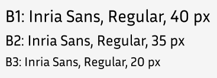
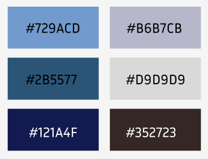
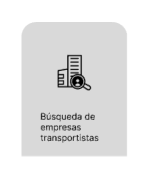
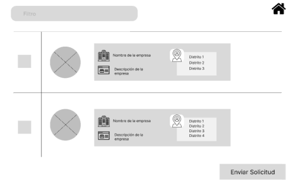
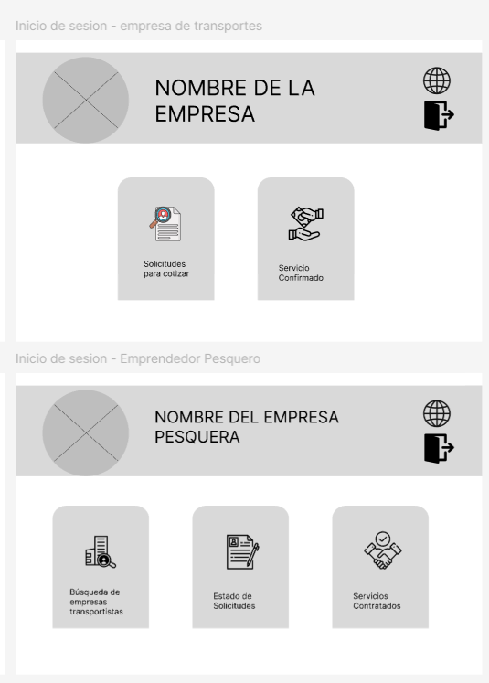
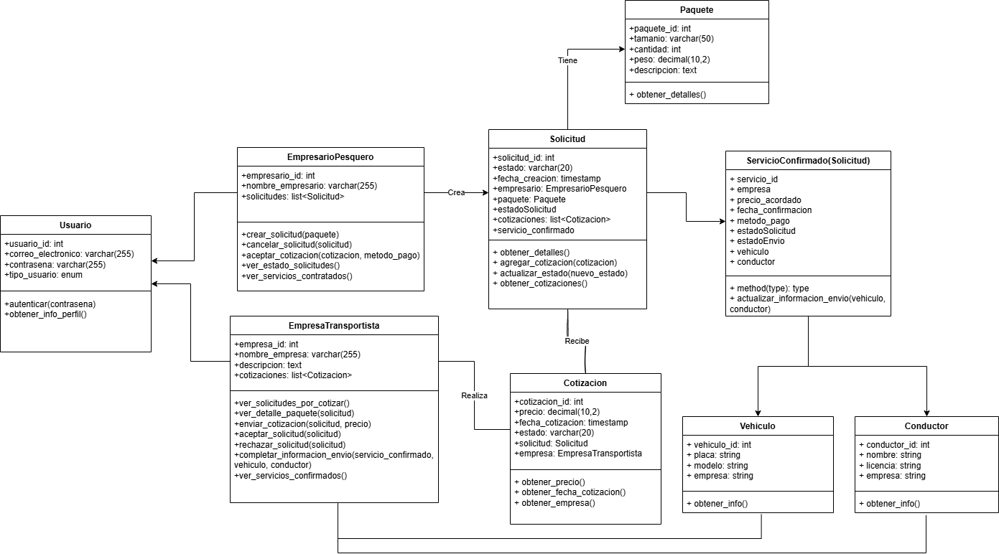
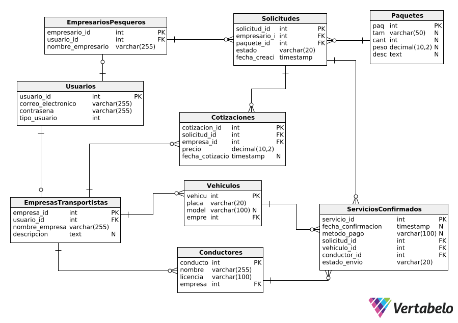

## Capítulo IV: Product Design

### 4.1. Style Guidelines

#### 4.1.1. General Style Guidelines

**Branding**

Hemos seleccionado el nombre "**PescaGo**" junto con un logo que representa un barco pesquero estilizado.
El logo ha sido elegido porque simboliza de manera directa y visual la esencia de la actividad que la aplicación busca facilitar: el transporte y comercio relacionado con la pesca.
El barco es un ícono universalmente reconocido en el sector pesquero, lo que permite que tanto empresarios del rubro como empresas de transporte se identifiquen fácilmente con la plataforma.

El nombre "PescaGo" combina dos conceptos clave:
"Pesca", que remite directamente al sector pesquero, principal público objetivo de la plataforma.
Y "Go", que en inglés significa “en movimiento”, sugiriendo rapidez y eficiencia, atributos esenciales de la aplicación, que busca conectar empresas de transporte con empresarios pesqueros de forma ágil y segura. (ver figura 4.1)

  

<em>Figura 4.1: Logo de PescaGo.</em>

**Tipografías**

Títulos:

Se utilizó la tipografía Inria Sans en sus variantes Bold, Regular y Light para los títulos, ya que esta fuente transmite claridad visual, permitiendo que la información este ordenada y tenga un estilo profesional a la estructura de la plataforma. (Ver figura 4.2)

  

<em>Figura 4.2: Topografía de los titulos.</em>

Botones:

Se utilizo estos estilos de botones, sencillo y claros para que el usuario se puede sentir a gusto con la plataforma. (Ver figura 4.3)

  

<em>Figura 4.3: Diferentes estilos de los botones.</em>

Parráfos:

En los párrafos se optó por la tipografía Inria Sans en su estilo Regular, ya que ofrece una lectura fluida y cómoda, facilitando la comprensión del contenido. (Ver figura 4.4)

  

<em>Figura 4.4: Topografía de los parráfos.</em>

Iconos:

Se usaron estos iconos para una mejor comprensición de las funcionalidades que ofrece la plataforma. (Ver figura 4.5)

  

<em>Figura 4.5: Diferentes estilos de los iconos .</em>

Colores:

Se eligieron tonos de azul, combinando matices claros y oscuros, porque el azul transmite confianza, seguridad y frescura, valores esenciales en el rubro de transporte y pesca. (Ver figura 4.6)

  

<em>Figura 4.6: Paleta de colores .</em>

#### 4.1.2. Web Style Guidelines

En el diseño web de PescaGo se ha adoptado una línea visual limpia y moderna que transmite confianza y cercanía, valores esenciales en el sector pesquero y logístico. La paleta de colores utiliza tonos azules, que evocan el mar y generan tranquilidad, combinando variantes claras y oscuras para lograr contraste y guiar la atención del usuario. Se ha seleccionado la tipografía Inria Sans por su estilo versátil y legible, usando pesos bold, regular y light para diferenciar jerarquías de información, facilitando la comprensión del contenido. Los botones y formularios mantienen un estilo uniforme y simple, ayudando al usuario a completar sus tareas sin distracciones. Esta combinación de elementos visuales busca ofrecer una experiencia profesional, clara y accesible, adecuada tanto para empresarios pesqueros como para empresas de transporte.

### 4.2. Information Architecture

#### 4.2.1. Organization Systems

Para lograr una navegación intuitiva y una estructura de contenido clara en las experiencia web de PescaGo, hemos optado por aplicar diferentes sistemas de organización según el tipo de información que se presenta. A continuación, se detallan las decisiones adoptadas:

**Organización visual del contenido**

1. **Visual Hierarchy:**

   Se utiliza en páginas clave como la Landing Page, el panel de control del usuario, la sección de búsqueda de servicios y el seguimiento de envíos. Esta estructura permite resaltar la información más importante mediante títulos grandes en Inria Sans Bold, contrastes de color azul y una disposición visual que guía al usuario hacia las acciones prioritarias.

2. **Step-by-Step:**

   Se aplica en procesos como el registro de usuarios, la solicitud de transporte, la creación de rutas y la generación de órdenes. Aquí, la información se presenta paso a paso, ayudando al usuario a completar tareas mediante formularios claros y botones sencillos, diseñados para una experiencia sin distracciones.

3. **Matricial:**

   Está presente en secciones donde el usuario necesita comparar información, como el historial de envíos, opciones de transporte y reportes estadísticos. Mediante tablas, íconos representativos y etiquetas claras, lo cual, facilita el análisis visual simultáneo de múltiples elementos.

**Esquemas de categorización del contenido**

1. **Alfabético:**

   Se utiliza en listados como empresas de transporte, rutas disponibles o productos registrados. Esta forma de organización permite búsquedas rápidas y efectivas cuando el usuario ya tiene una referencia textual clara.

2. **Cronológico:**

   Se emplea en el historial de pedidos, entregas, actualizaciones y actividad reciente del usuario. Presentar la información en orden temporal facilita el seguimiento de acciones pasadas y la revisión de eventos recientes de manera eficiente.

3. **Por tópicos:**

   Se implementa en la sección de ayuda, artículos informativos, donde el contenido se agrupa por temas como logística, seguridad o recomendaciones del sector pesquero. Esta clasificación permite una navegación enfocada según los intereses del usuario.

4. **Según audiencia:**

   La plataforma distingue entre perfiles como empresarios pesqueros y empresas de transporte. Cada uno accede a una interfaz personalizada con contenido y funcionalidades adaptadas a sus necesidades específicas, mejorando la experiencia de uso.

#### 4.2.2. Labeling Systems

Dentro de la plataforma de PescaGo el sistema de etiquetado ha sido diseñado con un enfoque simple, claro y familiar, para asegurar que los usuarios puedan enteder y navegar en la platafoma sin dificultad. Las etiquetas que se van a emplear utilizan un lenguaje directo, con un número mínimo de palabras, priorizando la comprensión rápida en la aplicación web.

En las **etiquetas de navegación principales** seleccionadas tenemos las etiquetas de _Inicio_, _Buscar transporte_, _Mis pedidos_, _Mi cuenta_, _Ayuda_ y _Cerrar sesión_. Estas etiquetas fueron seleccionadas, ya que son las más comunes y para los usuarios será de fácil identificación.

Dentro de las **etiquetas para formularios** seleccionadas tenemos etiquetas como _Nombre_, _Correo electrónico_, _Tipo de carga_, _Fecha de envío_, _Destino_, _Agregar ruta_, _Confirmar_ o _Cancelar_. Se evita el uso de frases largas o ambiguas, facilitando una experiencia fluida en cada paso del proceso.

Las **etiquetas para secciones de usuarios** que seleccionamos son _Pedidos activos_, _Historial de envíos_, _Estadísticas_, _Rutas registradas_ o _Notificaciones_, las cuales nos permiten una organización clara de las secciones internas.

Por último, hemos considerado las **etiquetas por rol de usuario**. Por ejemplo, los transportistas encontrarán etiquetas como _Ofertas recibidas_, _Ruta asignada_ y _Registrar disponibilidad_, mientras que los empresarios pesqueros verán opciones como _Solicitar transporte_ o _Ver entregas_. Esta diferenciación permite personalizar la experiencia según el perfil del usuario.

#### 4.2.3. SEO Tags and Meta Tags

Para garantizar que PescaGo sea fácilmente encontrado por motores de búsqueda y que su presentación en los resultados de búsqueda sea clara y atractiva, se han definido etiquetas SEO y metaetiquetas específicas tanto para la Landing Page como para la Web Application. Estas etiquetas ayudan a mejorar el posicionamiento orgánico (SEO), incrementar la visibilidad en línea y transmitir confianza a los usuarios desde el primer contacto. 

### Landing Page

PescaGo: Plataforma de Transporte y Comercio Pesquero

**Meta Description:**

PescaGo optimiza la logística de tus productos marinos conectando a transportistas especializados con emprendedores del sector pesquero.

**Meta Keywords:**

Pesca, Transporte pesquero, Logística marítima, Envíos pesqueros, Plataforma pesquera, Conectar transporte pesca, PescaGo Perú, Comercio pesquero digital

### Web Application

PescaGo: Panel de Usuario - Gestión de Envíos y Rutas

**Meta Description:**

Accede a tu cuenta en PescaGo para gestionar envíos, registrar rutas, recibir notificaciones y optimizar tu operación logística en el sector pesquero.

**Meta Keywords:**

Gestión de envíos, Transporte marítimo, Logística pesquera, Rutas, Plataforma logística, Seguimiento de envíos

#### 4.2.4. Searching Systems

En lo que respeta a los sistemas de búsqueda, PescaGo ha sido diseñado para ofrecer una experiencia de búsqueda intuitiva y eficaz. 

Para los empresarios, esta implementación está enfocada directamente para la búsqueda de empresas transportistas y utilizar los filtros para luego visualizar toda la información mediante Cards visuales. Dentro de estas Cards se observará información como el **Nombre de la empresa**, **Descripción de la Empresa** y los distritos de cobertura.

  

<em>Figura 4.7: Captura del boceto de búsqueda de empresas transportistas.</em>

  

<em>Figura 4.8: Captura del boceto de lista de Cards con información de empresas de transporte.</em>

#### 4.2.5. Navigation Systems

**Para Empresarios Pesqueros**

El sistema de navegación para empresarios pesqueros está diseñado con una estructura clara y eficiente. En la parte superior de la pantalla se encuentra una barra de navegación principal que incluye el logo de PescaGo y un menú desplegable con las opciones más importantes: **Inicio**, **Búsqueda de Empresa de Transportistas**, **Estado de Solicitudes**, **Servicios Contratados**.

**Para Empresas de Transporte**

La navegación para transportistas sigue un enfoque diferente, optimizado para sus necesidades específicas. Se implemetó un menú principal que cuenta con las principales opciones: **Inicio**, **Solicitudes para cotizar** y **Servicio Confirmado**.

  

<em>Figura 4.9: Captura del boceto de los sistemas de navegación dentro de la plataforma.</em>

### 4.4. Web Applications UX/UI Design

#### 4.4.1. Web Applications Wireframes

**Inicio de sesión**

Se muestra a continuación la Wireframe de inicio de sesión que es para ambos segmentos, para hacer mas accesible el ingreso solo se pidio correo y contraseña. (Ver figura 4.9)

  

<em>Figura 4.10: Captura del boceto de inicio de sesión.</em>

**Registro de la empresa transportista**

Para registrarse le pedira los datos basicos para que asi sea mas factible mostrar esa informacion al segmento de empresa pesquera. (Ver figura 4.10)

  

<em>Figura 4.10: Captura del boceto del registro de la empresa transportista.</em>

<em>Figura 4.11: Captura del boceto del registro de la empresa transportista.</em>

**Registro del empresario pesquero**

Para registrase lo mas rapido posible y hacer uno de la plataforma , solo se le pide el nombre, correo y contraseña. (Ver figura 4.11)

  

<em>Figura 4.11: Captura del boceto del registro de empresario pesquero.</em>

<em>Figura 4.12: Captura del boceto del registro de empresario pesquero.</em>

**Funcionalidades de la empresa transportista**

A continuación se mostrará todos los bocetos con las funcionalidades que realizara la empresa transportista en la plataforma. Como por ejemplo, solicitudes para cotizar y sus servicios confirmados. (Ver figuras 4.12)

  

<em>Figura 4.12: Capturas de los bocetos con las funcionalidades de la empresa transportista.</em>

<em>Figura 4.13: Capturas de los bocetos con las funcionalidades de la empresa transportista.</em>

**Funcionalidades del empresario pesquero**

A continuación se mostrará todos los bocetos con las funcionalidades que realizara el empresario pesquero en la plataforma. Como por ejemplo, Búsqueda de empresas transportistas, Estado de Solicitudes y sus Servicios Contratados. (Ver figuras 4.13)

  

<em>Figura 4.13: Capturas de los bocetos con las funcionalidades del empresario pesquero.</em>

<em>Figura 4.14: Capturas de los bocetos con las funcionalidades del empresario pesquero.</em>

**Enlace del Figma :** [Ver en Figma](https://www.figma.com/design/6G4202Wv0UNJR3e3yA9GHs/Untitled?node-id=0-1&m=dev&t=4WCujskndBN3NXUK-1)

#### 4.4.2. Web Applications Wireflow Diagrams

**user goal:** 
**Como** Empresario pesquero o Empresa de transportes
**quiero** registrarme a la aplicación web
**Para** identificar qué tipo de usuario soy. (Ver figura 4.14)

  

<em>Figura 4.15: Wireflow Diagrams del ingreso a PescaGo.</em>

<em>Figura 4.14: Wireflow Diagrams del ingreso a PescaGo.</em>

**user goal:** 
**Como** Empresa de transportes
**quiero** poder comprender e interactuar con el servicio que la aplicación web me está proporcionando
**Para** así poder generar las solicitudes de una manera clara y correcta sin temor a equivocación. (Ver figura 4.15)

  

<em>Figura 4.16: Wireflow Diagrams de la empresa transportista.</em>

<em>Figura 4.15: Wireflow Diagrams de la empresa transportista.</em>

**user goal:** 
**Como** Empresario pesquero
**quiero** poder comprender e interactuar con el servicio que la aplicación web me está proporcionando
**Para** así poder generar mis solicitudes de una manera clara y correcta sin temor a equivocación. (Ver figura 4.16)

  

<em>Figura 4.17: Wireflow Diagrams del empresario pesquero.</em>

**Enlace del Figma :** [Ver en Figma](https://www.figma.com/design/6G4202Wv0UNJR3e3yA9GHs/Untitled?node-id=26-378&m=dev&t=wIVDlU15xFdh7fHu-1)

#### 4.4.3. Web Applications Mock-ups

**Inicio de sesión**

Se muestra a continuación los mock-ups de inicio de sesión que es para ambos segmentos. (Ver figura 4.17)

  

<em>Figura 4.17: Web Applications del inicio de sesión.</em>

<em>Figura 4.18: Web Applications del inicio de sesión.</em>

**Mock-ups de la empresa transportista**

A continuación se mostrará todos los bocetos con las funcionalidades que realizara la empresa transportista en la plataforma. Como por ejemplo su registro, solicitudes para cotizar y sus servicios confirmados. (Ver figuras 4.18)

  

<em>Figura 4.18: Web Applications Mock-ups de la empresa transportista.</em>

<em>Figura 4.19: Web Applications Mock-ups de la empresa transportista.</em>

**Mock-ups del empresario pesquero**

A continuación se mostrará todos los bocetos con las funcionalidades que realizara el empresario pesquero en la plataforma. Como por ejemplo su registro, Búsqueda de empresas transportistas, Estado de Solicitudes y sus Servicios Contratados. (Ver figuras 4.19)

  

<em>Figura 4.20: Web Applications Mock-ups del empresario pesquero.</em>

**Enlace del Figma :** [Ver en Figma](https://www.figma.com/design/6G4202Wv0UNJR3e3yA9GHs/Untitled?node-id=26-379&m=dev&t=4WCujskndBN3NXUK-1)

#### 4.4.4. Web Applications User Flow Diagrams

**- User goal:** 
**Como Empresario pesquero o Empresa de transportes quiero registrarme a la aplicación web Para identificar qué tipo de usuario soy.**  
En el dashboard de PescaGo, ambos tipos de usuarios ingresarán a la aplicación web a través de la landing page. Una vez dentro de la página de inicio,
deberán registrarse para poder utilizar la plataforma. Para ello, deben hacer clic en la opción “¿Deseas registrarte?”.

A continuación, se les presentarán dos opciones: Empresa Transportista o Empresario Pesquero.

Si selecciona Empresa Transportista, deberá completar un formulario con los siguientes datos: nombre de la empresa, una breve descripción,
correo electrónico y contraseña. Luego, deberá hacer clic en “Registrarse” para finalizar el proceso.

Si selecciona Empresario Pesquero, deberá llenar el formulario correspondiente con: nombre del empresario, correo electrónico y contraseña.
Finalmente, deberá hacer clic en “Registrarse” para completar su registro.

Si ya cuentan con un usuaio en PescaGo, pueden entrar de manera directa a la aplicación web.

Para una mejor comprensión del flujo, puede consultar el diagrama ilustrativo. (Ver figura 4.20)

  

<em>Figura 4.20: Web Applications User Flow Diagrams del inicio de sesión.</em>

<em>Figura 4.21: Web Applications User Flow Diagrams del inicio de sesión.</em>

**- User goal:** 
**Como Empresa de transportes quiero poder comprender e interactuar con el servicio que la aplicación web me está proporcionando Para así poder generar las solicitudes de una manera clara y correcta sin temor a equivocación.**  
La página de inicio para el usuario Empresa Transportista cuenta con dos funcionalidades principales:

**1. Solicitudes para Cotizar** 
En este apartado, podrá visualizar todas las solicitudes enviadas por los Empresarios Pesqueros que requieren sus servicios para transportar paquetes.
Si desea revisar los detalles de un paquete antes de tomar una decisión (aceptar o rechazar la solicitud), deberá hacer clic sobre el ícono del paquete. Al hacerlo, se abrirá una ventana flotante que mostrará información detallada, como el tamaño, la cantidad y el peso, entre otros datos relevantes.

En caso de no estar interesado en alguna solicitud, podrá seleccionarla y cancelarla, indicando de este modo que no aceptará realizar ese servicio.También se puede aplicar si desea cancelar una gran cantidad de solicitudes.
Por otro lado, si decide aceptar una solicitud y desea enviar una propuesta económica, deberá hacer clic en el botón "Cotizar", donde podrá ingresar el precio total por el servicio solicitado.
Una vez completada la cotización, la solicitud aparecerá marcada con un check en el apartado "Cotizar", indicando que la propuesta ha sido enviada correctamente.

**2. Servicio Confirmado** 
En esta sección, se mostrarán todas las solicitudes que ya han sido confirmadas y pagadas por los clientes.
Dentro de cada solicitud, encontrará la opción "Información de Envío", donde deberá completar un formulario con los datos del vehículo y del conductor que realizará la entrega. Es importante llenar esta información lo antes posible para brindar confianza y seguridad al cliente sobre quién será responsable del traslado.
Una vez completado el formulario, deberá hacer clic en "Enviar". Cuando la información haya sido enviada correctamente, la solicitud mostrará un check en el apartado "Información de Envío", indicando que el proceso se ha completado.

Para una mejor comprensión del flujo, puede consultar el diagrama ilustrativo. (Ver figura 4.21)

  

<em>Figura 4.22: Web Applications User Flow Diagrams de la empresa transportista.</em>

<em>Figura 4.21: Web Applications User Flow Diagrams de la empresa transportista.</em>

**- User goal:** 
**Como Empresario pesquero quiero poder comprender e interactuar con el servicio que la aplicación web me está proporcionando Para así poder generar mis solicitudes de una manera clara y correcta sin temor a equivocación.**  
La página de inicio para el usuario Empresario Pesquero cuenta con tres funcionalidades principales:

**1. Búsqueda de Empresas** 
En esta sección, se podrán visualizar todas las empresas transportistas registradas en PescaGo. El usuario tendrá acceso a un apartado de filtros que permite buscar empresas por distrito, facilitando así la selección sin necesidad de revisar cada empresa manualmente.
Además, se mostrará una breve descripción de cada empresa para que el usuario pueda tomar una decisión informada. Una vez seleccionadas las empresas que considera adecuadas para enviar su paquete, deberá hacer clic en "Enviar solicitud" y completar un formulario con los datos específicos del paquete, tales como: dimensiones, peso, cantidad, entre otros. Al finalizar, deberá hacer clic en "Enviar" y la solicitud será enviada a todas las empresas seleccionadas.

**2. Estado de Solicitudes** 
Esta sección permite al usuario visualizar el estado actual de sus solicitudes. Los estados posibles son:

- Pendiente: la empresa aún no ha revisado la solicitud.

- Rechazada: la empresa ha decidido no aceptar el servicio.

- Aceptada: la empresa ha aprobado la solicitud y ha definido un precio, el cual se mostrará en la columna "Precio" de la tabla.

Si el usuario no está conforme con las ofertas recibidas, podrá seleccionar aquellas propuestas que no le interesan y hacer clic en "Cancelar" para descartarlas.
Si, por el contrario, desea aceptar una de las ofertas, solo deberá seleccionar la empresa que le resulte conveniente y proceder con el pago correspondiente. Para ello, deberá hacer clic en la opción "Pagar" dentro de la tabla. Una vez elegida esta opción, podrá seleccionar entre los diferentes métodos de pago disponibles y completar el formulario con la información solicitada. Una vez finalizado este proceso, la contratación quedará registrada.

**3. Servicios Contratados** 
En esta sección, el usuario podrá visualizar todos los servicios de transporte que ya han sido pagados. Aquí encontrará información relevante sobre la empresa contratada, los detalles del paquete y un apartado adicional con los datos del vehículo y del conductor asignado.
Si este último campo aparece como Pendiente, significa que la empresa aún está completando la información, la cual será actualizada y enviada al usuario a la brevedad posible.

Para una mejor comprensión del flujo, puede consultar el diagrama ilustrativo. (Ver figura 4.22).

  

<em>Figura 4.23: Web Applications User Flow Diagrams del empresario pesquero.</em>

**Enlace del Miro :** [Ver en Miro](https://miro.com/welcomeonboard/TFg1SVlscDQwdGlNWHZhNkpSeUE5aWhnRm51ZURXc2YvNjRrTlBsS3BwVHdnbE05SFFVSFpwMCtSKzZ0MHUwUk44VU1kYXVaL0pLbDBwaVNnTzVvRnZ5RXlDZ2dXMHg4ZmEzS0plNWNZZDMzUEk3YzYrSG4rb3djRVJhL2I2dGxnbHpza3F6REdEcmNpNEFOMmJXWXBBPT0hdjE=?share_link_id=756884883545)

### 4.5. Web Applications Prototyping.

Durante la creación de los flujos de acción para los prototipos, se consideraron las diferentes formas en que los usuarios podrían interactuar con la aplicación web. Los prototipos fueron diseñados de manera interactiva, permitiendo que cada sección garantice una experiencia de usuario intuitiva y funcional.
Asimismo, se tomaron como referencia los Diagramas de Flujo de Usuario y los Wireflow Diagrams, los cuales contribuyeron a una mejor comprensión y organización de cada funcionalidad dentro de la aplicación.
Como parte del proceso, se elaboró un video demostrativo donde se interactúa con el prototipo, con el fin de mostrar de manera visual la experiencia de navegación y el flujo de uso propuesto para los usuarios. Además, se incluye una imagen referencial del prototipo. (Ver figura 4.23)

  

<em>Figura 4.23: Captura de video sobre la interacción con el prototipo.</em>

<em>Figura 4.24: Captura de video sobre la interacción con el prototipo.</em>

**Enlace del Clipchamp :** [Ver en Video](https://upcedupe-my.sharepoint.com/:v:/g/personal/u20201c131_upc_edu_pe/Efpo172zIoBCqdcPsvyc_CYBYJRY-YugLBOZwhibyoZ5lw?e=XpmDJD&nav=eyJyZWZlcnJhbEluZm8iOnsicmVmZXJyYWxBcHAiOiJTdHJlYW1XZWJBcHAiLCJyZWZlcnJhbFZpZXciOiJTaGFyZURpYWxvZy1MaW5rIiwicmVmZXJyYWxBcHBQbGF0Zm9ybSI6IldlYiIsInJlZmVycmFsTW9kZSI6InZpZXcifX0%3D)

### 4.7. Software Object-Oriented Design.

En dicha sección se verá la estructuración de nuestra star-up que será reevaluada a lo largo de nuestro proyecto.

#### 4.7.1. Class Diagrams.

  

#### 4.7.2. Class Dictionary.

- Usuario: Entidad abstracta que representa a cualquier usuario del sistema. Contiene la información básica de - autenticación (correo electrónico y contraseña) y el tipo de usuario (empresario pesquero o empresa - transportista).

- EmpresarioPesquero: Entidad que representa a un empresario pesquero, un tipo específico de usuario. Contiene - información adicional como su nombre y mantiene una colección de las solicitudes de transporte que ha creado y - los servicios que ha contratado.

- EmpresaTransportista: Entidad que representa a una empresa de transportes, otro tipo específico de usuario. - Contiene información adicional como el nombre de la empresa y su descripción, y mantiene colecciones de las - cotizaciones que ha enviado, los servicios confirmados, sus vehículos y sus conductores.

- Paquete: Entidad que representa un paquete que necesita ser transportado. Contiene información sobre su tamaño, - cantidad, peso y una descripción opcional.

- Solicitud: Entidad que representa una petición de transporte creada por un empresario pesquero para un paquete específico. Contiene el estado de la solicitud, la fecha de creación, y referencias al empresario que la creó y al paquete asociado. También mantiene una colección de las cotizaciones recibidas.

- Cotizacion: Entidad que representa una oferta de precio realizada por una empresa transportista en respuesta a una solicitud. Contiene el precio, la fecha de la cotización y referencias a la solicitud y a la empresa que la realizó.

- ServicioConfirmado: Entidad que representa un acuerdo formal para un servicio de transporte, resultante de la aceptación de una cotización por parte del empresario pesquero. Contiene información sobre la fecha de - confirmación, el método de pago, el estado del envío y referencias a la solicitud original, la empresa - transportista contratada, el vehículo asignado y el conductor asignado.

- Vehiculo: Entidad que representa un vehículo utilizado por una empresa de transportes. Contiene información como - la placa y el modelo, y una referencia a la empresa propietaria.

- Conductor: Entidad que representa a un conductor empleado por una empresa de transportes. Contiene su nombre, número de licencia y una referencia a la empresa para la que trabaja.

### 4.8. Database Design.

#### 4.8.1. Database Diagram.

  

