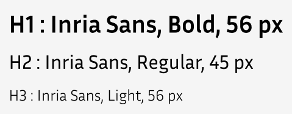
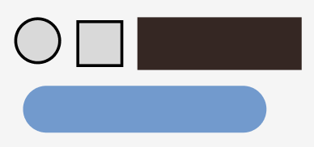

## Capítulo IV: Product Design

### 4.1. Style Guidelines

#### 4.1.1. General Style Guidelines

**Branding**

Hemos seleccionado el nombre "**PescaGo**" junto con un logo que representa un barco pesquero estilizado.
El logo ha sido elegido porque simboliza de manera directa y visual la esencia de la actividad que la aplicación busca facilitar: el transporte y comercio relacionado con la pesca. 
El barco es un ícono universalmente reconocido en el sector pesquero, lo que permite que tanto empresarios del rubro como empresas de transporte se identifiquen fácilmente con la plataforma. 

El nombre "PescaGo" combina dos conceptos clave:
"Pesca", que remite directamente al sector pesquero, principal público objetivo de la plataforma.
Y "Go", que en inglés significa “en movimiento”, sugiriendo rapidez y eficiencia, atributos esenciales de la aplicación, que busca conectar empresas de transporte con empresarios pesqueros de forma ágil y segura. (ver figura 4.1)

  

<em>Figura 4.1: Logo de PescaGo.</em>

**Tipografías**

Títulos:

Se utilizó la tipografía Inria Sans en sus variantes Bold, Regular y Light para los títulos, ya que esta fuente transmite claridad visual, permitiendo que la información este ordenada y tenga un estilo profesional a la estructura de la plataforma. (Ver figura 4.2)

  

<em>Figura 4.2: Topografía de los titulos.</em>

Botones:

Se utilizo estos estilos de botones, sencillo y claros para que el usuario se puede sentir a gusto con la plataforma. (Ver figura 4.3)

  

<em>Figura 4.3: Diferentes estilos de los botones.</em>

Parráfos:

En los párrafos se optó por la tipografía Inria Sans en su estilo Regular, ya que ofrece una lectura fluida y cómoda, facilitando la comprensión del contenido. (Ver figura 4.4)

  

<em>Figura 4.4: Topografía de los parráfos.</em>

Iconos:

Se usaron estos iconos para una mejor comprensición de las funcionalidades que ofrece la plataforma. (Ver figura 4.5)

  

<em>Figura 4.5: Diferentes estilos de los iconos .</em>

Colores:

Se eligieron tonos de azul, combinando matices claros y oscuros, porque el azul transmite confianza, seguridad y frescura, valores esenciales en el rubro de transporte y pesca. (Ver figura 4.6)

  

<em>Figura 4.6: Paleta de colores .</em>

#### 4.1.2. Web Style Guidelines

En el diseño web de PescaGo se ha adoptado una línea visual limpia y moderna que transmite confianza y cercanía, valores esenciales en el sector pesquero y logístico. La paleta de colores utiliza tonos azules, que evocan el mar y generan tranquilidad, combinando variantes claras y oscuras para lograr contraste y guiar la atención del usuario. Se ha seleccionado la tipografía Inria Sans por su estilo versátil y legible, usando pesos bold, regular y light para diferenciar jerarquías de información, facilitando la comprensión del contenido. Los botones y formularios mantienen un estilo uniforme y simple, ayudando al usuario a completar sus tareas sin distracciones. Esta combinación de elementos visuales busca ofrecer una experiencia profesional, clara y accesible, adecuada tanto para empresarios pesqueros como para empresas de transporte.

### 4.2. Information Architecture

### 4.4. Web Applications UX/UI Design

#### 4.4.1. Web Applications Wireframes

**Inicio de sesión**

Se muestra a continuación la Wireframe de inicio de sesión que es para ambos segmentos, para hacer mas accesible el ingreso solo se pidio correo y contraseña. (Ver figura 4.7)

  

<em>Figura 4.7: Captura del boceto de inicio de sesión.</em>

**Registro de la empresa transportista**

Para registrarse le pedira los datos basicos para que asi sea mas factible mostrar esa informacion al segmento de empresa pesquera. (Ver figura 4.8)

  

<em>Figura 4.8: Captura del boceto del registro de la empresa transportista.</em>

**Registro del empresario pesquero**

Para registrase lo mas rapido posible y hacer uno de la plataforma , solo se le pide el nombre, correo y contraseña. (Ver figura 4.9)

  

<em>Figura 4.9: Captura del boceto del registro de empresario pesquero.</em>

**Funcionalidades de la empresa transportista**

A continuación se mostrará todos los bocetos con las funcionalidades que realizara la empresa transportista en la plataforma. Como por ejemplo, solicitudes para cotizar y sus servicios confirmados. (Ver figuras 4.10)

  

<em>Figura 4.10: Capturas de los bocetos con las funcionalidades de la empresa transportista.</em>

**Funcionalidades del empresario pesquero**

A continuación se mostrará todos los bocetos con las funcionalidades que realizara el empresario pesquero en la plataforma. Como por ejemplo, Búsqueda de empresas transportistas, Estado de Solicitudes y sus Servicios Contratados. (Ver figuras 4.11)

  

<em>Figura 4.11: Capturas de los bocetos con las funcionalidades del empresario pesquero.</em>

