## Capítulo V: Product Implementation, Validation & Deployment  
### 5.1. Software Configuration Management
En esta sección describimos los productos de software que hemos usado en el proyecto.
  #### 5.1.1. Software Development Environment Configuration
  
  - Project Management
  
    - Github: (https://github.com/)
        
        Es donde organizamos el proyecto. Aquí está la organización, la cual contiene 4 repositorios: Informe, Landing Page, Frontend y Backend
    
  - Requirements Management

    - Pivotal Tracker: (https://www.pivotaltracker.com/)

        Es un software que usamos para gestionar los proyectos y establecer las historias de usuario del proyecto

  - Product UX/UI Design
    
    - UXPressia: (https://uxpressia.com/)

        Acá diseñamos las User Persona, User Journey Mapping y Empathy Mapping
    
    - Figma: (https://www.figma.com/es-es/)

        Acá hicimos los diseños de la landing page y de la aplicación web (wireframes, mockups y prototipos)

  - Software Development
    - Git: Es un software de control de versiones para desarrollar el proyecto
    - Github: Es un sistema de control de versiones de Git
    - HTML5: Es un lenguaje de marcado que sirve para estructurar la página
    - CSS3: Es un lenguaje de hojas de estilo en cascada que le da estilo a la página (hace que una  página sea visualmente más atractiva)
    - JavaScript: Es un lenguje de programación que genera interactividad y dinamismo a una sitio web
    - VSCode: Es el editor de código fuente para el desarrollo de la landing page
    - Angular: Es un framework que usaremos para el desarrollo frontend de la aplicación web

  - Software Deployment
    - Netlify: Plataforma para desplegar la landing page

  #### 5.1.2. Source Code Management

  Utilizamos Github como plataforma, así como un sistema de control de versiones.
  
  Para ello se creó una organización para el proyecto del equipo. En esta organización, se crearon 4 repositorios, los cuales corresponden al informe del proyecto, la landing page, el frontend y el backend.
  
  - Organización del proyecto: https://github.com/1ASI0729-2510-4321-devvolution
    - Informe: https://github.com/1ASI0729-2510-4321-devvolution/PescaGo-Report
    - Landing page: https://github.com/1ASI0729-2510-4321-devvolution/PescaGo-LandingPage
    - Frontend: https://github.com/1ASI0729-2510-4321-devvolution/PescaGo-Frontend
    - Backend: https://github.com/1ASI0729-2510-4321-devvolution/PescaGo-Backend

  Gitflow Decidimos utilizar este modelo de trabajo ya que permite mantener el codigo ordenado al dividirlo en ramas, de tal forma que nos facilita trabajar colaborativamente. Las ramas que se utilizaron son:

  - Main: En esta rama se encuentra el código que se encuentra en producción.
  - Develop: En esta rama se encuentra el código que se encuentra en desarrollo.
  - Feature: En esta rama se encuentran las nuevas funcionalidades que se están desarrollando.

  Conventional commits Se utilizó el estándar de commits convencionales para mantener un historial de cambios limpio y ordenado. Los commits se dividen en los siguientes tipos:

  - feat: Se utiliza para nuevas funcionalidades.
  - fix: Se utiliza para corrección de errores.
  - chore: Se utiliza para cambios en el código que no afectan la funcionalidad.
  - refactor: Se utiliza para cambios en el código que no afectan la funcionalidad.

  #### 5.1.3. Source Code Style Guide & Conventions

  Para desarrollar nuestro proyecto hemos requerido de algunas nomenclaturas, referencias y lenguajes para la solución.
  
  Tecnologias: Utilizamos HTML5, CSS3 y JavaScript para el desarrollo de la landing page.

  - HTML: Para el lenguaje HTML, nos planteamos utilizar las convenciones descritas en la guía “HTML Style Guide and Coding Conventions”:
  
    - Usar nombres de elementos en minúsculas.
    - Cerrar todos los elementos HTML.
    - Usar nombres de atributos en minúsculas.
    - Usar atributos en imágenes.
    - Evitar líneas de código largas.
    - Usar sintaxis simple para los enlaces para las hojas de estilo y para cargar script externos

  - CSS: Para el lenguaje CSS, utilizaremos las siguientes prácticas para alcanzar un código coherente, sostenible y ordenado:

    - Utilizar minúsculas y guiones para los nombres de propiedades.
    - Utilizar un espacio después de los dos puntos y un punto y coma para separar pares -  propiedad-valor.
    - Agrupar reglas CSS relacionadas y separarlas con una línea en blanco.
    - Utilizar nombres de clases que sean descriptivos y reflejen el propósito del elemento.
    - Separar los nombres de las clases y ID con un guión

  Herramientas: Nos apoyamos de las tecnologías más utilizadas y recomendadeas para el desarrollo web, como los son Webstorm, Git, GitHub, LudcidChart, Figma y Miro.

  #### 5.1.4. Software Deployment Configuration

  Implementaremos la landing page utilizando Netlify, una plataforma que facilita el despliegue y hosting de sitios web estáticos. El proceso implica conectar un repositorio de Github a Netlify. Una vez conectado, Netlify se encarga de construir y desplegar automáticamente la landing page cada vez que se realicen cambios y se suban al repositorio. Simplemente necesitamos autorizar a Netlify a acceder al repositorio de Github que contiene los archivos de la landing page, y la plataforma se encargará del resto, proporcionando una URL pública para acceder al sitio web.

### 5.2. Landing Page, Services & Applications Implementation
  #### 5.2.1. Sprint 1
   #### 5.2.1.1. Sprint Planning 1
  
  <table border="1px" align="center">
      <tr>
          <th>Sprint #</th>
          <th>Sprint 1</th>
      </tr>
      <tr> 
          <td colspan="2" style="text-align: center;">Sprint Planning Background</td>
      </tr>
      <tr>
          <td style="font-weight: bold;">Date</td>
          <td>07-04-2025</td>
      </tr>
      <tr>
          <td style="font-weight: bold;">Time</td>
          <td>8:00 pm - 10:00 pm</td>
      </tr>
      <tr>
          <td style="font-weight: bold;">Location</td>
          <td>Canal de Voz de Discord</td>
      </tr>
      <tr>
          <td style="font-weight: bold;">Prepared By</td>
          <td>Belleza Tello, Paolo Eduardo</td>
      </tr>
      <tr>
          <td style="font-weight: bold;">Attendees (to planning meeting)</td>
          <td>
              Belleza Tello, Paolo Eduardo 
              Fernandez Alva, María Fernanda 
              Macavilca Quispe, Ian 
              Prado Vargas, Mario Benjamín 
              Ramos Argüelles, Alexandra Belen 
          </td>
      </tr>
      <tr>
          <td style="font-weight: bold;">Sprint 0 Review Summary</td>
          <td>Debido a que es nuestro primer sprint de desarrollo, no existe un review summary del sprint.</td>
      </tr>
      <tr>
          <td style="font-weight: bold;">Sprint 0 Retrospective Summary</td>
          <td>Debido a que es nuestro primer sprint de desarrollo, no existen planes de mejora.</td>
      </tr>
      <tr> 
          <td colspan="2" style="text-align: center;">Sprint Goal & User Stories</td>
      </tr>
      <tr>
          <td style="font-weight: bold;">Sprint 1 Goal</td>
          <td>
              El objetivo principal de este sprint es la creación de la landing page de nuestro producto. Esperamos que esta página ofrezca una experiencia visualmente atractiva y   una información concisa, lo cual se validará con la interacción de los usuarios en  cada parte.
          </td>
      </tr>
      <tr>
          <td style="font-weight: bold;">Sprint 1 Velocity</td>
          <td>18</td>
      </tr>
      <tr>
          <td style="font-weight: bold;">Sum of Story Points</td>
          <td>18</td>
      </tr>
    </table>

   #### 5.2.1.2. Sprint Backlog 1

| Sprint # | Sprint 1 | | | | | | |
|:-- | :-- | :-- | :-- | :-- | :-- | :-- | :-- |
| Epic/ Story | | Work-Item | | | | | |
| Id | Title | Id | Title | Description | Estimation (Hours) | Assigned To | Status (To-Do / In-Process/ To- Review/ Done) |
| E1-US01 | Barra de Navegación en la Landing Page | W01 | Barra de Navegación | Facilitar el acceso a las secciones más relevantes del servicio |  4 | Prado Vargas, Mario Benjamín | Done  |
| E1-US02 | Información sobre el servicio brindado | W02 | Info Trasfondo del Servicio | La página web debe mostrar la información de los servicios que me van a brindar |  4 | Prado Vargas, Mario Benjamín | Done  |
| E1-US03 | Información sobre el procedimiento de uso de la aplicación web | W03 | Info Uso del Servicio | Mostrar el procedimiento que tendría que hacer un usuario para usar este servicio | 4  | Prado Vargas, Mario Benjamín |  Done |
| E1-US04 | Conocer los testimonios de clientes pasados | W04 | Sección Testimonios | Mostrar algunos testimonios de "clientes anteriores" |4   | Prado Vargas, Mario Benjamín | Done  |
| E1-US05 | Conocer las ventajas de la aplicación web | W05 | Sección Beneficios | Mostrar las ventajas que tiene la aplicación frente a otras aplicaciones similares |  4 | Prado Vargas, Mario Benjamín | Done  |
| E1-US06 | Contacto | W06 | Sección Contactos | Sección con información de contacto | 4  | Prado Vargas, Mario Benjamín | Done  |
| E1-US07 | Cambiar idiomas | W07 | Botón Idiomas | Cambiar el idioma de la página web de Inglés al Español  y viceversa| 4  | Prado Vargas, Mario Benjamín |  To-Do |

   #### 5.2.1.3. Development Evidence for Sprint Review

   <table>
    <tr>
     <td><strong>Repository</strong></td>
     <td><strong>Branch</strong></td>
     <td><strong>Commit Id</strong></td>
     <td><strong>Commit Message</strong></td>
     <td><strong>Commit Message Body</strong></td>
     <td><strong>Commited on (Date)</strong></td>
    </tr>
    <tr>
     <td>PescaGo-LandingPage</td>
     <td>main</td>
     <td>81b0748</td>
     <td>Create index.html</td>
     <td>Add base code to the index.html doc</td>
     <td>24/04/2025</td>
    </tr>
    <tr>
     <td>PescaGo-LandingPage</td>
     <td>main</td>
     <td>09032da</td>
     <td>feat: add navbar</td>
     <td></td>
     <td>24/04/2025</td>
    </tr>
    <tr>
     <td>PescaGo-LandingPage</td>
     <td>main</td>
     <td>dc8a856</td>
     <td>feat: add hero section</td>
     <td></td>
     <td>24/04/2025</td>
    </tr>
    <tr>
     <td>PescaGo-LandingPage</td>
     <td>main</td>
     <td>59a0490</td>
     <td>feat: Adding the Features Section</td>
     <td></td>
     <td>24/04/2025</td>
    </tr>
    <tr>
     <td>PescaGo-LandingPage</td>
     <td>main</td>
     <td>9671f7d</td>
     <td>feat: Adding the Works Section</td>
     <td></td>
     <td>24/04/2025</td>
    </tr> 
    <tr>
     <td>PescaGo-LandingPage</td>
     <td>main</td>
     <td>99cff96</td>
     <td>feat: add testimonials section</td>
     <td></td>
     <td>24/04/2025</td>
    </tr> 
    <tr>
     <td>PescaGo-LandingPage</td>
     <td>main</td>
     <td>2ca13af</td>
     <td>feat: add Why Choose Us Section</td>
     <td></td>
     <td>24/04/2025</td>
    </tr> 
    <tr>
     <td>PescaGo-LandingPage</td>
     <td>main</td>
     <td> 249afd7</td>
     <td>Create script.js</td>
     <td></td>
     <td>24/04/2025</td>
    </tr> 
    <tr>
     <td>PescaGo-LandingPage</td>
     <td>main</td>
     <td>0a3ab9e</td>
     <td>feat: add footer and bootstrap</td>
     <td></td>
     <td>24/04/2025</td>
    </tr> 
    <tr>
     <td>PescaGo-LandingPage</td>
     <td>main</td>
     <td>23fb61f</td>
     <td>Create style.css</td>
     <td></td>
     <td>24/04/2025</td>
    </tr> 
    <tr>
     <td>PescaGo-LandingPage</td>
     <td>main</td>
     <td>aff84c2</td>
     <td>feat: Animation added</td>
     <td></td>
     <td>24/04/2025</td>
    </tr>
    <tr>
     <td>PescaGo-LandingPage</td>
     <td>main</td>
     <td>13c3ffb</td>
     <td>feat: Add base styles and hero section to style.css</td>
     <td></td>
     <td>24/04/2025</td>
    </tr>
    <tr>
     <td>PescaGo-LandingPage</td>
     <td>main</td>
     <td>4b09311</td>
     <td>feat: add styles for primary buttons and section layout with transitions</td>
     <td></td>
     <td>24/04/2025</td>
    </tr>
    <tr>
     <td>PescaGo-LandingPage</td>
     <td>main</td>
     <td>3d77f25</td>
     <td>docs: add styles</td>
     <td></td>
     <td>24/04/2025</td>
    </tr>
    <tr>
     <td>PescaGo-LandingPage</td>
     <td>main</td>
     <td>3ee40be</td>
     <td>Create logo.svg</td>
     <td></td>
     <td>24/04/2025</td>
    </tr>
    <tr>
     <td>PescaGo-LandingPage</td>
     <td>main</td>
     <td>ba13e90</td>
     <td>feat: add footer and bootstrap</td>
     <td></td>
     <td>24/04/2025</td>
    </tr>
    <tr>
     <td>PescaGo-LandingPage</td>
     <td>main</td>
     <td>c17b832</td>
     <td>docs: add image and assets folder</td>
     <td>Created the `assets` folder and uploaded an image for use as the logo.</td>
     <td>24/04/2025</td>
    </tr>
   </table>

   #### 5.2.1.4. Testing Suite Evidence for Sprint Review

   
Para la entrega del Sprint 1, nos enfocamos en lograr el desarrollo completo y el despliegue del Landing Page.

| Repository   | Branch | Commit Id | Commit Message                      | Commit Message Body | Commited On |
| ------------ | ------ | --------- | ----------------------------------- | ------------------- | ----------- |
| PescaGo-LandingPage | main   | 81b0748   | Create index.html | - | 24/04/2025  |

   #### 5.2.1.5. Execution Evidence for Sprint Review
   
   En este sprint, el equipo logro desplegar la primera versión de la landing page satisfactoriamente, en este punto se mostrara la evidencia de ello.   
   
   #### Inicio
   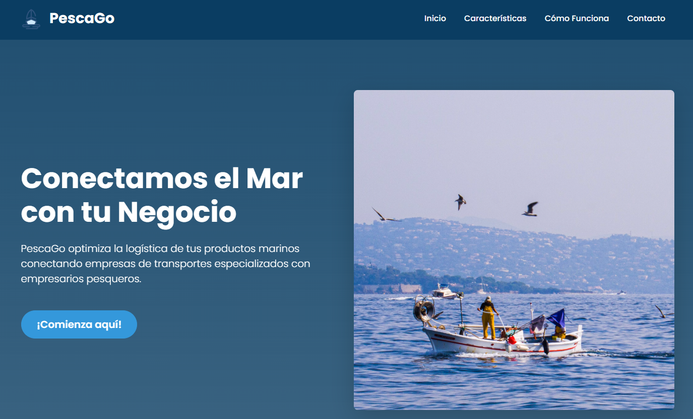

   #### Caracteristicas
   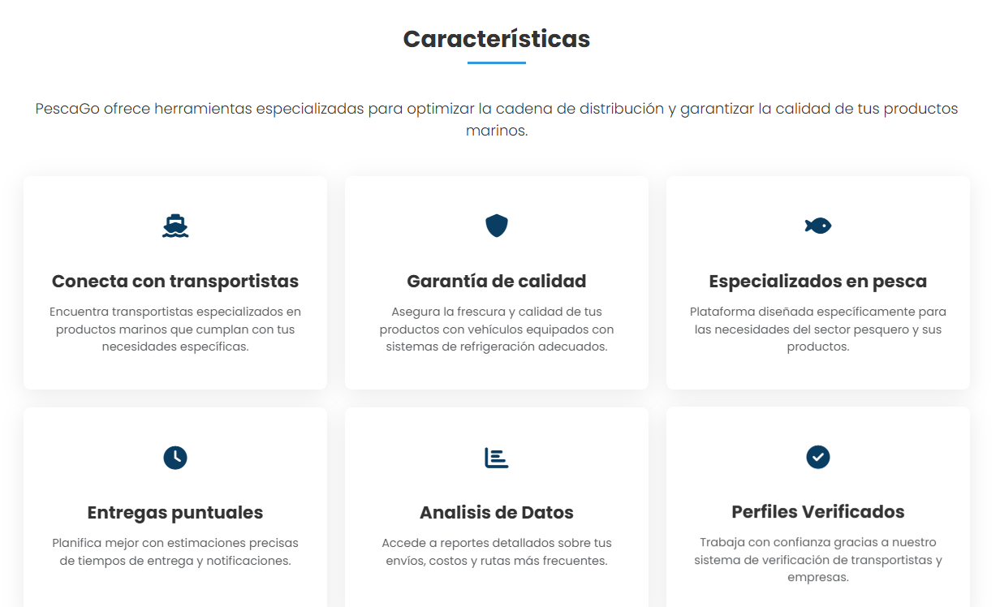

   #### Cómo Funciona
   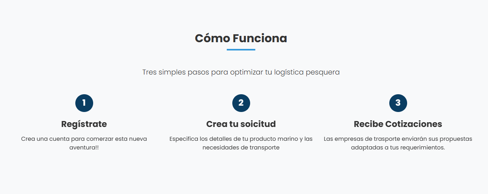

   #### Testimonios
   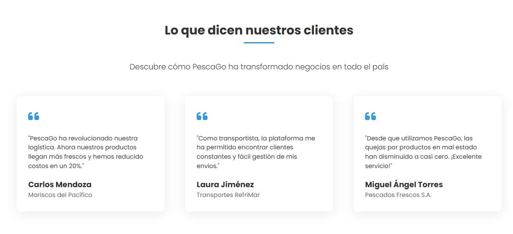

   #### Beneficios
   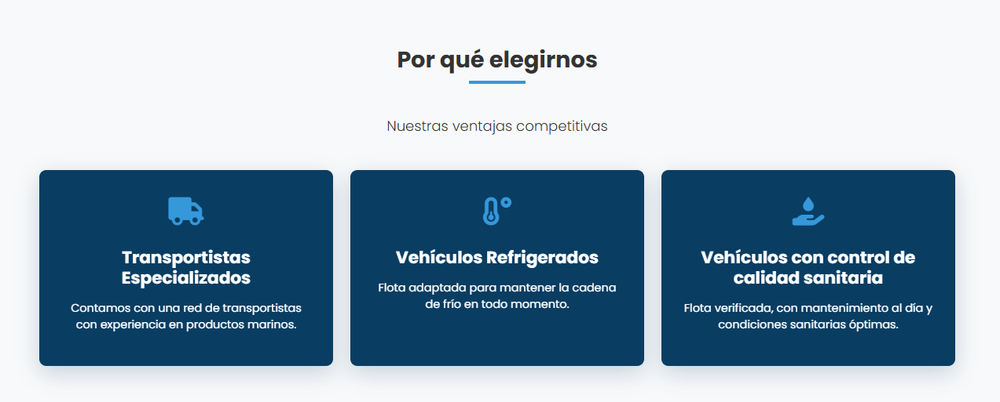

   #### Contacto
   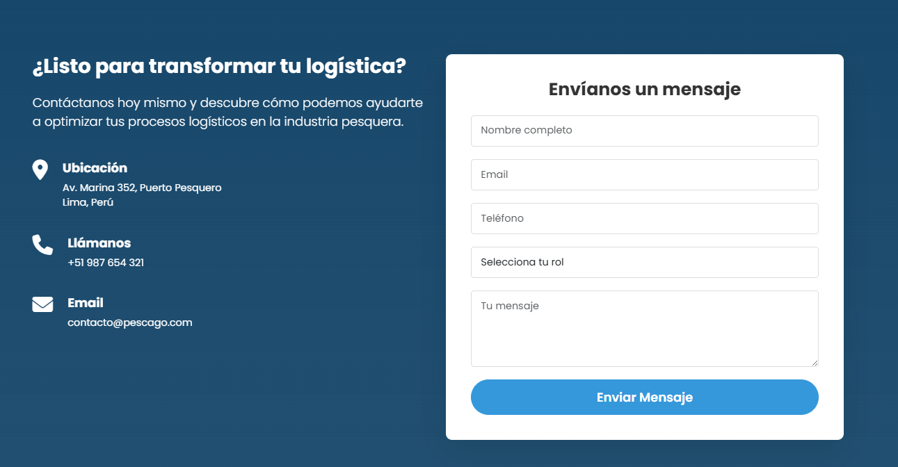   

   #### 5.2.1.6. Services Documentation Evidence for Sprint Review
   
   Link de la landing page desployada: https://pescago.netlify.app/

   #### 5.2.1.7. Software Deployment Evidence for Sprint Review

   Para el desarrollo de la landing page, se usó lo siguiente:
   
   - HTML: Para la estructura de la landing page
   - CSS: Para darle estilos a la landing page
   - JS: Para darle dinamismo a la landing page
   - Git: Es el sistema de control de versiones
   - Github: Software online para almacenar repositorios Git

   #### 5.2.1.8. Team Collaboration Insights during Sprint

   
A continuación, se compartirá la tabla de colaboradores del repositorio de Github para identificar a cada miembro del equipo:

| Username (GitHub) | Nombre                          |
| ----------------- | ------------------------------- |
| AleRamosA                     | Ramos Argüelles, Alexandra Belen |
| PaoloBellezaTelloo            | Belleza Tello, Paolo Eduardo |
| MariaFernandaFernandezAlva    | Fernandez Alva, María Fernanda    |
| IanMQ                         | Macavilca Quispe, Ian      |
| mariopvdev                    | Prado Vargas, Mario Benjamín     |
  

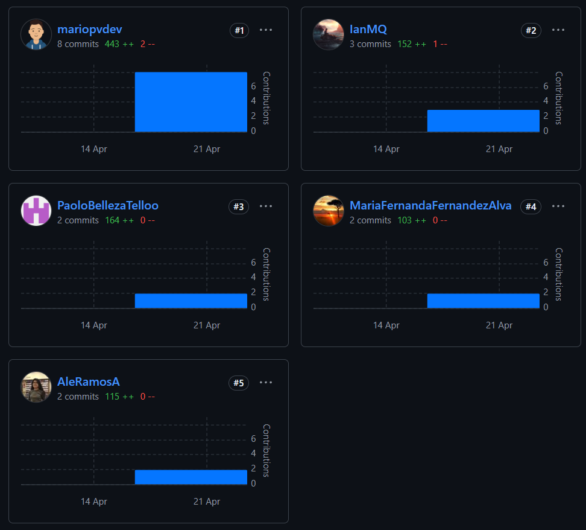

  #### 5.2.2. Sprint 2
   #### 5.2.2.1. Sprint Planning 2

<table border="1px" align="center">
      <tr>
          <th style="font-weight: bold;" >Sprint #</th>
          <th style="font-weight: bold;" >Sprint 2</th>
      </tr>
      <tr> 
          <td colspan="2" style="font-weight: bold;">Sprint Planning Background</td>
      </tr>
      <tr>
          <td style="font-weight: bold;">Date</td>
          <td>13-05-2025</td>
      </tr>
      <tr>
          <td style="font-weight: bold;">Time</td>
          <td>5:00 pm - 10:00 pm</td>
      </tr>
      <tr>
          <td style="font-weight: bold;">Location</td>
          <td>Canal de Voz de Discord</td>
      </tr>
      <tr>
          <td style="font-weight: bold;">Prepared By</td>
          <td>Prado Vargas, Mario Benjamín</td>
      </tr>
      <tr>
          <td style="font-weight: bold;">Attendees (to planning meeting)</td>
          <td>
              Belleza Tello, Paolo Eduardo 
              Fernandez Alva, María Fernanda 
              Macavilca Quispe, Ian 
              Prado Vargas, Mario Benjamín 
              Ramos Argüelles, Alexandra Belen 
          </td>
      </tr>
      <tr>
          <td style="font-weight: bold;">Sprint 1 Review Summary</td>
          <td>Debido a que no hubó una revisión en la TB1, no existe un review summary del sprint 1.</td>
      </tr>
      <tr>
          <td style="font-weight: bold;">Sprint 1 Retrospective Summary</td>
          <td>El equipo logró organizarse y completar las tareas planificadas, a pesar de algunos desafíos iniciales relacionados con la coordinación y la gestión del tiempo. Se identificó la necesidad de mejorar la comunicación interna y definir mejor los roles desde el inicio. </td>
      </tr>
      <tr> 
          <td colspan="2" style="font-weight: bold;">Sprint Goal & User Stories</td>
      </tr>
      <tr>
          <td style="font-weight: bold;">Sprint 2 Goal</td>
          <td>
              El objetivo principal de este sprint es desarrollar el frontend de nuestra aplicación PescaGo, con especial enfoque en implementar las funcionalidades clave para los usuarios.
          </td>
      </tr>
      <tr>
          <td style="font-weight: bold;">Sprint 2 Velocity</td>
          <td>8</td>
      </tr>
      <tr>
          <td style="font-weight: bold;">Sum of Story Points</td>
          <td>67</td>
      </tr>
    </table>

   #### 5.2.2.2. Aspect Leaders and Collaborators

<table border="1" style="border-collapse: collapse; text-align: center;">
  <tr>
    <th>Team Member (Last Name, First Name)</th>
    <th>GitHub Username</th>
    <th>Inicio de sesion & Registro</th>
    <th>Solicitudes para cotizar</th>
    <th>Servicio Confirmado</th>
    <th>Búsqueda de empresas transportistas</th>
    <th>Estado de Solicitudes</th>
    <th>Servicios Contratados</th>
  </tr>
  <tr>
    <td>Ramos Argüelles, Alexandra Belen</td>
    <td>AleRamosA</td>
    <td>L</td>
    <td>C</td>
    <td>C</td>
    <td>C</td>
    <td>C</td>
    <td>C</td>
  </tr>
  <tr>
    <td>Belleza Tello, Paolo Eduardo</td>
    <td>PaoloBellezaTelloo</td>
    <td>C</td>
    <td>L</td>
    <td>C</td>
    <td>C</td>
    <td>C</td>
    <td>C</td>
  </tr>
  <tr>
    <td>Fernandez Alva, María Fernanda</td>
    <td>MariaFernandaFernandezAlva</td>
    <td>C</td>
    <td>C</td>
    <td>L</td>
    <td>C</td>
    <td>C</td>
    <td>C</td>
  </tr>
  <tr>
    <td>Macavilca Quispe, Ian</td>
    <td>IanMQ</td>
    <td>C</td>
    <td>C</td>
    <td>C</td>
    <td>L</td>
    <td>C</td>
    <td>C</td>
  </tr>
  <tr>
    <td>Prado Vargas, Mario Benjamín</td>
    <td>mariopvdev</td>
    <td>C</td>
    <td>C</td>
    <td>C</td>
    <td>C</td>
    <td>L</td>
    <td>L</td>
  </tr>
</table>

  #### 5.2.2.3. Sprint Backlog 2

<table border="1" cellspacing="0" cellpadding="4">
  <tr>
    <th style="text-align: center;"><b>Sprint #</b></th>
    <th colspan="7" style="text-align: center;"><b>Sprint 2</b></th>
  </tr>
  <tr>
    <td colspan="2" style="text-align: center;"><b>User Story</b></td>
    <td colspan="6" style="text-align: center;"><b>Work-item / Task</b></td>
  </tr>
  <tr>
    <td style="text-align: center;"><b>ID</b></td>
    <td style="text-align: center;"><b>Title</b></td>
    <td style="text-align: center;"><b>ID</b></td>
    <td style="text-align: center;"><b>Title</b></td>
    <td style="text-align: center;"><b>Description</b></td>
    <td style="text-align: center;"><b>Estimation (hours)</b></td>
    <td style="text-align: center;"><b>Assigned To</b></td>
    <td style="text-align: center;"><b>Status</b></td>
  </tr>

  <tr>
    <td>E3-US11</td>
    <td>Sección de búsqueda</td>
    <td>T1</td>
    <td>Solicitud de búsqueda</td>
    <td>Implementacion de una busqueda de empresas por filtro</td>
    <td style="text-align: center;">8h</td>
    <td>integrante1</td>
    <td style="text-align: center;">Done</td>
  </tr>

  <tr>
    <td>E3-US13</td>
    <td>Solicitar el servicio a la empresa prestadora de vehículos</td>
    <td>T2</td>
    <td>Solicitud del servicio</td>
    <td>Implementacion de un boton para enviar una solicitud a la empresa</td>
    <td style="text-align: center;">8h</td>
    <td>integrante2</td>
    <td style="text-align: center;">Done</td>
  </tr>

  <tr>
    <td>E3-US14</td>
    <td>Gestionar solicitudes enviadas</td>
    <td>T3</td>
    <td>Solicitudes enviadas</td>
    <td>Implementación de una tabla con informacion de cada solicitud</td>
    <td style="text-align: center;">7h</td>
    <td>integrante3</td>
    <td style="text-align: center;">Done</td>
  </tr>

  <tr>
    <td>E4-US18</td>
    <td>Gestión de pagos</td>
    <td>T4</td>
    <td>Pagos</td>
    <td>Implementar una tabla con donde se pueda visualizar los clientes que pagaron por el servicio.</td>
    <td style="text-align: center;">7h</td>
    <td>integrante4</td>
    <td style="text-align: center;">Done</td>
  </tr>

  <tr>
    <td>E4-US19</td>
    <td>Enviar información del vehículo hacia el empresario pesquero</td>
    <td>T5</td>
    <td>Informacion del vehículo</td>
    <td>Implementar un formulario para el registro de vehículos y para conductores</td>
    <td style="text-align: center;">6h</td>
    <td>integrante5</td>
    <td style="text-align: center;">Done</td>
  </tr>

  <tr>
    <td>E2-US08</td>
    <td>Registro para de la empresa prestadora de vehículos</td>
    <td>T6</td>
    <td>Información de la empresa</td>
    <td>Implementación de un formulario para el llenado de los datos generales</td>
    <td style="text-align: center;">5h</td>
    <td>Integrante1</td>
    <td style="text-align: center;">Done</td>
  </tr>

  <tr>
    <td>E2-US09</td>
    <td>Registro para de el empresario pesquero</td>
    <td>T7</td>
    <td>Información del empresario</td>
    <td>Implementación de un formulario para el llenado de los datos generales</td>
    <td style="text-align: center;">5h</td>
    <td>Integrante2</td>
    <td style="text-align: center;">Done</td>
  </tr>

  <tr>
    <td>E3-US15</td>
    <td>Pagar a la empresa seleccionada</td>
    <td>T8</td>
    <td>Pagar servicio</td>
    <td>Implementar un botón para pagar de manera rápida</td>
    <td style="text-align: center;">4h</td>
    <td>Integrante3</td>
    <td style="text-align: center;">Done</td>
  </tr>

  <tr>
    <td>E3-US16</td>
    <td>Obtener información del vehículo repartidor</td>
    <td>T9</td>
    <td>Información del vehiculo como conductor</td>
    <td>Implementar una tabla con todos los datos requeridos</td>
    <td style="text-align: center;">4h</td>
    <td>Integrante4</td>
    <td style="text-align: center;">Done</td>
  </tr>

  <tr>
    <td>E3-US17</td>
    <td>Gestión de solicitudes recibidas</td>
    <td>T10</td>
    <td>Solicitudes recibidas</td>
    <td>Implementación para cotizar las solicitudes de los empresarios pesqueros</td>
    <td style="text-align: center;">4h</td>
    <td>Integrante5</td>
    <td style="text-align: center;">Done</td>
  </tr>

  <tr>
    <td>E2-US10</td>
    <td>Ingreso a la aplicación</td>
    <td>T11</td>
    <td>Inicio de sesión</td>
    <td>Implementación de dos botones para seleccionar el usuario que desea ser</td>
    <td style="text-align: center;">2h</td>
    <td>Integrante5</td>
    <td style="text-align: center;">Done</td>
  </tr>
</table>

   #### 5.2.2.4. Development Evidence for Sprint Review.
En esta sección, se presentan los commits realizados en el repositorio del frontend en GitHub. Estos commits reflejan el progreso y las mejoras implementadas durante el sprint 2, proporcionando una visión detallada de las actividades de desarrollo y las contribuciones del equipo.

Link del repositorio: [PescaGo - Frontend](https://github.com/1ASI0729-2510-4321-devvolution/PescaGo-Frontend)

<table border="1" cellpadding="5" cellspacing="0">
  <tr>
    <th>Repository</th>
    <th>Branch</th>
    <th>Commit Id</th>
    <th>Commit Message</th>
    <th>Commit Message Body</th>
    <th>Commited on (Date)</th>
  </tr>
  <tr>
    <td>PescaGo - Frontend</td>
    <td>main</td>
    <td>81b748</td>
    <td>feat: add ..</td>
    <td>Acceso a la funcionalidad..</td>
    <td>13/05/2025</td>
  </tr>
  <tr>
    <td>PescaGo - Frontend</td>
    <td>main</td>
    <td>81b748</td>
    <td>feat: add ..</td>
    <td>Acceso a la funcionalidad..</td>
    <td>13/05/2025</td>
  </tr>
  <tr>
    <td>PescaGo - Frontend</td>
    <td>main</td>
    <td>81b748</td>
    <td>feat: add ..</td>
    <td>Acceso a la funcionalidad..</td>
    <td>13/05/2025</td>
  </tr>
  <tr>
    <td>PescaGo - Frontend</td>
    <td>main</td>
    <td>81b748</td>
    <td>feat: add ..</td>
    <td>Acceso a la funcionalidad..</td>
    <td>13/05/2025</td>
  </tr>
  <tr>
    <td>PescaGo - Frontend</td>
    <td>main</td>
    <td>81b748</td>
    <td>feat: add ..</td>
    <td>Acceso a la funcionalidad..</td>
    <td>13/05/2025</td>
  </tr>
  <tr>
    <td>PescaGo - Frontend</td>
    <td>main</td>
    <td>81b748</td>
    <td>feat: add ..</td>
    <td>Acceso a la funcionalidad..</td>
    <td>13/05/2025</td>
  </tr>
  <tr>
    <td>PescaGo - Frontend</td>
    <td>main</td>
    <td>81b748</td>
    <td>feat: add ..</td>
    <td>Acceso a la funcionalidad..</td>
    <td>13/05/2025</td>
  </tr>
</table>

   #### 5.2.2.5. Execution Evidence for Sprint Review

En el Sprint 2 hemos logrado implementar las funcionalidades más relevantes para los usuarios principales: el empresario pesquero y la empresa transportista.

A continuación, se presentan capturas de pantalla de las vistas implementadas.

* <strong>Inicio de sesión y registro</strong>

    

    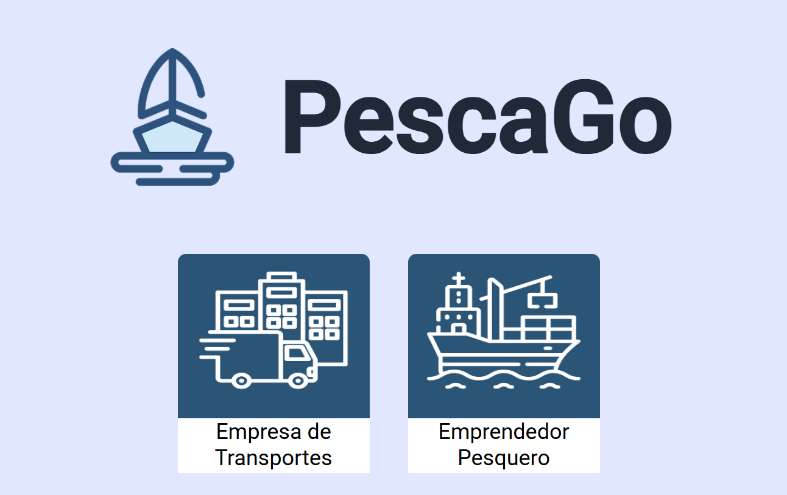

 

* <strong>Registro de Empresa Transportista</strong>

    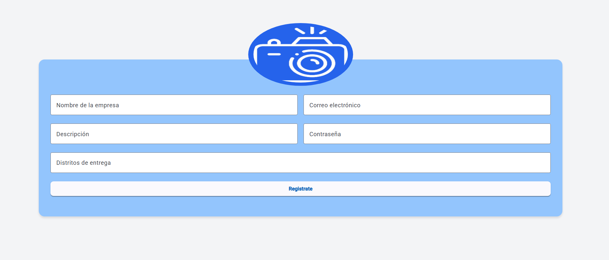

 

* <strong>Registro de Empresario Pesquero</strong>

    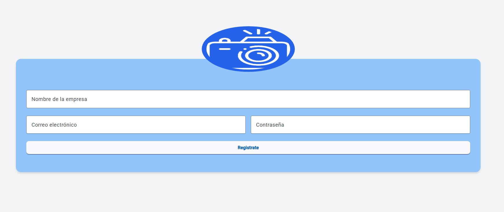

 

* <strong>Pantalla de inicio de la Empresa Transportista</strong>

    

 

* <strong>Funcionalidad de la solicitudes para cotizar</strong>

    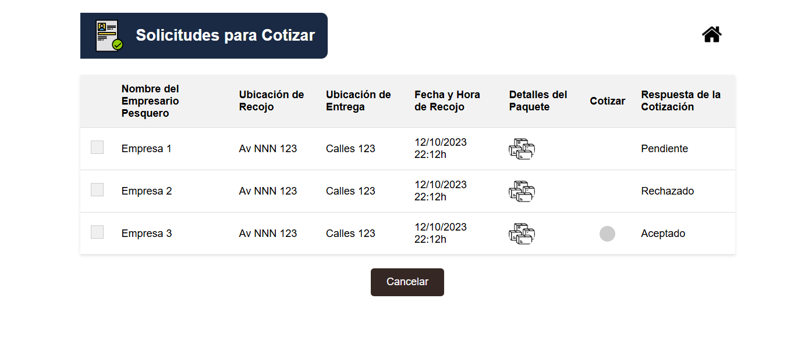

    

    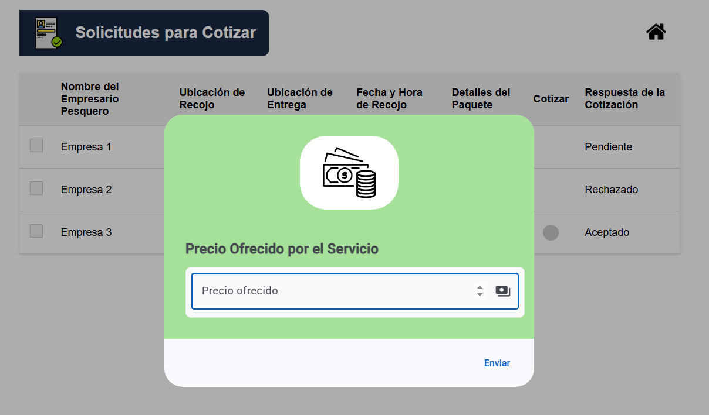

 

* <strong>Funcionalidad de Servicio Confirmado</strong>

    

 

* <strong>Pantalla de inicio del Empresario Pesquero</strong>

    

 

* <strong>Funcionalidad de Búsqueda de empresas transportistas</strong>

    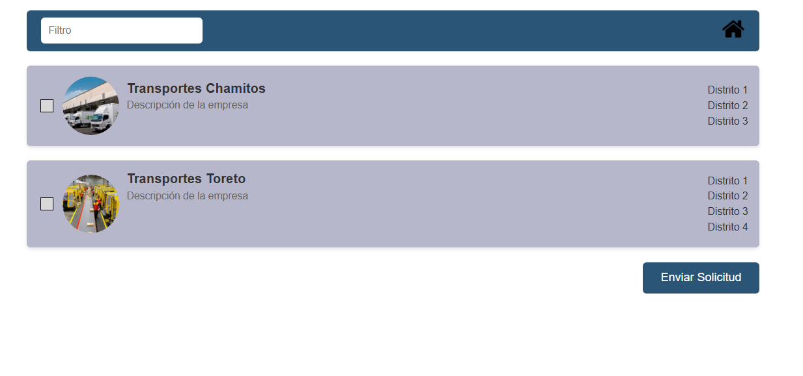

    

 

* <strong>Funcionalidad de Estado de Solicitudes</strong>

    

    

    

 

* <strong>Funcionalidad de Servicios Contratados</strong>

    

 

   #### 5.2.2.6. Services Documentation Evidence for Sprint Review

Durante el Sprint 2, utilizamos servicios HTTP mediante JSON Server, lo cual nos permitió crear una fake API para simular el backend de la aplicación.
Para este sprint, contamos con los siguientes endpoints principales:

-Empresa Transportista

-Empresario Pesquero

* <strong>Captura de la estructura de la Empresa Transportista (db.json):</strong>

  

* <strong>Captura de la estructura del Empresario Pesquero (db.json):</strong>

  

* <strong>Captura de la Fake API en funcionamiento:</strong>

  

   #### 5.2.2.7. Software Deployment Evidence for Sprint Review.

Durante el Sprint 2, se desplegó tanto el frontend como la fake API para permitir la integración y validación de las funcionalidades desarrolladas. Utilizamos JSON Server para simular la API REST, y el frontend fue ejecutado en entorno local para facilitar las pruebas.

(Tambien si se puede , se debe evidenciar en donde se esta desplegando y sus pasos a seguir)

A continuación, se presentan los links que evidencian el despliegue:

* <strong>Despliegue de la Fake Api</strong>: [Fake Api](url)

* <strong>Despliegue del Frontend</strong>: [PescaGo](url)
  

   #### 5.2.2.8. Team Collaboration Insights during Sprint. 

El equipo desarrolló el frontend por ramas con la finalidad de desarrollar cada sección de manera individual para optimizar el mantenimientoy colaboración durante el sprint. 

Link del GitHub con a la participación: [Pulse de GitHub](https://github.com/1ASI0729-2510-4321-devvolution/PescaGo-Frontend/pulse)

A continuación, se presentarán las tareas asignadas a cada integrante del equipo, así como el insight del equipo a través de la plataforma GitHub:

<table border="1">
  <tr>
    <th>Integrante</th>
    <th>Actividad</th>
  </tr>
  <tr>
    <td>Ramos Argüelles, Alexandra Belen</td>
    <td>Se encargó del inicio de sesión como los registros para ambos segmentos objetivos</td>
  </tr>
  <tr>
    <td>Belleza Tello, Paolo Eduardo</td>
    <td>Se encargó de realizar la funcionalidad "Solicitudes para cotizar" del segmento objetivo: Empresa Transportista</td>
  </tr>
  <tr>
    <td>Fernandez Alva, María Fernanda</td>
    <td>Se encargó de realizar la funcionalidad "Servicio Confirmado" del segmento objetivo: Empresa Transportista</td>
  </tr>
  <tr>
    <td>Macavilca Quispe, Ian</td>
    <td>Se encargó de realizar la funcionalidad "Búsqueda de empresas transportistas" del segmento objetivo: Empresario Pesquero. Tambien elaboró una parte de la funcionalidad "Servicios Contratados"</td>
  </tr>
  <tr>
    <td>Prado Vargas, Mario Benjamín</td>
    <td>Se encargó de realizar la funcionalidad "Estado de Solicitudes" del segmento objetivo: Empresario Pesquero. Tambien termino elaborar la funcionalidad "Servicios Contratados"</td>
  </tr>
</table>

Con la finalidad de identificar a cada integrante del equipo, presentaremos una tabla con los usuarios de los colaboradores en el repositorio de GitHub.

<table border="1">
  <tr>
    <th>Username (GitHub)</th>
    <th>Nombre</th>
  </tr>
  <tr>
    <td>AleRamosA</td>
    <td>Ramos Argüelles, Alexandra Belen</td>
  </tr>
  <tr>
    <td>PaoloBellezaTelloo</td>
    <td>Belleza Tello, Paolo Eduardo</td>
  </tr>
  <tr>
    <td>MariaFernandaFernandezAlva</td>
    <td>Fernandez Alva, María Fernanda</td>
  </tr>
  <tr>
    <td>IanMQ</td>
    <td>Macavilca Quispe, Ian Fernanda</td>
  </tr>
  <tr>
    <td>mariopvdev</td>
    <td>Prado Vargas, Mario Benjamín</td>
  </tr>
</table>

A continuación, se mostrarán las capturas de participación:

* <strong>Captura de los commits realizados</strong>

    

* <strong>Captura de la contribución de los integrantes</strong>

    

## Conclusiones

### Conclusiones y recomendaciones

Tras un periodo de cuatro semanas de trabajo intensivo, se ha completado exitosamente el primer sprint del proyecto. Durante esta fase inicial, se abordaron aspectos fundamentales para el desarrollo de la aplicación web.

En primer lugar, se llevó a cabo un exhaustivo análisis de la experiencia del usuario (UX) con el objetivo de comprender en profundidad las necesidades de los futuros usuarios y determinar la manera más eficaz de satisfacerlas a través de una interfaz intuitiva y eficiente. La elaboración de diagramas AS-IS y TO-BE permitió visualizar el estado actual y el estado futuro deseado del flujo de trabajo dentro de la aplicación, identificando áreas susceptibles de mejora y optimización.

Adicionalmente, se desarrolló un backlog de historias de usuario, lo cual facilitó la priorización de las funcionalidades esenciales que serán implementadas en las siguientes etapas del proyecto. Este backlog constituirá una guía para el desarrollo continuo, asegurando el enfoque en la consecución de los objetivos previamente establecidos.

Asimismo, se dedicó un esfuerzo significativo al diseño y desarrollo de la página de inicio (landing page) de la aplicación, la cual representará la primera interacción de los usuarios con la plataforma. Se elaboraron mockups detallados para esta página, garantizando la coherencia con los principios de diseño definidos durante el análisis UX.

En resumen, este primer sprint ha permitido establecer una base sólida para el proyecto, alineando los objetivos y definiendo una hoja de ruta clara para las fases venideras. El trabajo colaborativo y la meticulosa atención al detalle han sido cruciales para alcanzar los resultados obtenidos hasta el momento, y el equipo se encuentra en una posición favorable para avanzar en las próximas etapas de desarrollo.

## Bibliografía

## Anexos
  
    
              
              
              
